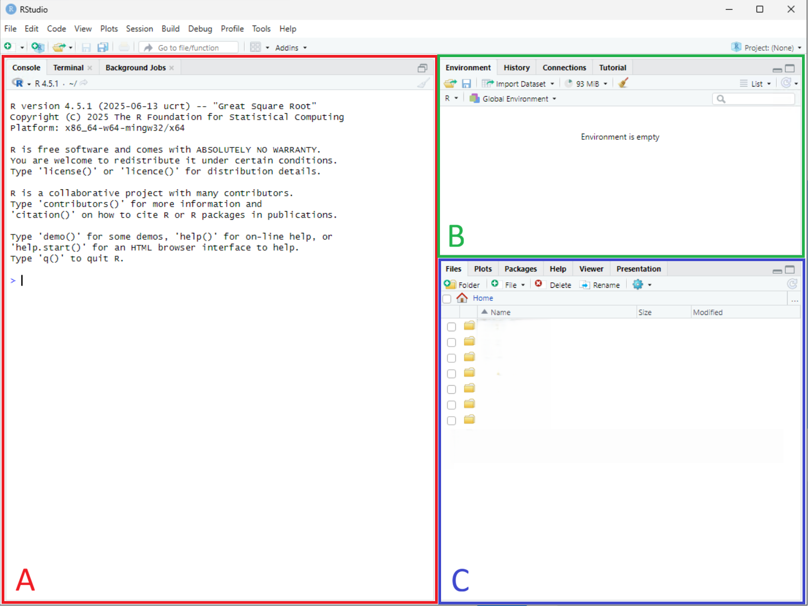
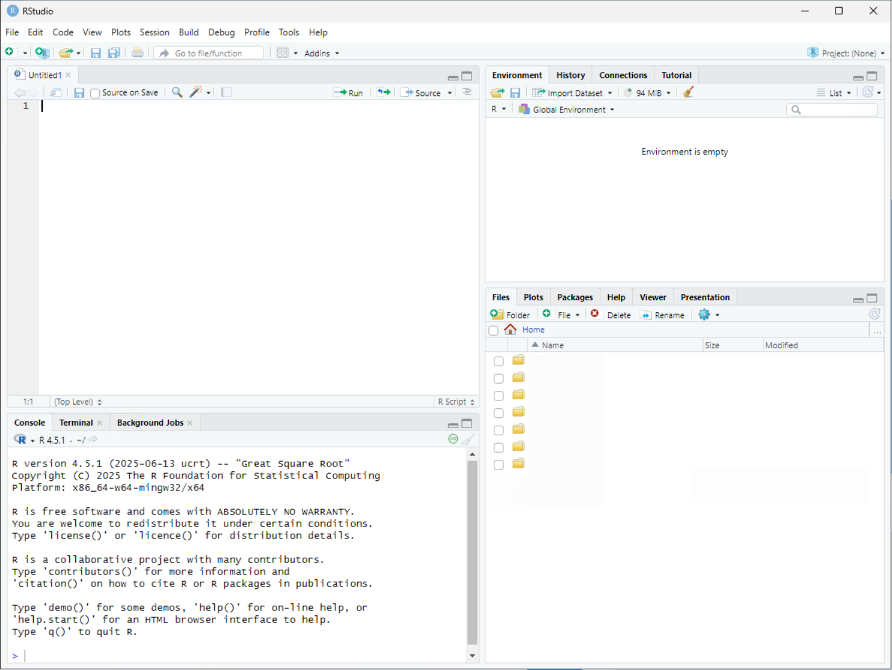
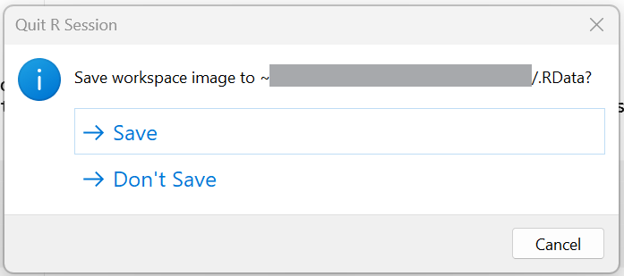

# R

## Why R?

R is an open source programming language developed for statistical analysis. Estimates of R usage in Economics suggest that only 9.8% of replication packages in economic journals contain .R scripts (i.e. R code) (Source: [*Economics and R Blog*](https://skranz.github.io/r/2023/12/29/FindingEconomicArticles7.html)). Stata remains dominant (with 72%), with Matlab second (24%).

**Why not R? It's free!?** Part of the story is network 'lock-in': academics train students to use the tools they know, which is Stata and Matlab. But R usage is rising; in particular, among younger researchers. And this is happening for a few key reasons:

1. Data is changing. Stata was designed to work with rectangular datasets that suited the analysis of cross-sectional and longitudinal survey data. In the age of the internet, there is A LOT of data and it is not stored in this type of structure. R and Python have packages designed to manage BIG 'messy' data. 

2. Data science tools - like statistical and machine learning - are increasingly important in Economics research. Many of the industry standard data science packages are written for R and Python. 

3. Data visualization. In the age of digital media, graphical visualization of data is increasingly important. Stata's graphical tools are designed for the age of print media, while there exist extensive R and Python packages for data visualization. 

**Should you learn R?** Sure! R is a widely used programming language and learning econometric analysis in R will enable you to integrate these skills with other R programming features. And once you've learnt one programming language, it is relatively easy to learn another with modern development tools. You should be aware that R has a steeper learning curve than Stata, but the payoff in flexibility and integration with other tools is significant.

An advantage of using R is that it is a free open source language. You will have remote access to R and the RStudio IDE via [AppsAnywhere](https://appstore.st-andrews.ac.uk/). Unfortunately, AppsAnywhere will not allow you install user written packages, but does have a range of popular packages pre-installed. However, you can also install these on your own computer. You will first need to [install R](https://cran.r-project.org/) and then an IDE. R comes with its own, fairly basic, IDE, but I recommend using [RStudio](https://posit.co/products/open-source/rstudio). If you are a more experienced programmer, you can also consider [Positron](https://posit.co/products/ide/positron).[^1]

[^1]: Developed by the same team as RStudio, Positron is a 'fork' of VS Code. It combines the multi-language features of VS Code with the data science features of RStudio. Positron is still in development and does not have all of RStudio's features; e.g., it doesn't work with R-projects.

**Why not Python?** It is used by the Statistics and Maths modules that count as optional prerequisites for this module. But more importantly, R has particularly strong econometrics packages through CRAN, which is important for your module. Python is more widely used in Machine Learning and has excellent data visualization packages. If needs be, you can always run Python commands within R (via `reticulate` package). 

## Navigating the RStudio's GUI

Upon launching RStudio with [AppsAnywhere](https://appstore.st-andrews.ac.uk/), you will see a screen that looks as follows:

{fig-align="center"}
[**A.**]{style="color:red;"} This window shows the 'Console', 'Terminal', and 'Background Jobs'. The 'Console' will display plain text copy of executed code as well as output. You can also execute code directly from the 'Console'. 

[**B.**]{style="color:green;"} This window shows a number of tabs, we will focus on the 'Environment' tab. This window will display all objects (data frames, matrices, scalars) stored in memory.[^2]

[^2]: Unlike Stata, R can open multiple datasets in memory simultaneously. 

[**C.**]{style="color:blue;"} This window contains a number of useful tabs. The 'Files' tab will allow you to navigate between folders on your computer; open, rename, and create new files. The 'Plot' tab will populate with graphs created. The 'Packages' will allow you to update and install new packages, while the 'Help' tab is where you can look up specific functions. 

# Scripts

In the top left corner click on the icon with the plus sign in front of a plain white square ('New File'). From the menu, select the option 'R Script'. This will open a new window.

{fig-align="center"}

Create a folder for this lab, either in your OneDrive or 'Home Drive (H:)'. A good idea would be to create an EC3301 folder in the Documents folder of either drives. Then create a sub-folder for this lab: "..\Documents\EC3301\Lab 1\".

Save the script in your lab folder as "lab-1.R". 

## Setting up an .R scripts

An .R script is a plain text file that is used to store code. All text in script will be interpretted as code unless commented out. You can comment out a line using `#` symbol. 

Add a some information to the top of your file about the purpose of this script.

```{r}
#| eval: false

# Title: Econometrics Lab 1: Working with data in R
# Author: [INSERT NAME]
# Date: [INSERT DATE]
```

Next, we will set the working directory for the project so we do not need to use file paths each time we open and save a file.

```{r}
#| eval: false

setwd("[INSERT FILE PATH]/EC3301/Lab 1")
```

:::{.callout-note title="R projects"}
A more complete way to set up a new project in R is through the creation of an `.Rproj` file. We will do this in the next lab. 
:::

# Data

Download the files `shs2023.dta` and `shs2023.csv` from Moodle (under Week 2). The `.dta` file is a Stata dataset that contains a extra metadata information. The latter is a simpler plain text copy of the file, without this metadata. Downloaded the files and move them to your project folder. 

## Opening a `.csv` file

We will begin by loading the csv file. 

```{r}
#| echo: true
#| eval: false
shs_csv <- read.csv("shs2023.csv")
```

```{r}
#| echo: false
#| output: false
#| eval: true
shs_csv <- read.csv("material/lab-1/shs2023.csv")
```

There should now be a new object in the 'Environment' panel. It shows that the file has 10496 observations and 47 variables. If you double click on `data` it will open the dataset alongside your .R script. 

You can learn about the structure of the dataset using the function `str()`

```{r}
#| echo: true
#| eval: false
str(shs_csv)
```

Notice that each variable has a different format. Some are character variables (`chr`), in which each value is a piece of text. Others are integers (`int`) or logicals (`logi`). The same information can be found by clicking the arrow symbol next to `data` in the 'Environment' tab.

## Opening a `.dta` file

To open a `.dta` file we need to use the package `haven`, which is not a base R package. This requires us to first load the `haven` library before we can use the 

```{r}
#| echo: true
#| eval: false
library(haven)
shs_dta <- read_dta("shs2023.dta")
```

```{r}
#| echo: false
#| warning: false
#| eval: true
library(haven)
shs_dta <- read_dta("material/lab-1/shs2023.dta")
```

The dataset has the same number of variables, but there is extra information attached to each variable (variable labels, value labels). These are features from the metadata attached to `.dta` files. Crucially, many of the character variables in `shs_csv` are stored as numerical variables in `shs_dta`. 

```{r}
#| echo: true
#| eval: false
str(shs_dta)
```

## 'Tidy' data with `tidyverse`

`tidyverse` is a [collection of R packages](https://tidyverse.org/) designed to create, manipulate, and visualize 'tidy' data. 

What is tidy data? 'Tidy' data has a matrix structure (sometimes referred to as 'rectangular' datasets) where a row represents a unique observation, a column a unique variable, and a cell a unique value. The datasets we just loaded were tidy and so are most downloadable survey datasets or macroeconomic spreadsheets. However, there are many forms of 'untidy' data. For example, when you scrape data from a website it has a complex structure with many levels (often using a list structure in R; see [Basic Programming in R](material-programming-R.qmd)). 


We will use three packages from `tidyverse`: `dplyr` and `ggplot2`. You can either load the whole `tidyverse` library, or each sub library separately. This lab does the latter. The `haven` package we used to load the Stata `.dta` file is actually a `tidyverse` package too, but is not loaded with `tidyverse` (for some reason). 

If/when you are working on your own computer, you will first need to install `tidyverse` (run `install.package("tidyverse")`). If you are using AppsAnywhere, `tidyverse` is already installed. 

## Managing data with `dplyr`

```{r}
#| warning: false
library("dplyr")
```

Allows you to easily manipulate datasets; including, 

- adding variables using `mutate()`
- select specific variables using `select()`
- select specific observations using `filter()`

We will begin my filtering out certain variables from the main file:

1. Create a new `clean' dataframe that has a few select variables

```{r}
#| eval: false
clean <- select(shs_dta, area, RTParea, MD20QUIN, hhsize, hb1, hb509, rent_amt, rent_sum, mortgage_amt, mortgage_sum, shared_ownership_sum, shared_ownership_amt)
```

:::{.callout-note}
An alternative would have been to change the `shs_dta` dataframe: `shs_dta <- select(shs_dta, ...)`. 

This operation does not change the dataset saved on the harddrive of the computer ("..\EC3301\Lab 1\shs2023.dta"). Removing variables like this is fine, so long as you do not save over the original data. 
:::

Next, we will rename some of the variables. 

2. Rename the variable `hb1` to `dwell_type` using the `rename()` function. 

```{r}
#| eval: false
clean <- rename(clean, dwell_type = hb1)
```

3. Rename `hb509` to `own_grp` in the clean file. 

The labels attached these variables are equally uninformative. We can change the labels using the packaged `labelled` that is a companion to `haven`

```{r}
#| warning: false
library("labelled")
```

4. Label `dwell_type` "Type of dwelling"

```{r}
#| eval: false
var_label(clean$dwell_type) <- "Type of dwelling"
```

5. Label `own_grp` "Ownership of the dwelling"


## Using pipes

You would have noticed that many of the `dplyr` functions require you to reference the dataframe in question. If you are making repeated edits to the same dataframe, the code can be spead up using a 'pipe'. Here is an example of the `dplyr` pipe. 

```{r}
#| eval: true
#| output: false
clean <- shs_dta %>%
  select(area, RTParea, MD20QUIN, hhsize, hb1, hb509, rent_amt, rent_sum, mortgage_amt, mortgage_sum, shared_ownership_sum, shared_ownership_amt) %>%
  rename(dwell_type = hb1, own_grp = hb509)
```

You can see how this would reduce the number of lines need to perform a sequence of dataset manipulations. Unfortunately, there is no straightforward option to add the `var_label()` function to this sequence as it is not a `dplyr` function. 

:::{.callout-note}
The `%>%` is a `tidyverse` pipe. R has a native pipe operator too: `|>`. There are some important differences in how they operate. 
:::


# Variables

Datasets can contain both numerical and character (i.e. text) variables. In this section we will look at two types of numerical variables:

1. categorical (discrete) variables where values correspond to distinct categories; e.g. "Renter", "Owner"
2. continuous variables can take on any value along the real line; the amount paid for rent (likely stored as an integer)

*A priori* it is not always obvious which variables are which. You can use the `typeof()` function to check how many unique values a variable takes on:

```{r}
#| echo: true

typeof(clean$MD20QUIN)
typeof(shs_csv$MD20QUIN)
```

The variable `MD20QUIN` is stored as a 'double' in `shs_csv`, but in the `.csv` file it was stored as a 'character'. This distinction is the result of transformations made to the data when it was exported as a `.csv` file from Stata. 

## Categorical variables

The simplest way to summarize the information in a categorical variable is to create a frequency table, which can be done using the base R function `table()`

1. How many types of dwelling are there in the data?

```{r}
#| echo: true

table(clean$dwell_type)
```

An alternative approach - using the `dplyr` package - is `count()`. 

```{r}
#| echo: true
clean %>% count(dwell_type)
```

Which is a shorthand for:

```{r}
#| echo: true
clean %>%
  group_by(dwell_type) %>%
  summarise(n = n(), .groups = "drop")
```

The option `.groups = "drop"` removes the grouping of the data afterwards. If you wanted to group by a second variable, you can add another variable to the `group_by()` function. 

To add the propotion of observations, you can do the following. 

```{r}
#| echo: true
clean %>% 
  count(dwell_type) %>%
  mutate(prop = n / sum(n))
```


We now see that the variable actually takes on 3 values, each with a label.

2. How households live in rented accommodation?

3. Create a cross-tabulation of the variables `dwell_type` and `own_grp`. How many households rent a flat in the dataset?

4. The variable `MD20QUIN` (Scottish Index of Multiple Deprivation (SIMD), 2020 quintiles) has information about the socio-economic status of the household. Are the observations balanced across quintiles? 

You will notice that the labels of the values attached to `MD20QUIN` are incomplete. The value labels can be listed as follows:

```{r}
val_labels(clean$MD20QUIN)
```

We can create our own label and attach them to this variable:

```{r}
#| echo: true
val_labels(clean$MD20QUIN) <- c("Bottom: 0-20%" = 1, "Lower: 20-40%" = 2, "Middle: 40-60%" = 3, "Upper: 60-80%" = 4, "Top: 80-100%" = 5)
clean %>% 
  count(MD20QUIN) %>%
  mutate(prop = n / sum(n))
```

## Continuous variables

You do not want to tabulate a continuous variable because it has too many unique values. The simplest way to evaluate the distribution of a continuous variable is with the base R `summary()` function.

1. What is the average amount money paid as rent by households in the data?

```{r}
#| echo: true

summary(clean$rent_amt)

```

Alternatively, you could programme a table using `dplyr`

```{r}
clean %>%
  summarise(
    n = n(),
    mean = mean(rent_amt, na.rm = TRUE),
    sd = sd(rent_amt, na.rm = TRUE),
    min = min(rent_amt, na.rm = TRUE),
    max = max(rent_amt, na.rm = TRUE)
  )
```

where `na.rm = TRUE` removes missing (i.e. `NA`) observations from the calculation. 

2. The number of observations in the dataframe is 10,496? Does this match the total number of observations used to compute the mean? [Hint: check the first table or add `n_valid = sum(!is.na(rent_amt))` to the `dplyr` version.] 

3. Create a frequency table of the categorical variable `rent_sum` to explore why there only 3,414 observations. 

4. Create a table which also includes the $25^{th}$, $50^{th}$, and $75^{th}$ percentiles of the distribution. 

## Adding conditions

In the previous section we saw that some observations do not have information on rent paid. This is a common feature of survey data, since surveys often include skip patterns: if a household owns the dwelling they live in they will skip the question on monthly rental payments. 

In R, a common way to resolve this is to create a new dataframe that selects only those households. For example, using base R indexing:

```{r}
#| eval: false
clean_rent <- clean[clean$rent_sum == 1, ]
```
or the `subset()` function
```{r}
#| eval: false
clean_rent <- subset(clean, rent_sum == 1)
```

Followed by `summary(clean_rent$rent_amt)`. Using the `dplyr` package, we can use the filter command:

```{r}
clean %>%
  filter(rent_sum==1) %>%
  summarise(
    n = n(),
    mean = mean(rent_amt, na.rm = TRUE),
    sd = sd(rent_amt, na.rm = TRUE),
    min = min(rent_amt, na.rm = TRUE),
    max = max(rent_amt, na.rm = TRUE)
  )
```

Notice, you need to know the numerical value of the category of `rent_sum`, not the value label, to create such a condition. 

1. What is the average mortgage payment of households who own their home and provide a mortgage payment? [You can ignore those with `mortgage_sum==3' "Buying with mortgage - amount given by respondent, but not used in imputation routines"]

2. Is the average imputed mortgage payment higher than the average reported payment?

3. Using the variable `area`, which city has higher mean and/or median rental payments: Edinburgh OR Glasgow? 

## Summary statistics

A common task in data analysis is to summarize a continuous variable by values of a categorical variable. Here are two ways to do this in base R:

- using the `by()` function

```{r}
by(clean$rent_amt, clean$MD20QUIN, summary)
```

- using the `tapply()` function

```{r}
tapply(clean$rent_amt, clean$MD20QUIN, mean, na.rm = TRUE)
```

The way to do this using `dplyr` would be using `group_by()`

```{r}
clean %>%
  group_by(MD20QUIN) %>%
  summarise(
    n = n(),
    mean = mean(rent_amt, na.rm = TRUE),
    sd = sd(rent_amt, na.rm = TRUE),
    min = min(rent_amt, na.rm = TRUE),
    max = max(rent_amt, na.rm = TRUE),
    .group = "drop"
  )
```

1. Using the variable `RTParea`, compute a table of average rental and mortgage payments by area. 

## Create new variables

To create a new variable in R you need to need to assign a new field to the dataframe. The traditional way to do this is:

```{r}
clean$amt_sum <- NA
```

The variable `amt_sum` has been assigned 'missing' values. 

```{r}
summary(clean$amt_sum)
```

We can now modify the values based on other variables. Let's assign the vairable values based on the rule:

- `=1` if rent payment observed;
- `=2` if mortgage payment observed;
- `=3` if shared-ownership payment observed.

We can modify values using the command `replace`.

```{r}
clean$amt_sum[clean$rent_amt>0] <- 1
clean$amt_sum[clean$mortgage_amt>0] <- 2
clean$amt_sum[clean$shared_ownership_amt>0] <- 3
```

In the `dplyr` package there is a useful function called `mutate()` which allows you to add and modify existing variables. Here is how we could create the above variable `amt_sum`:

```{r}
clean <- clean %>%
  mutate(
    amt_sum = case_when(
      shared_ownership_amt > 0 ~ 3,
      mortgage_amt > 0 ~ 2,
      rent_amt > 0 ~ 1,
      TRUE ~ NA_real_
    )
  )
```

Check if there are still `NA`-missing values:

```{r}
clean %>%
  group_by(amt_sum) %>%
  summarise(n = n(), .groups = "drop")
```

1. Check that those with rental, mortgage, and shared payments are mutually exclusive. 

2. Create a new variable called `payment` equal to the sum of `rent_amt`, `mortgage_amt`, and `shared_ownership_amt`. [Hint: you will not be able to do this by adding the variables together. Try the`rowSums()` function from base R.]

3. Compute the mean of `payment` and the number of observations for which `payment==.`. Who has a missing value of `payment`? How should these values be coded?

4. Create a new variable - `pc_payment` - equal to the total monthly payment divided by household size. Label the variable "Per capita monthly payment for housing."

5. Which `area` has the highest average per capita payment?


# Graphs

R has a range of base R graphing functions; however, the `ggplot()` (part of `tidyverse`) is by far the most flexible and useful function you can learn. You plot anything from a basic scatter plot to a geographical map using this function. Fortunately, LLMs are rather good at helping you design the perfect plot. 

## Basic R plots

Histograms are useful graphs for visualizing the distribution of a continuous variable. In base R, you can do this as follows:

```{r}
hist(clean$rent_amt)
```

You can edit the labels as follows:

```{r}
hist(clean$rent_amt, 
     main = "Distribution of Rental Payments",
     xlab = "Rental Payments (Weekly)",
     ylab = "Frequency",
     col = "lightblue",
     border = "white")
```

For categorical variables, bar graphs are more useful. For example, we can plot the frequency of observations in each category of `RTParea`. 

```{r}
barplot(table(clean$RTParea),
     main = "Frequency by RTP area",
     xlab = "RTP Area",
     ylab = "Frequency",
     col = "lightblue",
     border = "white")
```

or for proportions:
```{r}
#| eval: false
barplot(prop.table(table(clean$RTParea)),
     main = "Proportion by RTP area",
     xlab = "RTP Area",
     ylab = "Proportion",
     col = "lightblue",
     border = "white")
```

Suppose you wanted visualize the mean rental payment by RTP area in a bar graph. To do this you need to two steps:

```{r}
means <- tapply(clean$rent_amt, clean$RTParea, mean, na.rm = TRUE)
barplot(means,
        main = "Mean Rental Payment by RTP Area",
        xlab = "RTP Area",
        ylab = "Mean Rental Payment (Weekly)",
        col = "lightblue",
        border = "white")
```


## Using `ggplot2`

```{r}
#| warning: false
library("ggplot2")
```

`ggplot2` is a more complete package and together with `dplyr` can become your 'one stop shop' for graphing. Here is how you would graph the above plot using the two packages:

```{r}
means <- clean %>%
  group_by(RTParea) %>%
  summarise(mean_rent = mean(rent_amt, na.rm = TRUE), .groups = "drop")

ggplot(means, aes(x = RTParea, y = mean_rent)) +
  geom_col(fill = "lightblue", color = "white") +
  labs(
    title = "Mean Rental Payment by RTP Area",
    x = "RTP Area",
    y = "Mean Rental Payment (Weekly)"
  )
```

Notice that we've lost the labels of the RTP Area. This is because in generating the `means` dataframe we lost that information. Here's how we can add that additional information. 

```{r}
means <- clean %>%
  mutate(RTParea = as_factor(RTParea)) %>%
  group_by(RTParea) %>%
  summarise(mean_rent = mean(rent_amt, na.rm = TRUE), .groups = "drop")

ggplot(means, aes(x = RTParea, y = mean_rent)) +
  geom_col(fill = "lightblue", color = "white") +
  labs(
    title = "Mean Rental Payment by RTP Area",
    x = "RTP Area",
    y = "Mean Rental Payment (Weekly)"
  ) 
```

1. The labels of the above graph do not display very well. See if you can change the angle of labels so that they are displayed at a $45^\circ$ angle. 

2. Create a graph that displays the average rent and mortgage paid by households in each of the `RTParea`. Edit the graph so that it has an informative y-axis title, legend, and title. 

3. Create a single graph showing 5 separate histograms of rental payments for each `MD20QUIN` group. Use the `facet_wrap()` function within `ggplot()` to do this. 

## Exporting graphs

You can use the `ggsave()` function to export your graph. But first you will need to adjust the code to create an object that is the graph. Earlier we directly executed the `ggplot()` function. However, you can create an object equal to that plot. 

```{r}
myplot <- ggplot(means, aes(x = RTParea, y = mean_rent)) +
  geom_col(fill = "lightblue", color = "white") +
  labs(
    title = "Mean Rental Payment by RTP Area",
    x = "RTP Area",
    y = "Mean Rental Payment (Weekly)"
  ) 
```

Now you can export this plot as a `.png` or `.jpg`. As we have set a working directory, this should automatically be saved in this location. 

```{r}
#| eval: false
ggsave("file_name.png",
       width = 9, height = 6,
       plot = myplot)
```

The default size is $7\times 7$, which doesn't fit the figure well. 

1. Save the last graph you created in the same folder as the data and `.do` file using the name "hist_rent_by_quintile.png"

# Replication

You are now ready to try and execute all of today's work, while saving a copy of your graph. If this works, it will mean that your work is replicable, *so long as you have saved your* .R file (**CHECK**). 

When you close RStudio (don't do it yet) you will see the following warning asking you whether you want to save your workspace (i.e. all the objects in memory: see 'Environment' tab). Doing so will create a new .RData file. 

{fig-align="center"}

**THIS IS NOT NECESSARY** and you can select 'Don't Save', so long as you have saved your .R script. 

## Final set-up

Here is how your .R file should look:

```{r}
#| eval: false

# Title: Econometrics Lab 1: Working with data in R
# Author: [INSERT NAME]
# Date: [INSERT DATE]

# Load libraries
library("haven")
library("labelled")
library("dplyr")
library("ggplot2")

# Clear all objects from the R environment
rm(list = ls())

# Set working directory
setwd("[INSERT FILE PATH]/EC3301/Lab 1")

# Open data
shs_csv <- read.csv("shs2023.csv")
shs_dta <- read_dta("shs2023.dta")


[ALL THE EXERCISES GO HERE!]

```

The function `rm(list = ls())` removes all objects in memory. You do not have to add this line, because R does not create an error when you define an object that already exists. It simply redefines that object. However, clearing the environment ensures that your script does not fail to define an object you later use. 

## Replicate

Having checked the .R script and made sure it is saved, execute the entire file. Check that there are no error messages. If all works, you can close RStudio, **selecting 'Don't Save'** when it offers you the option to save your workspace. 
