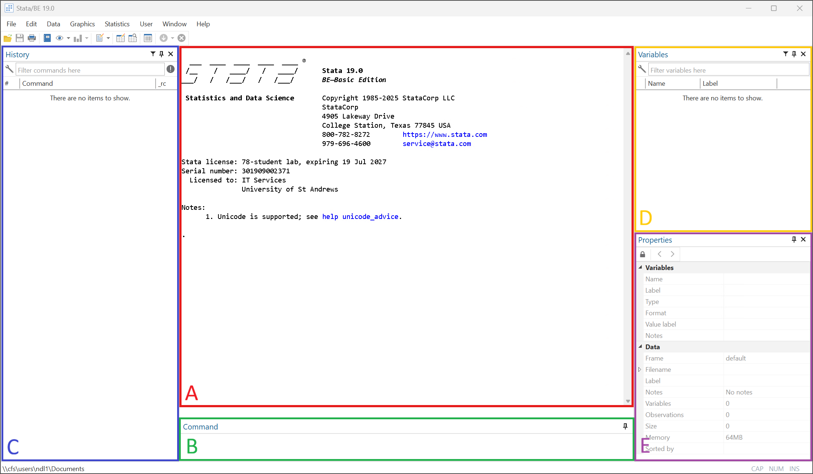
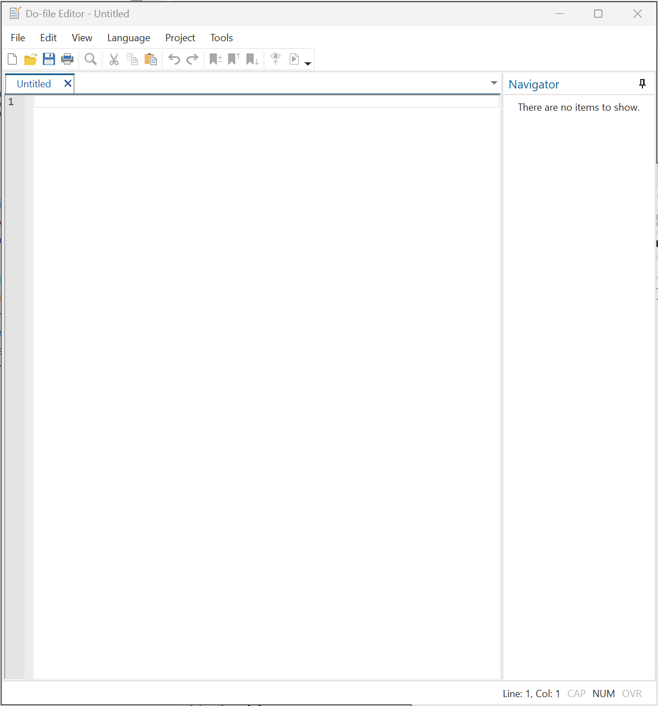
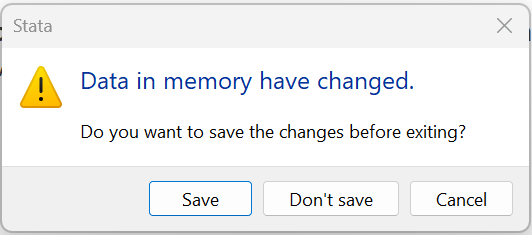

# Stata

## Why Stata

Stata is a proprietory statistical software used by researchers. Estimates of Stata usage in Economics suggest that 71% of replication packages in economic journals contain Stata .do scripts (i.e. Stata code) (Source: [*Economics and R Blog*](https://skranz.github.io/r/2023/12/29/FindingEconomicArticles7.html)). R is rising, but still only found in 9.8% of replication packages.

**Why Stata?** Part of the story is network 'lock-in': academics train students to use the tools they know. But the software has its merits and developed the right set of tools for the data available at the time. These strengths are:

1.  Stata's command-line functionality allows for reproducible workflows, without requiring general programming language expertise. While not a complete language, Stata does have programming features; like loops, macros, and functions.

2.  Stata's own packages and commands come with extensive documentation and are rigorously tested. User-written commands are community-vetted through the Statistical Software Components (SSC), with many Econometrician contributors.[^1]

[^1]: Unlike open-source languages like R, StataCorp carries legal liability for its code, making it an attractive choice for economists in litigation support and legal consulting where accountability is important.

<!-- -->

3.  For smaller datasets, Stata is fast! It processes data by first loading it into memory on the computer, which makes all computations rather efficient. However, this also means that Stata is limited by the available RAM (computer memory).

4.  Stata is designed to analyse and manage rectangular datasets: each row is an observation, with each column a new variable. For example, survey data where each row represents a respondent and each column a survey question response. Indeed, Stata has many functions designed specifically for the analysis of cross-sectional and longitudinal surveys, which are extensively used in applied economics research.

5.  Stata's .dta format preserves variable metadata (labels, formats, notes), making it easier to share documented datasets compared to plain text formats like CSV. This aids in collaboration and the sharing of vital metadata between data providers (e.g. surveyors) and users.

Many of these strengths are not unique to Stata but, put together, they demonstrate why Stata became so widely used in applied economics research beginning in the 1990s. This was a period of increasing access to high quality micro-level survey data, improved computing, new econometrics methods, and the 'Credibility Revolution' in Economics.

**BUT**, these strengths also point to Stata's vulnerabilities. In the age of the internet, we are surrounded by data, but much of this data is not rectangular ('tidy'). Moreover, Stata is not designed to work with *BIG* data. For this reason, data scientists and engineers increasingly work with R and Python. And many of the econometrics packages that made Stata the default option for economists are now available in these open source languages.

**Should you learn Stata?** Sure! Stata provides an easy introduction to data management, econometric analysis, and basic programming. These skills are transferable to many data analysis settings; including working with data in Excel. And once you have mastered Stata, it will be relatively easy to adapt those skills to a programming language setting.

There is one major consideration: you will have remote access to Stata via [AppsAnywhere](https://appstore.st-andrews.ac.uk/). You can sign into AppsAnywhere from your own computer so long as you are connected to the campus network (or VPN), but will not be able to install the software directly on your computer. Of course, you are free to purchase your own [Stata license](https://www.stata.com/order/new/edu/profplus/student-pricing/). Unfortunately, AppsAnywhere will not allow you install user written packages.

## Navigating Stata's GUI

Upon launching Stata with [AppsAnywhere](https://appstore.st-andrews.ac.uk/), you will see a screen that looks as follows:

{fig-align="center"}

[**A.**]{style="color:red;"} Output window which is a plain text display of the commands executed and their output. Graphs will be displayed in a separate window.

[**B.**]{style="color:green;"} Command window where you can run a type and execute (using the `Enter` key) a command.

[**C.**]{style="color:blue;"} History window which contains a list of all commands executed. If you click on an item listed here it will reappear in your command line where you can re-execute it.

[**D.**]{style="color:orange;"} Variables window shows all the variables in the opened dataset.

[**E.**]{style="color:purple;"} Properties window shows details about a selected variable as well as the whole dataset.

These windows can be moved and closed if you prefer more space or a different orientation. The 'Windows' tab at the top of the Stata window will allow you reopen any closed windows.

# Data

Download file "shs2023.dta" from Moodle (under Week 2). This is a Stata dataset saved in its custom .dta file format. Then, move the downloaded file from the Downloads folder to a location on either your OneDrive or 'Home Drive (H:)'. A good idea would be to create an EC3301 folder in the Documents folder of either drives. Then create a sub-folder for this lab: "..\Documents\EC3301\Lab 1\". Move `shs2023.dta` to this folder.

## Opening a .dta file

Now, back in Stata:

- Navigate to 'File>Open'
- Locate the folder where you stored "shs2023.dta"
- Select 'Open'

The Variables and Properties window should now be populated with information about the "shs2023.dta". In the output window you should see the output:

```         
. use "..\EC3301\Lab 1\shs2023.dta"
```

The same operation of opening the data through menus can be replicated using the command `use`. Use the History window to copy the line into the Command window and (press `ENTER` on the keyboard). It should open the dataset again.

```{stata}
*| echo: false
*| output: false
use "material\lab-1\shs2023.dta", clear
```

## Viewing and describing the data

You have now opened the dataset (i.e. loaded it into memory) and should see information about the dataset in the Variables and Properties windows.

1.  How many variables are there?
2.  How many observations are there?
3.  What does the variable `hc4` measure?

To view the actual data look for the small table icon **with the magnifying glass** in the top left corner ('Data Editor (Browse)'). Clicking this button will open a separate window that shows you the data. Notice how the dataset looks like a big 'rectangle'/matrix, with each variable as a new column. 

You can achieve the same result with command:

```{stata}
*| eval: false
browse
```

You can use the search bar at the top of the Variables window to look for variables containing particular information. Equally, you can use the `lookfor` command. Try to find any variables with information about electricity. For example, 

```{stata}
*| echo: true
lookfor elec
```

This command looks for the phrase `elec` in either the variable name of label. 

Notice, the above command provided a lot of information about two variables in the dataset: Variable name; Storage type; Display format; Value label; and Variable label. The same information can be accessed using the `describe` command. 

```{stata}
*| eval: false
describe htcostsum_1
```

:::{.callout-note title="Abbreviations"}
Stata does not need the full name of a command to recognise it: the command `describe` can be shortened to `des`, even just `d`. Similarly, so long as there is no ambiguity, you can shorten the name of a variable. The above command can be shortened to `d htcostsum_1`. Since there is a `htcostsum_2`, anything short of `htcostsum_1` will lead to ambiguity.
:::

## Managing data

There are a large number of variables in the dataset and we will not be using all of them. We can `drop` particular variables we do not need, or `keep` the variables we will use. Since the latter is a short list, it makes sense to use `keep`.

1. Remove all unnecessary variables using the command:

```{stata}
keep area RTParea MD20QUIN hhsize hb1 hb509 rent_amt rent_sum mortgage_amt mortgage_sum shared_ownership_sum shared_ownership_amt
```

:::{.callout-important}
This command removes the variables from the dataset in memory, NOT the dataset saved on the harddrive of the computer ("..\EC3301\Lab 1\shs2023.dta"). Removing variables like this is fine, so long as you do not save over the original data. If you make these changes permanent by saving changes to the data (saved on the harddrive), the removed variables will be lost and you would need to recover the original source of data. 
:::

The dataset contains the original variable names and labels. Some of variable names correspond to the question in the questionnaire they relate to (e.g. `hb1`). These names are not very intuitive, so we will begin by renaming certain variables. 

2. Rename the variable `hb1` `dwell_type` using the `rename` command

```{stata}
*| eval: false
rename hb1 dwell_type
```

3. Rename `hb509` `own_grp` 

The labels attached these variables are equally uniformative. We can change the labels using the command `variable label`

4. Label `dwell_type` "Type of dwelling"

```{stata}
*| eval: false
label var dwell_type "Type of dwelling"
```

5. Label `own_grp` "Ownership of the dwelling"

# Scripts

## Reproducibility with .do files

At this stage it is important to stop and think about reproducibility. We have just made changes to the data, changing names and labels, but to reproduce these changes we would have to manually re-execute these commands. This is not very efficient. 

This is where a .do file scripts comes in. These are plain text script that are used to store a sequence of commands. They can also include programming features like loops and macros (more on that later). To create a new .do file click on the small page icon **with the pencil** in the top left corner ('New Do-file Editor'). This should open a new window that looks like this:

{fig-align="center"}

Before you progress, save the file as "lab-1.do" in the same folder where you stored the data. 

The text in .do files is interpretted as commands unless commented out. Here are a few ways you can leave comments:

- A single `*` at the start of a line comments it out

- A double `\\` will also comment out a line and can be used after a command too

- The pair `\*` followed by `*\` can be used to comment out multiple lines.  

We can now copy the commands we have executed into our new .do file and add some comments:

```{stata}
*| eval: false

* Title: Econometrics Lab 1: Working with data in Stata
* Author: [INSERT NAME]
* Date: [INSERT DATE]
  
* Open data
use "[INSERT FILE PATH]\shs2023.dta", clear

* Managing data

** 1. Remove all unnecessary variables using the command:

keep area RTParea MD20QUIN hhsize hb1 hb509 rent_amt rent_sum mortgage_amt mortgage_sum shared_ownership_sum shared_ownership_amt
```

```{stata}
*| echo: false
*| output: false

* Rename and re-label variables
rename hb1 dwell_type
label var dwell_type "Type of dwelling"

rename hb509 own_grp
label var own_grp "Ownership of the dwelling"
```

:::{.callout-important type="Saving changes to data"}
*Notice the extra option* `, clear` after `use`. This gives Stata permission to reopen the original dataset without saving changes to the current file in memory. It is best practice to never save changes to original data. Instead, save all the changes you made in a .do file so that they are reproducible. When you do need to save changes to the dataset, use the `save` command to save the data under a new name. 
:::

You can execute the .do file using the 'play' button in the top left of the editor window ('Execute selection (do)'). Clicking this will execute the entire file. Alternatively, use your cursor to highlight a line (or multiple lines) and then execute these specific lines using the same 'do' button. 

:::{.callout-note type="Hotkeys"}
The hotkey 'Ctrl + L' on the keyboard will highlight the line of the .do file you cursor is on. Then you can use 'Ctrl + D' to execute that line.  
:::

# Variables

Datasets can contain both numerical and string (i.e. text) variables. In this section we will look at two types of numerical variables:

1. categorical (discrete) variables where values correspond to distinct categories; e.g. "Renter", "Owner"
2. continuous variables can take on any value along the real line; the amount paid for rent (likely stored as an integer)

*A priori* it is not always obvious which variables are which. You can use the `codebook` command to check how many unique values a variable takes on:

```{stata}
*| echo: true

codebook dwell_type

```

## Categorical variables

The simplest way to summarize the information in a categorical variable is to create a frequency table, which can be done using the `tabulate` (or `tab` for short) command:

1. How many types of dwelling are there in the data?

```{stata}
*| echo: true

tab dwell_type

```

The output above shows the labels attached to each category, but not the numerical values that underpin these labels. We can ask Stata to show us this useful information:

```{stata}
*| echo: true
numlabel, add
tab dwell_type
```

We now see that the variable actually takes on 3 values, each with a label.

2. How many households live in rented accommodation?

3. Create a cross-tabulation of the variables `dwell_type` and `own_grp`. How many households rent a flat in the dataset?

4. The variable `MD20QUIN` (Scottish Index of Multiple Deprivation (SIMD), 2020 quintiles) has information about the socio-economic status of the household. Are the observations balanced across quintiles? 

You will notice that the labels of the values attached to `MD20QUIN` are incomplete. The `describe` command will give us the name of this label.

```{stata}
*| echo: true
des MD20QUIN
label list MD20QUIN
```

We can create our own label and attach them to this variable:

```{stata}
*| echo: true
label def QUINTILE 1 "Bottom: 0-20%" 2 "Lower: 20-40%" 3 "Middle: 40-60%" 4 "Upper: 60-80%" 5 "Top: 80-100%"
label val MD20QUIN QUINTILE
tab MD20QUIN
```


## Continuous variables

You do not want to tabulate a continuous variable because it has too many unique values. The simplest way to evaluate the distribution of a continuous variable is with the `summarize` command (or just `sum`).

1. What is the average amount money paid as rent by households in the data?

```{stata}
*| echo: true

sum rent_amt

```

2. Did you notice that the number of observations is listed as 3,414? Does this match the total number of observations in the dataset? [You can use the `count` command to check this.] 

3. Browse the dataset to investigate: `browse rent_amt`. 

4. Create a frequency table of the categorical variable `rent_sum` to explore why there only 3,414 observations. 

5. Use the option `, detail` in your summary of both `rent_amt` and `mortgage_amt`. Which has the highest median?

```{stata}
*| echo: true

sum rent_amt, detail
sum mortgage_amt, detail
```

:::{.callout-note type="Options"}
Most Stata commands have additional options. These follow the basic command with `,`. Use the `help` command (e.g. `help summarize`) to see all the options for a command.
:::

## Adding conditions

In the previous section we saw that some observations do not have information on rent paid. This is a common feature of survey data, since surveys often include skip patterns: if a household owns the dwelling they live in they will skip the question on monthly rental payments. 

In Stata, you can apply `if` conditions to most commands allowing you to restrict the operation to a subset of data that meets another condition. 

In the data there are 2,229 observations that pay rent and provided an estimate of rental income. The following code will compute the average rental payment of these observations by selecting on the sample in this group.

```{stata}
*| echo: true

sum rent_amt if rent_sum==1
```

Notice, you need to know the numerical value of the category of `rent_sum`, not the value label, to create such a condition. 

1. What is the average mortgage payment of households who own their home and provide a mortgage payment? [You can ignore those with `mortgage_sum==3' "Buying with mortgage - amount given by respondent, but not used in imputation routines"] 

2. Is the average imputed mortgage payment higher than the average reported payment?

3. Using the variable `area`, which city has higher mean and/or median rental payments: Edinburgh or Glasgow?

## Summary statistics

A common task in data analysis is to summarize a continuous variable by values of a categorical variable. There is a simple way to do this using a few different commands. 

- We can `tabulate` with the `summarize()` option. 

```{stata}
*| echo: true

tab MD20QUIN, sum(rent_amt)
```

- Another command `table` allows for more options. The list of statistics can also correspond to different variables. Try `help table` to see all options. 

```{stata}
*| echo: true

table MD20QUIN, stat(mean rent_amt) stat(sd rent_amt) stat(count rent_amt)
```

- The command `tabstat` is similarly flexible, but uses a different notation: `help tabstat`. 

```{stata}
*| echo: true

tabstat rent_amt, by(MD20QUIN) stat(mean sd count) 
```

1. Using the variable `RTParea`, compute a table of average rental and mortgage payments by area. 

## Generate new variables

To create a new variable in Stata you need to use the `generate` command:

```{stata}
*| echo: true
gen amt_sum = .
```

The variable `amt_sum` has been assigned 'missing' values. 

```{stata}
*| echo: true
sum amt_sum
```

We can now modify the values based on other variables. Let's assign the vairable values based on the rule:

- `=1` if rent payment observed;
- `=2` if mortgage payment observed;
- `=3` if shared-ownership payment observed.

We can modify values using the command `replace`.

```{stata}
*| echo: true
replace amt_sum = 1 if rent_amt > 0 & rent_amt != .
replace amt_sum = 2 if mortgage_amt > 0 & mortgage_amt != .
replace amt_sum = 3 if shared_ownership_amt > 0 & shared_ownership_amt != .
```

Why the additional condition `& rent_amt != .`? First off, the symbol `&` means 'and', which means that both conditions must be true. The reason for this extra condition is that Stata treats a `.`-missing value as a very large number. So any condition of the form `>` will include missing values if they exist. And we know they exist for this variable. 

We can check the values of our variable:

```{stata}
tab amt_sum, missing
```

1. Check that those with rental, mortgage, and shared payments are mutually exclusive. 

2. Create a new variable called `payment` equal to the sum of `rent_amt`, `mortgage_amt`, and `shared_ownership_amt`. [Hint: you will not be able to do this by adding the variables together.]

3. Compute the mean of `payment` and the number of observations for which `payment==.`. Who has a missing value of `payment`? How should these values be coded?

4. Create a new variable - `pc_payment` - equal to the total monthly payment divided by household size. Label the variable "Per capita monthly payment for housing."

5. Which `area` has the highest average per capita payment?


# Graphs

Stata has a number of graphical commands; too many to remember. The best option is to use the interactive menus to set up a graph. Each time you execute a graph using the menus it print the corresponding code in the output window. You can then copy the code from the output window to your .do file to replicate. 

## Basic graphics

Making a histogram: 

- in the main Stata window go to 'Graphics>Histogram'
- use the 'Variable' drop-down menu to select `rent_amount`
- select 'Submit' [If you select 'OK', Stata will close the Graphing window. If you want to continue to edit the graph, select 'Submit' instead.]

This should create the graph below 

```{stata}
*| echo: false
hist rent_amt 
```

and populate the Output window with the code below. 

````
. histogram rent_amt 
````
Copy the line (**excluding the** `.`) to your .do file.

Making a frequency bar graph:

- in the main Stata window go to 'Graphics>Bar chart'
- select the option 'Graph of percent of frequencies within categories'
- under the 'Categories' tab, select 'Group 1' and find `RTParea` under 'Grouping variable:'
- select 'Submit'

```{stata}
*| echo: false
graph bar, over(RTParea) 
```

Again, copy the code to your .do file.

Making a bar graph of means, but categories. 

- navigate back to the 'Bar chart' window
- under the 'Main' tab, select 'Graph of summary statistics'
- leave the default 'Statistic' as a Mean, but select `rent_amt` under 'Variables'
- select 'Submit'

```{stata}
*| echo: false
graph bar (mean) rent_amt, over(RTParea)
```

1. The labels of the above graph do not display very well. Navigate back to the 'Bar chart' window. Under the 'Categories' tab, you will see an option to edit the 'Properties' of the categories. See if you can change the angle of labels so that they are displayed at a $45^\circ$ angle. 

2. Create a graph that displays the average average rent and mortgage paid by households in each of the `RTParea`. Edit the graph so that it has an informative y-axis title, legend, and title. 

3. Create a single graph showing 5 separate histograms of rental payments for each `MD20QUIN` group. Use the 'By' tab in the 'Graphics>Histogram' window to do this. You can also select the option 'Add a graph of totals' to make it an even 6 histograms. 

## Exporting graphs

Stata has its own file format for graphs .gph. You can save a graph using this format using `graph save`. 

```{stata}
*| eval: false
*| echo: true
graph save "[INSERT FILE PATH]\EC3301\Lab 1\graph.gph", replace
```

The problem is that .gph files have to be opened in Stata, which is not particularly useful. You would rather save an image as a .png or .jpg which can then be opened using a Photo application and easily copied into a Word document. 

You can do this using the `graph export` command. 

```{stata}
*| eval: false
*| echo: true
graph export "[INSERT FILE PATH]\EC3301\Lab 1\file_name.png", replace
```

1. Save the last graph you created in the same folder as the data and .do file using the name `hist_rent_by_quintile.png`

# Logs 

We are nearing the end of the lab. Make sure that all the changes you have made to your .do are saved. If you have stored all the relevant code in the .do file, you should be able to replicate your results next time you open Stata. 

But what about all of the tables and summary statistics we created in the 'Output' window. These are not stored in the .do file. We can store these using a log file. 

## Logs

A log file keeps a plain text record of all the output shown in the 'Output' window. You can store this using a number of file types. 

Stata has its own file format for logs .smcl (and also .log). As with the .gph file format, this file-type can only be opened in Stata. There are two ways to initiate a log:

- go to 'File>Log>Begin' and save the log file in the directory of choice;
- OR add the following **to the top** of your .do file.

```{stata}
*| eval: false
*| echo: true
log using "[INSERT FILE PATH]\EC3301\Lab 1\lab-1.smcl", replace
```

You must also then add the following to the end of your .do file:

```{stata}
*| eval: false
*| echo: true
log close
```

A better format to use is a plain text format that can then be opened in a text editor like Notepad. Here is how you would do this:

- Add the following to the top of your .do file. 

```{stata}
*| eval: false
*| echo: true
cap log close
log using "[INSERT FILE PATH]\EC3301\Lab 1\lab_1.txt", replace text
```

The `cap log close` ensures that you avoid an error message created when you try to restart the log file before closing it. 

- Add the following to the bottom of the .do file. 

```{stata}
*| eval: false
*| echo: true
log close
```

# Replication

You are now ready to try and execute all of today's work, while saving a copy of your graph and a log file. If this works, it will mean that your work is replicable, *so long as you have saved your* .do file (**CHECK**). 

When you close Stata (don't do it yet) you will see the following warning you that the data in memory has been changed (from the original file you opened) and if you fail to save these changes they will be lost. 

{fig-align="center"}

**YOU SHOULD SAY NO!** Why? Because then you will change the original file and the results will no longer be replicable using your .do file. 

## Setting a directory

You will have noticed that on several occasions we have had to specify the location of files, like when we exported a copy of the graph and saved the log file. If all your files are stored in the same directory, we can set this once and then Stata will use this as the default location. 

```{stata}
*| eval: false
*| echo: true
cd "[INSERT FILE PATH]\EC3301\Lab 1"
```

Having told Stata the directory on your computer where everything is stored, we can edit the lines for `graph export` and `log using`. For example, 

```{stata}
*| eval: false
*| echo: true
graph export "file_name.png", replace
```

## Final set-up

Here is how your .do file should look:

```{stata}
*| eval: false

* Title: Econometrics Lab 1: Working with data in Stata
* Author: [INSERT NAME]
* Date: [INSERT DATE]

* Clear all objects in memory
clear all

* Set directory
cd "[INSERT FILE PATH]\EC3301\Lab 1"

* Start log
cap log close
log using lab_1.txt, replace text

* Open data
use "shs2023.dta"


[ALL THE EXERCISES GO HERE!]


* Close log
log close
```

The line `clear all` removes the existing data from memory, as well as any other stored objects (scalars, matrices, macros, estimates, etc.). This is not strictly needed, but if you remove it you should then add the `clear` as an option to the `use` command: `use "shs2023.dta", clear`. Otherwise, you will get an error message when you try to open the data. This is because Stata will not open a new dataset when there is another dataset in memory that has unsaved changes. Adding the `clear` option (or `clear all`) gives Stata permission to close the open dataset, despite there being unsaved changes. 

## Replicate

Having checked the .do file and made sure it is saved, execute the entire file. Check that there are no error messages. If all works, you can then close the .do file editing window and then close Stata, **selecting 'Don't save'** when it warns you that the data in memory has changed. 