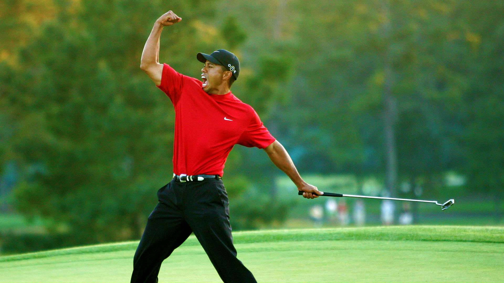
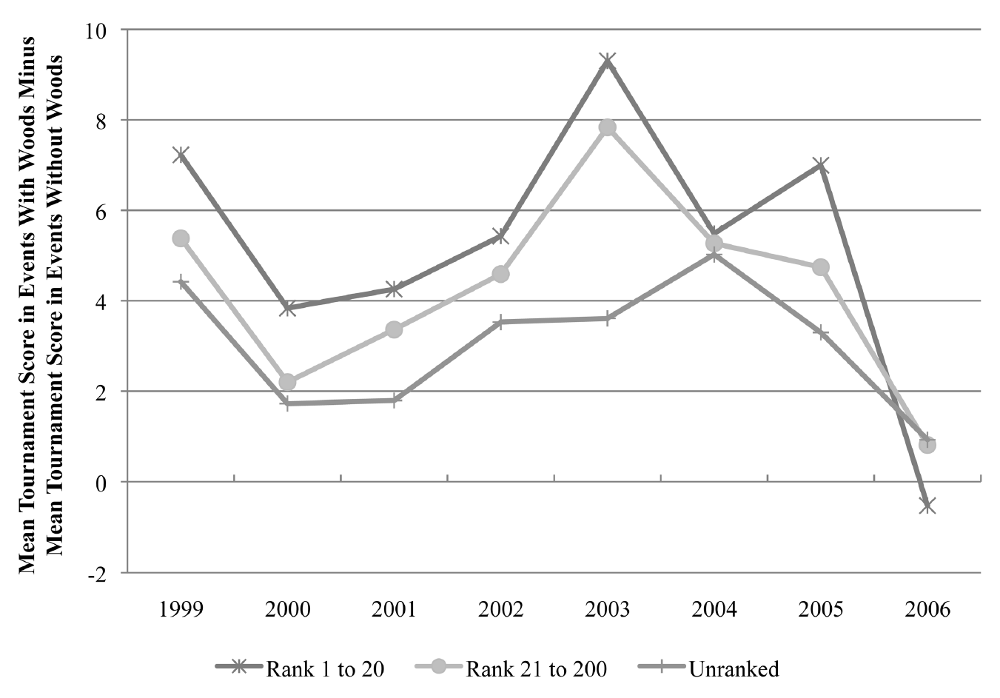
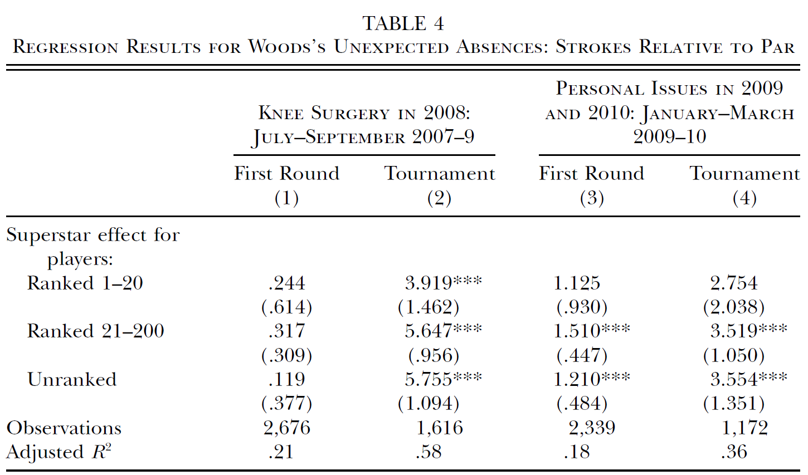

::: {.content-visible unless-format="revealjs"}
## Reading

This lecture covers material from:

- Chapter 1 Wooldridge
:::

:::: {.content-visible when-format="revealjs"}
## Why are you here?

::: incremental
- You chose to be here

  - You applied to St Andrews

  - You chose to major in Economics

  - Econometrics is a honours requirement

  - You registered for the module

  - You got up this morning to attend this lecture out of some combination of duty, peer pressure, enthusiasm, intrique, existential dread, etc.

  - $\Rightarrow$ **it's not my fault!**\
:::
::::

:::: {.content-visible when-format="revealjs"}
## Why you should return, in-person, next week

::: incremental
1.  "Econometrics is the most important module you will take in Economics" (Dr Neil Lloyd, 10 September 2026)

    - Is it an easy subject? **No!**
    - Can you still find it interesting and useful? **Yes!**

2.  Lecture attendance matters, but probably not for the reasons you think

    - The person who runs a marathon without training may finish, but will struggle to run another 2 weeks later.
    - Attending lectures is akin to following a well-paced training regimen
    - We teach you Econometrics so you can understand Applied Economics: Labour, Development, Trade, etc.

3.  I'll be here, I really like this subject, and it's no fun teaching it if you don't engage 😒
:::
::::

# Econometrics

## Econometrics? What is it?

> "Econometrics is based upon the development of statistical methods for estimating economic relationships, test economic theories, and evaluating and implementing government and business policy." (Wooldridge, 2025, pp. 2)

::: {.fragment .fade-in}
There are a few key elements here:

- statistical methods
- economic relationships
- testing theory
- policy evaluation
:::

## Purpose of Econometrics

Econometrics encompasses a set of tools used by Economists to empirically verify claims made about "the real world" (as observed in the **data**):

**Purpose 1:** Test economic theory.

::: {.fragment .fade-in}
e.g., **Efficiency wage theory:** paying workers in excess of their marginal product will increase effort/retention (reduce shirking).

**How would we test this theory?**

- Need data on worker wages and a measure of effort (?)
- Ideally, we want to compare similar workers, doing the same job, but being paid different wages.
:::

## 

The impact of economic policy is often theoretically ambiguous,

e.g., according to standard economic models, **minimum wages** should

- decrease in employment under perfect competition
- increase in employment under monopsony

:::: {.fragment .fade-in}
**Purpose 2:** Evaluate the impact of economic policy.

- Statistical significance: Can we reject a null (zero) effect?

- Sign: Do we find a positive or negative impact?

- Magnitude: How big was the effect (on average)? [^1]

[^1]: Linked to the idea of economic significant and used in cost-benefit analysis.

::: callout-note
Evidence on the impact of a policy can be a used as a (in)direct test of economic theory. For example, the literature on Minimum Wages - which broadly finds no disemployment effect - is cited as evidence of monopsony power in the labour market.
:::
::::

:::: {.content-visible unless-format="revealjs"}
::: {.callout-tip title="Reduced-form vs Structural Estimation" collapse="true"}
Econometrics also encompasses the estimation of structural economic models. For example, estimating the macroeconomic Real Business Cycle model. In this setting, the goal is to estimate the structural parameters of the model, which then allows you to do policy evaluation and/or counterfactual analysis.

This module will largely deal with the estimation of reduced-form models. These are models which focus on the relationship between economic variables, but do not necessarily identify structural parameters from an economic model.
:::
::::

## Data

A lot is going to depend on the nature of the data.

:::: {.fragment .fade-in}
::: incremental
1.  Cross-sectional data

    ::: nonincremental
    - Each observation represents a different unit (individual, firm, state, municipality,...), observed at the same period of time
    - e.g. [British Social Attitudes Survey](https://natcen.ac.uk/british-social-attitudes)
    - Notation: $y_{i}$
    :::

2.  Time series data

    ::: nonincremental
    - Each observation represents the same unit, observed over multiple periods of time
    - e.g. [UK CPI](https://www.ons.gov.uk/economy/inflationandpriceindices)
    - Notation: $y_{t}$
    :::
:::
::::

## 

More complex complex data can include both a cross-sectional and time dimension

:::: {.fragment .fade-in}
::: incremental
3.  Repeated/pooled cross-section data

    ::: nonincremental
    - A collection of multiple cross-sections
    - e.g. British Social Attitudes for 1983-2025
    - Notation: $y_{it}$
    :::

4.  Longitudinal/panel data

    ::: nonincremental
    - Multiple units (individual, firm, state) are observed over multiple periods of time
    - e.g. [UK Household Longitudinal Study](https://www.understandingsociety.ac.uk/) ("Understanding Society")
    - Notation: $y_{it}$
    :::
:::
::::

## DGP

Datasets vary in another important dimension: the *data generating process* (DGP)

:::: {.fragment .fade-in}
::: incremental
1.  Experimental data

    ::: nonincremental
    - Key variables are the outcome of a randomized experiment (i.e. probabilistic)
    - *Controlled* experiments: researcher determines the assignment mechanism
    - Field (i.e. RCTs) and lab experiments are increasingly common in Economics
    :::

2.  Observational (non-experimental) data

    ::: nonincremental
    - The true data generating process (or assignment mechanism) is unknown
    - Also referred to as retrospective data; e.g. surveys, administrative records, etc.
    :::

    ::: {.callout-important title="Natural Experiments"}
    *Natural* experiments occur when the assignment mechanism is outside the control of the researcher, but still creates the conditions of an experiment (i.e. treated and control). This assignment need not be random, but must be exogenous to factors relevant to the outcome. These are considered observational studies.
    :::
:::
::::


## Econometric analysis

```{mermaid}
%%| fig-width: 6
flowchart LR
  A[Data] --> B[Econometric model ]
  B --> C[Estimator]
  C --> E[Inference]
```

:::: {.fragment .fade-in}
- Inference will depend on the properties of the estimator

- The properties of the estimator will, in turn, depend on the assumptions of the model

- The assumptions of the model have to fit (within reason) the data generating process.

::: callout-note
This is a not a description of the research process, which typically begins with a research question and testable hypothesis. In reality, applied economic research questions are often constrained by the nature of the data and econometric model. This creates a feedback loop between the econometric analysis and research question. This is particularly the case in observational studies where the researcher does not know the data generating process (or control assignment in the experiment).
:::
::::

## Causal Inference

When testing economic theory or evaluating policy, it is important to be able to separate out causation from correlation. 

For example, to test efficiency wage theory

  $$
    E[e_i|w_i = high]-E[e_i|w_i = low]
  $$

:::: {.fragment .fade-in}
::: incremental
Experiments solve this problem through random assignment

  - Higher wages are paid to a random subset of workers.
  - In Lecture 5, we will discuss the Potential Outcomes Framework that underpins this theory. 
:::
::::

## Causal Inference

In observational studies, we can't rely on random assignment. Instead,

  - Control variables: adjust for confounding factors
  - Instruments: exploit exogenous sources of variation
  - Transformations: transform the model to remove sources of bias

## Ceteris Paribus

For example, to test efficiency wage theory, we might compare

  $$
    E[e_i|w_i = high,c]-E[e_i|w_i = low,c]
  $$  

where $c$ is a set of worker characteristics:

 - e.g. $c=\{education_i,age_i,gender_i,ethnicity_i\}$
 
Now the comparison is between two "similar" groups of workers.

:::{.callout-note title="Ceteris Paribus"}
A Latin phrase meaning "all other things being equal". A phrase that we use to infer causation from a comparison of similar, but not equal, groups. 
:::
 
 
# Example

## Brown (2011)

Paper: "Quitters Never Win: The (Adverse) Incentive Effects of Competing with Superstars"

Theory: "Superstar Effect": 

in tournaments,

  - with unequal distribution of talent,
  
  - may be optimal for less talented to "give up" (reduce effort) when competing against a more talented individual
  
## Data

> "Professional golf tournaments, where effort relates relatively directly to performance, present an opportunity to examine empirically the influence of a superstar." (pp. 983)

{fig-align="center"}

## Unconditional differences

{fig-align="center"}

But these are different tournaments with potentially different players!

## Econometric model

The author estimates a model that controls for certain player/event characteristics:

$$
\begin{aligned}
  strokes_{ij} =& \beta_1 star_j\times HRanked_i + \beta_2star_j\times LRranked_i \\
  &+ \beta_3star_j\times URanked_i + \alpha_1 HRanked_i + \alpha_2 LRranked_i \\
  &+ \gamma_0 + \gamma_1 X_i + \gamma_2 Y_j + \varepsilon_{ij}
  \end{aligned}
$$

where

- HRanked = top 20; LRranked = 21-200; URanked = unranked
- $X_i$: player characteristics
- $Y_j$: event controls (major dummy, weather, purse, field quality, viewership)


## Estimation & Inference

{fig-align="center"}

# EC3301 Housekeeping

## Syllabus

| Week | Topic                                                  |
|------|--------------------------------------------------------|
| 1    | Linear regression model                                |
| 2    | Ordinary least squares                                 |
| 3    | Properties of OLS and inference                        |
| 4    | Hypothesis testing and heteroskedasticity (recorded)   |
| 5    | Large sample properties of OLS                         |
| 6    | 🎉 Independent Learning Week 🎉                        |
| 7    | Dummy variables and potential outcomes framework       |
| 8    | Model misspecfication and omitted variables            |
| 9    | Proxy variables and instrumental variables             |
| 10   | Estimation with instrumental variables (recorded)      |
| 11   | Simple panel data models and difference in differences |

## Key dates

- Week 4: Class Test 1
  - 50 minutes, 25% weight
  - Covering Lectures 1-3
- Week 10: Class Test 2
  - 50 minutes, 25% weight
  - Covering Lectures 1-9 (with emphasis on 4-8)
- Week : Project
  - Individual, 50% weight
  - Due

## Support

- Econometric Labs
  
  - 5x 2 hours
  - Weeks 2,4,8,9,10 
  
- Tutorials

  - 4x 1 hour
  - Weeks 3,5,7,11
  
- Textbook

  - Wooldridge (2025) *Introductory Econometrics: A Modern Approach*, Eighth Edition, Cengage International Edition
  
- Office Hours

  - Fridays: 12-2pm, G5 Castlecliffe
  - No reservations required

## Overview

| Week | Lecture              | Classes       | Assessment   |
|------|----------------------|---------------|--------------|
| 1    | Lecture 1            |               |              |
| 2    | Lecture 2            | Lab 1         |              |
| 3    | Lecture 3            | Tutorial 1    |              |
| 4    | Lecture 4 (recorded) | Lab 2         | Class Test 1 |
| 5    | Lecture 5            | Tutorial 2    |              |
| 6    | 🎉                   | 🎉            | 🎉           |
| 7    | Lecture 6            | Tutorial 3    |              |
| 8    | Lecture 7            | Lab 3         |              |
| 9    | Lecture 8            | Lab 4         |              |
| 10   | Lecture 9 (recorded) | Lab 5         | Class Test 2 |
| 11   | Lecture 10           | Tutorial 4    |              |

## Contact

Email: neil.lloyd\@st-andrews.ac.uk

Office: G5 Castlecliffe

Moodle Forum: *Please use the Moodle forums ask questions about specific topics or the module in general.* 

:::{.callout-warning title="MS Teams"}
Please do not contact me directly via MS Teams. Use email or the Moodle forums. 
:::

# Questions?


