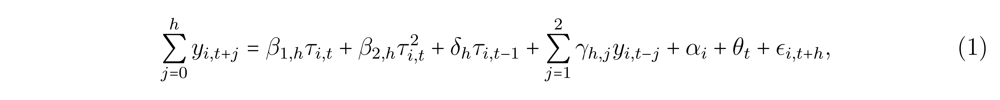
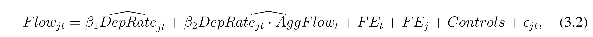
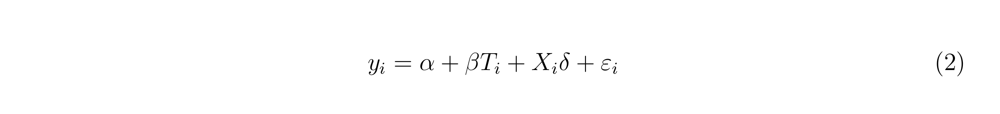
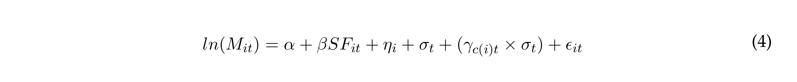
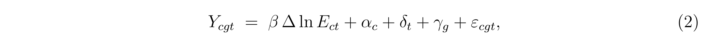
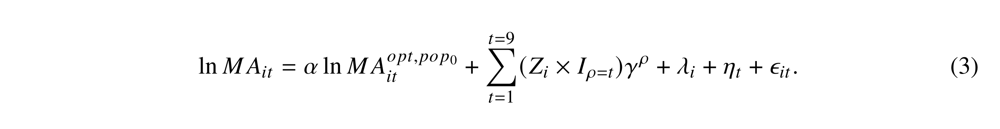

---
# GENERATED BY _prerender.py FROM lecture-1-multi.qmd - DO NOT EDIT
title: The Linear Regression Model
subtitle: "Lecture 1 (Stata code)"
format:
  pdf:
    toc: true
    output-file: lecture-1-notes-Stata.pdf
engine: knitr
multi-lang: stata
lang-stata: true
---
```{r}
#| include: false
#| cache: false

library(Statamarkdown)
knitr::opts_chunk$set(collectcode = TRUE)
```

::: {.content-visible unless-format="revealjs"}
## Reading

This lecture covers material from @wooldridge2025:

- Chapter 2.1 - "Definition of the Simple Regression Model"
- Chapter 2.7* - "Regression on a Binary Explanatory Variable"
- Chapter 3.1 - "Motivation for Multiple Regression"

*We will cover the Potential Outcomes Framework (Ch. 2.7a - "Counterfactual (or Potential) Outcomes, Causality, and Policy Analysis") in Week 7. For now, it is only important to know the interpretation of a regression on a binary ("dummy") variable.
:::

:::::{.content-visible when-format="revealjs"}
## 2 💊's, 1 medicine

:::: columns
::: {.column width="50%"}
🟦 [Wooldridge]{style="color:#00539b;"} 💊

1. Simple Linear Model

2. Ordinary Least Squares

3. Properties of OLS

4. Multivariate Model

5. Inference
:::

::: {.column width="50%"}
🔴 [Neil]{style="color:#c60c46;"} 💊

1. Linear Regression Model

2. Classical Linear Regression Model
   - Simple vs multivariate case
   
3. Ordinary Least Squares
   - Simple vs multivariate case

4. Properties of OLS

5. Inference
:::
::::
Over the next 3 lectures will cover most of Chapters 2-4 from Wooldridge. 
:::::


:::{.content-visible when-format="revealjs"}
## Today

Today we take the "May Dip" (shock therapy) approach

1. Straight in the deep end (cold plunge)

2. Come up for air

3. Swim to the shallows

4. Reflect on our (joint) trauma
:::


## Linear Regression Model

General form:

$$
  y = \beta_0 + \beta_1x_{1} + \beta_2x_{2}+\dots + \beta_kx_{k} + u
$$

 

## Component \#1: Data

$$
  \textcolor{red}{y} = \beta_0 + \beta_1\textcolor{red}{x_{1}} + \beta_2\textcolor{red}{x_{2}}+\dots + \beta_k\textcolor{red}{x_{k}} + u
$$
The **observable** variables in the model are,

- $y$: the outcome (dependent) variable,

- $x_{1},x_{2},\dots,x_{k}$: the $k$ regressors (independent variables).[^1]

[^1]: There are other words given to the righthand-side variables; including "control variables" and "covariates". These terms have a particular meaning which will become clearer at a later stage.


## Component \#2: Parameters

$$
  y = \textcolor{red}{\beta_0} + \textcolor{red}{\beta_1}x_{1} + \textcolor{red}{\beta_2}x_{2}+\dots + \textcolor{red}{\beta_k}x_{k} + u
$$
The relationship between the outcome and regressors is explained by set of *non-random* population parameters:

- $\beta_1, \beta_2, ..., \beta_k$ are often referred to as "slope coefficients",

- $\beta_0$ is the "intercept". 

:::{.callout-important title="Linear in Parameters"}
The model is referred to as the *linear* regression model because it is linear in parameters, NOT because it is linear in regressors. The $x_j$ are generic placeholder names. Consider, $x_{2}= x_{1}^2$, the model would be non-linear in $x_{1}$. However, it would remain linear in parameters. 
:::

## Component \#3: Error

$$
  y = \beta_0 + \beta_1x_{1} + \beta_2x_{2}+ \dots + \beta_kx_{k} + \textcolor{red}{u}
$$

The error term represents the part of $y$ that is NOT explained by the *regression function*.[^2]

[^2]: It is inaccurate to say "NOT explained by the regressors", as the the error term may contain non-linear functions of the regressors. 

::: {.fragment .fade-in}
In Econometrics, a lot of time is spent thinking about the error term:

- Theoretically, we will want to assume that it can be 'ignored'

- Practically, this often too strong an assumption to make. 
:::
 
## Vector notation

When reading papers, you will frequently see the following notation:

$$
  y = \mathbf{x}\beta + u
$$

**What's going on here?** The variables have been collected as vectors:

$$
  y = \underbrace{\begin{bmatrix} 1 & x_{1} & x_{2} & \dots &x_{k}\end{bmatrix}}_{\mathbf{x}}\underbrace{\begin{bmatrix} \beta_0 \\ \beta_1 \\ \beta_2 \\ \vdots \\ \beta_{ik} \end{bmatrix}}_\beta  + u
$$

When written in vector notation $\mathbf{x}$ always precedes $\beta$, as $\beta\mathbf{x}\neq \mathbf{x}\beta$.

::::{.content-visible unless-format="revealjs"}
:::{.callout-tip title="Vector notation differences" collapse=true}

Wooldridge defines $\mathbf{x}$ as a row vector, but $\beta$ as a column vector. Many texts define both as column vectors and will therefore express the linear population regression function as,

$$
  y = \mathbf{x}'\beta + u
$$

:::
::::

## Sample

When we have a sample of observations, $i=1,\dots,n$, we use the notation:

$$
  y_i = \beta_0 + \beta_1x_{i1} + \beta_2x_{i2}+\dots + \beta_kx_{ik} + u_i
$$

We will need to make further assumptions about sampling,

- do observations relate to one another?
- are they derived from the same population model?

:::{.callout-note title="Unit of Analysis"}
An often overlooked feature of the model is the unit of analysis. In the model, the subscript $i$ represents the unit at which the data is observed. For example, one model may represent data at the individual level, while another captures firm-level data. When each observation represents the same unit observed across different time periods, we usually use the notation $t$: $\{y_t,\mathbf{x}_t\}:\;t=1,\dots,T$. In panel or repeated cross-section datasets, the data is observed at two levels: $i$ and $t$.
:::

# How did we get here?

::: {.content-visible unless-format="revealjs"}
Let's take a step back and ask how we got here. Where does the Linear Population Regression Function come from? This is actually not an easy question to answer and there is more than one way to arrive at a model of this form. 
:::

## Approach \#1: DGP 

The model represents the true **data generating process** at the population level $\Rightarrow$

- if we know the population parameters 

- AND the joint distribution of the regressors and error term 

we can generate data in a manner akin to sampling from the population distribution.

e.g. 

$$
\begin{aligned}
&y_i = \beta_0 + \beta_1 x_{i} + u_i \\
\text{with}\;&\beta_0=0.5,\; \beta_1=0.6,\; x_{i}\sim U(0,1),\; u_i \sim N(0, 0.6^2)
\end{aligned}
$$

:::{.callout-note title="Population"}
When econometricians uses the word 'population', they are not referring to an enumerable collection of units, as in a census. They mean a probability distribution — the joint distribution over the random variables of interest, from which the observed sample is drawn. As we shall shortly see, the population parameters are defined in terms of the joint distribution of the random variables. 
:::

::::{.content-visible unless-format="revealjs"}
:::{.callout-tip title="Finite vs Super Population" collapse=true }
In design-based causal inference methods, a distinction is made bewteen the 'finite' and 'super' populations. The above description of the population fits the super-population approach: each sample is a draw from a theoretically infinite super-population. This sampling uncertainty is key to understanding the properties of the estimator. In the finite-population approach, the sample is treated as the population and uncertainty arises *only* from random assignment in an experiment.
:::
::::

## {.scrollable}

```{stata}
#| echo: true
#| code-fold: true
#| output: false

* Set seed
set seed 9871

* Parameters
scalar b0 = 0.5
scalar b1 = 0.6
scalar sd_norm = 0.6

set obs 100

* Variables
generate x = runiform()
generate error = rnormal(0,scalar(sd_norm))
generate y = scalar(b0) + scalar(b1)*x + error

* Plot
twoway (scatter y x) (function y = scalar(b0)+scalar(b1)*x, lcolor(red)), legend(off)
```

```{stata}
#| echo: false
#| output: false
graph export "material/lecture-1/dgp.png", replace
```
{fig-align="center" width=67%}


Econometricians use such approaches to study the properties of estimators. It is often referred to as a Monte Carlo simulation. Given that you know the true value of the population parameters, you can examine how well the estimator performs across multiple simulations. 


## Approach \#2: Prediction

Suppose you want to predict $y$ using information from a set of variables $\mathbf{x}=[x_1,x_2,\dots,x_k]$. The 'best' predictor of $y$ is the conditional expectation (function; CEF)

$$
  E[y | \mathbf{x}] = m(\mathbf{x})
$$

Where the CEF is a function of $\mathbf{x}$.[^3]

[^3]: Referred to as the population regression function.

::: {.fragment .fade-in}
This is the starting point for Data Science. 

- 'Fancier' methods like Lasso, Random Forests, and Neural Networks are simply newer methods to estimate $m(\mathbf{x})$. They have core advantages over linear regression models that relate specifically to 'big' data.
:::

::::{.content-visible unless-format="revealjs"}
:::{.callout-tip title="Best? Big?" collapse="true" }

What do we mean by *best* predictor? This is a very specific use of the word 'best'. The CEF is the best mean-squared error predictor of $y$. You can find more on this in the [additional material on the CEF](material-cef.qmd). 

'Big' data also has a very specific meaning. It does not concern the absolute size (i.e. number of observations $n$) of the dataset, but rather the number of regressors/predictors ($k$) relative to observations ($n$). 'Big' data is used to describe settings where you have more regressors than observations. 
:::
::::

##

It turns out that you can write (see [CEF Material](material-cef.qmd)), 

$$
  y = m(\mathbf{x}) + u
$$

where $u$ has the nice property $E[u| \mathbf{x}] = 0$. 

::: {.fragment .fade-in}
If you **assume** that $m(\mathbf{x})$ is linear (in parameters), then the best predictor of $y$ is

$$
  E[y | \mathbf{x}] = \beta_0 + \beta_1x_{1} + \beta_2x_{2}+\dots + \beta_kx_{k} 
$$

and,

$$
  y = \beta_0 + \beta_1x_{1} + \beta_2x_{2}+\dots + \beta_kx_{k} + u
$$

:::

:::{.callout-note title="Population Regression Function"}
The function $m(\mathbf{x})$ is called the population regression function and $\mathbf{x}\beta$ is referred to as the linear population regression function (or linear projection). It may be that $m(\mathbf{x})=\mathbf{x}\beta$.
:::

## Approach \#3: Economics

The traditional approach to Econometrics is rooted in the formal economic modelling. A famous example is the Solow Growth model:

**Step 1:** Specify production function 

Popular choice is Cobb-Douglas

$$
  Y_t = A_tK_t^\alpha L_t^{1-\alpha}
$$

::: {.fragment .fade-in}
**Step 2:** Express in terms of per-worker variables:

$$
  y_t = A_tk_t^\alpha
$$

where $y_t=Y_t/L_t$ and $k_t=K_t/L_t$. 
:::

##

**Step 3:** Log linearize

$$
  \ln y_t = \ln A_t + \alpha \ln k_t
$$
Now we have a linear model with a slope parameter $\alpha$ - the parameter of interest. 

::: {.fragment .fade-in}
**BUT** we have a problem:

1. $A_t$ - which represents TFP - is not observed in the data

2. There is no error term! The model is deterministic.
:::

::::{.content-visible unless-format="revealjs"}
:::{.callout-tip title="Missing error term" collapse=true}
Regression models have inherent uncertainty: the error term. Because of the error term, the realized value of $y$ need not match the value predicted by the population regression function (e.g. $\mathbf{x}\beta$). However, many economic models have no inherent uncertainty. And when they do, this uncertainty may be of a different form to that observed in real economic variables. Indeed, this issue of 'missing error term' is a very old problem in Economics. 

As @morgan1992history describes, economists were initially resistant to the adoption statistical methods. The hesitancy to consider these methodologies was down to a belief that the 'laws' studied by economists acted like laws of nature. That is, they could be directly measured, just as you would measure gravitational force. The was therefore no inherent uncertainty in the model. Indeed, early attempts to rationalize uncertainty in economic data often turned to measurement error. The model didn't fit the data perfectly because the variables were measured with error. 
:::
::::

## 

**Step 4:** Make an assumption

Assume that TFP follows a particular time-series process (i.e. DGP):[^4]

[^4]: If you are keen to learn more about these approaches you should consider taking [EC4437](https://www.st-andrews.ac.uk/subjects/modules/catalogue/?meta_semester_sand=2&meta_modulecode=EC4437&meta_ayrs_sand=2026%2F7) *Applied Macroeconomics*.

$$
  \ln A_t = \ln A_0 +gt+u_t
$$

where $gt$ is a deterministic trend and $u_t$ a stochastic shock. 

::: {.fragment .fade-in}
**NOW** we have a model of the form

$$
  \ln y_t = \ln A_0 + gt + \alpha \ln k_t+u_t
$$

which we can rewrite as a linear regression model with 3 unknown parameters:

$$
  \ln y_t = \beta_0 + \beta_1t + \beta_2 \ln k_t + u_t
$$

:::

::::{.content-visible unless-format="revealjs"}
:::{.callout-tip title="Mankiw, Romer \& Weil (1992)" collapse=true}
The above equation is a time-series regression model that requires rather strong assumptions. @mankiw1992contribution derives a more complete approach, based on a model with inherent uncertainty. The paper uses a linear approximation of dynamics around the steady state and derives an equation which can be estimated using a cross-section of country-level data. This approach is discussed by Prof. Daron Acemoglu in his comprehensive [lecture notes](https://economics.mit.edu/sites/default/files/inline-files/Economic%20Growth%20Lectures%202%20and%203%202025_0.pdf). 
:::
::::

## Approach \#4: Causal Inference

A more modern approach, popularized by applied microeconomists, is not rooted in formal economic modelling. Instead, it focuses on a set of research designs (methodologies) that target the causal relationship between two variables. These are often taught as *Microeconometrics*.[^5]

[^5]: If you are keen to learn more about these approaches you should consider taking [EC4425](https://www.st-andrews.ac.uk/subjects/modules/catalogue/?meta_semester_sand=2&meta_modulecode=EC4425&meta_ayrs_sand=2026%2F7) *Econometrics of Impact Evaluation*.

::::{.content-visible unless-format="revealjs"}
:::{.callout-tip title="Microeconometrics" collapse=true}
Microeconometrics focuses on the identification and estimation of causal relationships. It builds on the Neyman-Rubin Causal Model which includes the Potential Outcomes Framework. Related to this field are literatures on randomized experiments, causal inference, treatment effects, and policy evaluation. And these methods are prolific across applied microeconomics fields; including, Labour, Health, Education, Development, Public Policy, etc. 

If you are interested in these topics, you should consider reading:

1. @angrist2014mastering *Mastering 'Metrics* (good introduction)
2. @angrist2009mostly *Mostly Harmless Econometrics* (more advanced notation)
3. @cunningham2021causal *Causal Inference: The Mixtape* (up to date and available [online](https://mixtape.scunning.com/))

:::
::::

For example,  

$$
  \text{Marginal Tax Rate} \rightarrow \text{Labour Supply}
$$

::: {.fragment .fade-in}
A researcher might choose to estimate this relationship within a linear regression model framework, by specifying the *estimating equation*:

$$
  hrswrk_i = \beta_0 + \beta_1 \text{MTR}_i + u_i
$$

The *estimate* of $\beta_1$ tells us about how a change in $MTR$ affects $hrswrk$ in the data. 
:::

##

**BUT** if we were to estimate this relationship in the data, do we really think it will tell us something causal? Consider:

- those who face a higher marginal tax rate do so because they earn more;

- and those with higher income might be people with higher education;

- ..., etc.

::: {.fragment .fade-in}
Can we account for these differences in the model?

$$
  hrswrk_i = \beta_0 + \beta_1 MTR_i + \beta_2 income_i + \beta_3 yrsedu_i + u_i
$$

This is where we get into the idea of adding additional regressors as "control" variables. 
:::

# Classical Linear Regression Model

::::{.content-visible unless-format="revealjs"}
What constitutes a model? In some sense, a model is just a collection of assumptions. Here are the assumptions that govern the CLRM. Some of them will be more relevant once we discuss the estimation of the CLRM. We will follow Wooldridge's notation of labelling these MLR. 1-6. In Chapter 2, Wooldridge defines SLR. 1-6. These are a special case of MLR. 1-6 for a model with a simple linear model (i.e. single regressor and intercept).

:::{.callout-caution title="Alternatives"}
Please be aware that there alternative ways to specify the CLRM assumptions. One noteable variant, found in a number of texts (and websites), considers the case of non-random regressors. That is, the value of regressors does not change with sampling.
:::
::::

## MLR \#1

These assumptions have the abbreviation MLR for Multiple Linear Regression.

> **MLR-1: Linear in parameters** 
>
> The population model is given by,
>  
> $$
>   y = \beta_0 + \beta_1x_{1} + \beta_2x_{2}+\dots + \beta_kx_{k} + u
> $$

It may seem obvious, but it is nonetheless an assumption that the model is **correctly specified** as linear in parameters.

## MLR \#2

> **MLR-2: Random sampling** 
>
> Random sample of $n$ observations, $\{\mathbf{x}_i,y_i\}:\; i=1,\dots,n$, drawn from the population model

Random sampling is sometimes referred to as *independently and identically distributed* (iid). 

- The 'identically distributed' part can be relaxed (i.e. error variance)

::: {.fragment .fade-in}
Together with MLR-1, it gives us 

$$
   y_i = \beta_0 + \beta_1x_{i1} + \beta_2x_{i2}+\dots + \beta_kx_{ik} + u_i\qquad i=1,\dots,n
$$

- Needed for Law of Large Numbers and Central Limit Theorem
- Sampling is the primary source of uncertainty the model.
:::

## MLR \#3

> **MLR-3: No perfect collinearity** 
>
> No *exact* linear relationship among regressors (including the constant). 

This assumption is key for *identification*. It ensures that each parameter is uniquely identified. 

## Example

Consider a regression of hours-worked against temperature, measured in both $F^\circ$ and $C^\circ$, 

$$
  hrswrk_i = \beta_0 + \beta_1 tempC_i + \beta_2 tempF_i + u_i
$$

The model has 3 parameters. 

##


BUT there is a linear formula that links temperature in $F^\circ\Rightarrow C^\circ$:  $F^\circ = 9/5\cdot C^\circ+32$. 

- Plug this into the equation:

$$
  \begin{aligned}
    hrswrk_i=& \beta_0 + \beta_1 tempC_i + \beta_2 (9/5 \cdot tempF_i + 32) + u_i \\
            =& (\beta_0 + \beta_2 \cdot 32) + (\beta_1 + \beta_2 \cdot 9/5) tempC_i + u_i \\
            =& \gamma_0 + \gamma_1 tempC_i + u_i \\
  \end{aligned}
$$

The model has 2 parameters now. 

- The third was not identified because the variable $tempF_i$ is perfectly collinear with $tempC_i$ and the constant in the model.


## MLR \#4

> **MLR-4: Zero conditional mean** 
>
> The error term has expected value of 0 given the any value of the explanatory variables
>  
> $$
>    E[u | \mathbf{x}] = 0
> $$

::: {.fragment .fade-in}  
With random sampling, then MLR-4 $\Rightarrow E[u_i | \mathbf{x}_i]$ for $i=1,\dots,n$. 

- weaker than full independence: $u\perp \mathbf{x}$; 

- but stronger than uncorrelatedness: $Cov(\mathbf{x}, u) = 0$
:::

##

We can also show the following:

1. MLR-4 implies that the unconditional mean of the error term is 0 (Law of Iterated Expectations; see [CEF notes](material-cef.qmd)). 

$$
  E[u | \mathbf{x}] = 0 \Rightarrow E[u] = 0
$$

2. MLR-4 implies the error term is uncorrelated with all regressors

$$
  E[u | \mathbf{x}] = 0 \Rightarrow E[ux_{j}]=Cov(u, x_{j}) = 0\quad j=1,2,\dots,k
$$

##

3. MLR-4 implies that we can *treat* $\mathbf{x}$ as fixed across repeated samples (even if they are not; i.e. also random variables). 

   - If $x$ is fixed, there is only source of uncertainty: $u$. 
   - Allows us to treat $x$ as non-random in derivations; e.g. variance of estimator.
   
## MLR \#5

> **MLR-5: Homoskedasticity** 
>
> The variance of the error term is the same given any value of $\mathbf{x}$. 
>  
> $$
>   Var(u|\mathbf{x}) = \sigma^2
> $$

::: {.fragment .fade-in}
With random sampling, then MLR-5 $\Rightarrow Var(u_i|\mathbf{x}_i) = \sigma^2$ for $i=1,\dots,n$. 

- Needed to define the variance of the estimator

- Needed for the famous BLUE property of OLS (Gauss Markov Theorem)

- It can be relaxed; such errors are referred to as heteroskedastic
:::

## MLR \#6

> **MLR-6: Normality** 
>  
> The conditional distribution of the error term is normal.
>  
> $$
>   u|\mathbf{x}\sim N(0,\sigma^2)
> $$

::: {.fragment .fade-in}
- Needed to know the *finite* distribution of the estimator

- Can be relaxed, but then only asymptotic distribution is known 
:::

# Simple case

## SLR model

Let's consider the simplest case: a bivariate regression model

$$
  y_i = \beta_0 + \beta_1 x_i + u_i
$$

Under MLR. 1-4 (or Wooldridge's SLR. 1-4):

$$
  \begin{aligned}
    E[y_i | x_i] =& E[\beta_0 + \beta_1 x_i + u_i | x_i] \\
    =& E[\beta_0 | x_i] + E[\beta_1 x_i | x_i] + E[u_i | x_i] \\
    =& \beta_0 + \beta_1 x_i + E[u_i | x_i] \\
    =& \beta_0 + \beta_1 x_i
  \end{aligned}
$$

## Identification

Recall, under MLR-4

1. $E[u_i]=0$
2. $E[u_i x_i]=0$

We can use these two moments to demonstrate the identification of $\beta_0$ and $\beta_1$.

##

**Step 1**: Substitute $u_i = y_i - \beta_0 -\beta_1x_i$ into (1)

$$
  0 = E[u_i] = E[y_i - \beta_0 - \beta_1x_i]\Rightarrow \beta_0 = E[y_i]-\beta_1 E[x_i]
$$


**Step 2**: Substitute $u_i = y_i - \beta_0 -\beta_1x_i$ into (2)

$$
  0 = E[u_i x_i]=E[(y_i - \beta_0 -\beta_1x_i) x_i] = E[y_ix_i]-\beta_0 E[x_i]-\beta_1 E[x_i^2]
$$

**Step 3**: Substitute the solution for $\beta_0$


$$
  0 = E[y_ix_i]-\beta_0E[x_i]-\beta_1E[x_i^2] = E[y_ix_i] - (E[y_i]-\beta_1 E[x_i])E[x_i] - \beta_1 E[x_i^2]
$$

## 

Manipulate and solve

$$
  0 = \underbrace{E[y_ix_i]-E[y_i]E[x_i]}_{Cov(y_i,x_i)}-\beta_1(\underbrace{E[x_i^2]-E[x_i]^2}_{Var(x_i)})
$$

Arrive at the neat solution:

$$
  \beta_1 = \frac{Cov(y_i,x_i)}{Var(x_i)}
$$
and,

$$
  \beta_0 = E[y_i] - \beta_1 E[x_i]
$$

Both population parameters can be written as expressions of "observable" moments in the data. In this sense, they are *identified*. 

## 

Let's plot $E[y | x]=0.5 + 0.6 x$, the (linear) population regression function.

```{r}
#| echo: false
#| warning: false
#| fig-align: center

# Parameters
n   <- 100
b0 <- 0.5
b1 <- 0.6
sd_norm <- 0.6

# Points on line
x_vals <- c(2, 4, 6)
y_vals <- b0 + b1*x_vals

# Conditional mean points
mean_points <- data.frame(
  x = x_vals,
  y = b0 + b1 * x_vals,
  label = c("E(y~'|'~x[1])==beta[0]+beta[1]*x[1]",
            "E(y~'|'~x[2])==beta[0]+beta[1]*x[2]",
            "E(y~'|'~x[3])==beta[0]+beta[1]*x[3]")
)

# Regression line
line_df <- data.frame(x = c(0.5, 8))
line_df$y <- b0 + b1 * line_df$x

# Plot
ggplot() +
  # Regression line
  geom_line(data = line_df, aes(x = x, y = y),
            color = "blue", linewidth = 1) +
  # Points on the regression line
  geom_point(data = mean_points, aes(x = x, y = y),
             color = "red", size = 3) +
  # Labels for each point
  geom_text(data = mean_points,
            aes(x = x, y = y, label = label),
            parse = TRUE,
            hjust = -0.1, vjust = 0.5, size = 3.5) +
  # x-axis tick labels
  scale_x_continuous(
    breaks = x_vals,
    labels = c("x[1]=2", "x[2]=4", "x[3]=6"),
    limits = c(0.5, 8)
    ) +
  # y-axis tick labels
  scale_y_continuous(
    breaks = y_vals,
    labels = c("y[1]=1.7", "y[2]=2.9", "y[3]=4.1"),
    limits = c(-0.5, 6)
    ) +
  labs(x = "x", y = "y") +
  theme_classic() +
  theme(
    axis.title = element_text(size = 13, face = "italic")
  )
```

##

Around the $E[y_i|x_i]$, the error term is normaly distributed: $u_i\sim N(0,0.6^2)$

```{r}
#| echo: false
#| warning: false
#| fig-align: center

# Normal distributions
normal_curve_vertical <- function(x_center) {
  y_mid <- b0 + b1 * x_center
  y_seq <- seq(y_mid - 2, y_mid + 2, length.out = 300)
  density_vals <- dnorm(y_seq, mean = y_mid, sd = sd_norm)
  scale_factor <- 0.8
  data.frame(
    x = x_center + density_vals * scale_factor,
    y = y_seq,
    group = as.character(x_center)
  )
}

curves_df <- do.call(rbind, lapply(x_vals, normal_curve_vertical))

# Plot
ggplot() +
  # Regression line
  geom_line(data = line_df, aes(x = x, y = y), color = "blue", linewidth = 1) +
  # Normal distribution curves (rotated)
  geom_path(data = curves_df, aes(x = x, y = y, group = group),
            color = "darkgreen", linewidth = 0.9) +
  # Points on the regression line
  geom_point(data = mean_points, aes(x = x, y = y),
             color = "red", size = 3) +
  # x-axis tick labels
  scale_x_continuous(
    breaks = x_vals,
    labels = c("x[1]=2", "x[2]=4", "x[3]=6"),
    limits = c(0.5, 8)
  ) +
  # y-axis tick labels
  scale_y_continuous(
    breaks = y_vals,
    labels = c("y[1]=1.7", "y[2]=2.9", "y[3]=4.1"),
    limits = c(-0.5, 6)
  ) +
  # Annotation
  annotate("text", x = 6.2, y = b0 + b1 * 5.5,
           label = "E(y~'|'~x[1]) == beta[0] + beta[1]*x",
           parse = TRUE, hjust = 0, size = 4) +
  labs(x = expression(x[i]), y = "y") +
  theme_classic() +
  theme(
    axis.title = element_text(size = 13, face = "italic")
  )
```

##

This is what it would look like if you sampled $n=50$ errors for $x$ from that distribution. 

```{r}
#| echo: false
#| warning: false
#| fig-align: center

# Parameters
n_per_x <- 150

# Sample data from the model
set.seed(42)
sampled_data <- data.frame(
  x = rep(x_vals, each = n_per_x),
  y = rep(b0 + b1 * x_vals, each = n_per_x) + rnorm(n_per_x * length(x_vals), mean = 0, sd = sd_norm)
)

# Plot
ggplot() +
  # Sampled points (translucent so overlaps darken)
  geom_point(data = sampled_data, aes(x = x, y = y),
             color = "darkgreen", alpha = 0.15, size = 2) +
  # Regression line
  geom_line(data = line_df, aes(x = x, y = y),
            color = "blue", linewidth = 1) +
  # Conditional mean points
  geom_point(data = mean_points, aes(x = x, y = y),
             color = "red", size = 3) +
  # Labels
  geom_text(data = mean_points,
            aes(x = x, y = y, label = label),
            parse = TRUE,
            hjust = -0.1, vjust = 0.5, size = 3.5) +
  # x-axis tick labels
  scale_x_continuous(
    breaks = x_vals,
    labels = c("x[1]=2", "x[2]=4", "x[3]=6"),
    limits = c(0.5, 8)
  ) +
  # y-axis tick labels
  scale_y_continuous(
    breaks = y_vals,
    labels = c("y[1]=1.7", "y[2]=2.9", "y[3]=4.1"),
    limits = c(-0.5, 6)
  ) +
  labs(x = expression(x[i]), y = "y") +
  theme_classic() +
  theme(
    axis.title = element_text(size = 13, face = "italic")
  )
```

For a given $x$, more of the observations will be concentrated around the *conditional* mean. 

## Interpretation: Continuous regressor

This then gives us a clear interpretation of $\beta_0$ and $\beta_1$

$$
  \begin{aligned}
    \beta_0 =& E[y_i | x_i=0] \\
    \beta_1 =& \frac{dE[y_i | x_i]}{dx_i}
  \end{aligned}
$$

:::: {.fragment .fade-in}
Note, $\beta_0$ may not have a "realistic" interpretation. 

- e.g., if $y$ is level of exports (to US) and $x$ is USD exchange rate of country $i$. 

:::{.callout-warning}
The interpretation of $\beta_1$ as a derivative assumes that $x_i$ is a continuous variable. 
:::
::::

##

Why not? 

$$
  \beta_1 = \frac{dy_i}{dx_i}
$$

::: {.fragment .fade-in}

- Without MLR. 1-4 (zero condition mean), we can't rule out a relationship bewteen $u$ and $x$
  - e.g., $u$ could include powers of $x$: $u_i= \beta_2 x_i^2 + v_i$
- With MLR. 1-4, $E[y_i|x_i] = \beta_0 + \beta_1 x_i$ (i.e. the population regression function)

:::


## Interpretation: Binary regressor

What if $x\in\{0,1\}$?

- We cannot differentiate $E[y_i|x_i]$. 

::: {.fragment .fade-in}
**Solution**: difference

$$
  \begin{aligned}
  E[y_i|x_i=\textcolor{blue}{0}] =& \beta_0 + \beta_1\times \textcolor{blue}{0} = \beta_0 \\
  E[y_i|x_i=\textcolor{red}{1}] =& \beta_0 + \beta_1\times \textcolor{red}{1} = \beta_0 + \beta_1 \\
  &\\
  \Rightarrow \beta_1 =& E[y_i|x_i=\textcolor{red}{1}]-E[y_i|x_i=\textcolor{blue}{0}]
  \end{aligned}
$$

:::

# Multivariate case

## MLR model

In the multivariate case we have models of the form ($k=3$),

$$
  y_i = \beta_0 + \beta_1 x_{i1} + \beta_2x_{i2}+\beta_3 x_{i3} + u_i
$$

As with the SLR case, under MLR 1-4:

$$
  E[y_i|\mathbf{x}_i] = \beta_0 + \beta_1 x_{i1} + \beta_2 x_{i2} + \beta_3 x_{i3}
$$

## Interpretation: Continuous regressor (linear)

**Suppose**, the linear population regression function is *also* linear in $x$.[^6]

[^6]: And additively separable, which rules out interactions between variables.

We can now think of each slope coefficient as 

$$
  \beta_j = \frac{\partial E[y_i | \mathbf{x}_i]}{\partial x_{ij}} \quad j=1,2,3
$$

::: {.fragment .fade-in}
This is a *partial derivative*. 

- Change in the conditional mean of $y$ for a 1 unit change in regressor $x_j$, **holding $x_2$ and $x_3$ fixed**

- Why additional regressors in a model are referred to as "control variables"; their presence changes the interpretation of the slope coefficient. 

:::

## Differential

The mean of the outcome will change in the following manner with the regressors:

$$
  \Delta E[y_i|\mathbf{x}_i] = \frac{\partial E[y_i | \mathbf{x}_i]}{\partial x_{i1}} \Delta x_{i1} + \frac{\partial E[y_i | \mathbf{x}_i]}{\partial x_{i2}} \Delta x_{i2} + \frac{\partial E[y_i | \mathbf{x}_i]}{\partial x_{i3}} \Delta x_{i3}
$$

So, if you ask what is the change in (expected value of y) from a $10$-unit change in $x_{1}$:

$$
  \Delta E[y_i|\mathbf{x}_i] = \beta_1 \times 10
$$

## Interpretation: Continuous regressor (polynomial)

**Suppose**, the *linear* population regression function includes higher-order polynomials of some $x$'s.[^7]

[^7]: And additively separable, which rules out interactions between variables.

$$
  E[y_i|\mathbf{x}_i] = \beta_0 + \beta_1 \textcolor{red}{x_{i1}} + \beta_2 \textcolor{red}{x_{i1}^2} + \beta_3 x_{i3}
$$

::: {.fragment .fade-in}
The derivative (w.r.t. $x_1$) now depends on the value of $x_1$: 

$$
  \frac{\partial E[y_i | \mathbf{x}_i]}{\partial \textcolor{red}{x_{i1}}}= \beta_1 + 2\beta_2 x_{i1}
$$

:::

## NBER example

From @NBERw35529 [p. 6] ["Temperature Fluctuations and Economic Conditions: Evidence from Weekly U.S. Data"](https://www.nber.org/papers/w35529)



- $\sum_{j=0}^{h}y_{i,t+j}$ $y_{i,t}$ - is the Economic Conditions Index for state $i$ in week $t$
- $\tau_{i,t}$ -  seasonally adjusted temperature

## Interpretation: Continuous regressor (interactions)

**Suppose**, the *linear* population regression function includes higher-order polynomials of some $x$, but had some interactions.

$$
  E[y_i|\mathbf{x}_i] = \beta_0 + \beta_1 \textcolor{red}{x_{i1}} + \beta_2 \textcolor{red}{x_{i1}}\cdot x_{i3} + \beta_3 x_{i3}
$$

::: {.fragment .fade-in}
The derivative (w.r.t. $x_1$) now depends on the value of $x_3$: 

$$
  \frac{\partial E[y_i | \mathbf{x}_i]}{\partial \textcolor{red}{x_{i1}}}= \beta_1 + \beta_2 x_{i3}
$$

:::

## NBER example

From @NBERw34128 [p. 10] ["The Dynamics of Deposit Flightiness and its Impact on Financial Stability"](https://www.nber.org/papers/w34128)



- $Flow_{jt}$ - deposit flow of bank $j$ in quarter $t$
- $DepRate_{jt}$ - deposit rates for bank $j$ in quarter $t$
- $AggFlow_{t}$ -  one-year cumulative deposit flow in quarter $t$

## Interpretation: binary variable

**Suppose**, that $x_{1}\in\{0,1\}$. 

$$
  E[y_i|\textcolor{blue}{x_{i1}=0},x_{i2},x_{i3}] = \beta_0 + \textcolor{blue}{0} + \beta_2 x_{i2} + \beta_3 x_{i3}
$$

and, 

$$
  E[y_i|\textcolor{red}{x_{i1}=1},x_{i2},x_{i3}] = \beta_0 + \textcolor{red}{\beta_1} + \beta_2 x_{i2} + \beta_3 x_{i3}
$$

::: {.fragment .fade-in}
Thus, 

$$
  \beta_1 = E[y_i|\textcolor{red}{x_{i1}=1},x_{i2},x_{i3}]-E[y_i|\textcolor{red}{x_{i1}=0},x_{i2},x_{i3}]
$$

:::

## NBER example

From @NBERw35729 [p. 24] ["When Microenterprises Grow, Are Consumers Better Off? Evidence from Large Loans to Microenterprises in Chile"](https://www.nber.org/papers/w35729)



- $T_i$ - indicator for treatment (loan receipt): treated $=1$, control $=0$
- $X_i$ - firm characteristics

## Log transformation

It is common in economics to apply a log-transformation to economic variables. 

$$
  \ln(y)
$$

**WHy?**

- helps to deal with outliers
- some variables are (close to) log-normal
- log-linearization is used to transform economic models
- changes the interpretation; e.g. growth rates of macroeconomic variables

## Interpretation: log-level

Suppose, 

$$
  E[\textcolor{red}{\ln(y_i)}|\mathbf{x}_i] = \beta_0 + \beta_1 x_{i1} + \beta_2 x_{i2} + \beta_3 x_{i3}
$$

$$
  \beta_j = \frac{\partial E[\textcolor{red}{\ln(y_i)} | \mathbf{x}_i]}{\partial x_{ij}}
$$
The coefficient is therefore measured in log-units of $y$. 

##

The relation to a change in the (expected) level of $y$ is given by,

$$
\%\Delta\; E[y_i|\mathbf{x}_i] = (exp(\beta_j)-1)\times 100
$$ 

::: {.fragment .fade-in}
For reasonably small values of $\beta_1$ (i.e. within the range $[-0.1,0.1]$) this can be approximated by,

$$
\%\Delta\; E[y_i|\mathbf{x}_i] \approx \beta_j\times 100
$$ 

A 1-unit change in $x_{ij}$ is associated with a $\approx \beta_j\times 100$ **percentage** change in the expected value of $y$.

This referred to as a **semi-elasticity**.
:::

## NBER example

From @NBERw35743 [p. 16] ["Immigration and Child Mortality during the Age of Mass Migration"](https://www.nber.org/papers/w35743)



- $\ln(M_{it})$ - log of the mortality rate in the town-year
- $SF_{it}$ - share of the town's population that was foreign-born

## Interpretation: level-log

Suppose, 

$$
  E[y_i|\mathbf{x}_i] = \beta_0 + \beta_1 \textcolor{blue}{\ln(x_{i1})} + \beta_2 x_{i2} + \beta_3 x_{i3}
$$

Then, 

$$
  \beta_1 = \frac{\partial E[y_i | \mathbf{x}_i]}{\partial \textcolor{blue}{\ln(x_{i1})}}
$$
The coefficient is measured in $y$. 

##

A 1 **percent** increase in $x$ is exactly $x\times1.01$. This is equivalent to a change in $\ln(x)$ of,

$$
\ln(x_i\times1.01) - \ln(x_i) = \ln(1.01) \approx 0.01
$$ 

Thus, a 1 **percent** increase in (the level of) $x$ is associated with a $\beta_1\times 0.01 = \beta_1/100$ increase in the expected value of $y$. Or, more accurately

$$
  \Delta E[y_i|x_i] = \beta_1\times \ln(1.01)
$$ 

This is also a **semi-elasticity**.

## NBER example

From @NBERw35639 [p. 23] ["Local Labor Demand and Achievement Gaps: Evidence from the Great Recession"](https://www.nber.org/papers/w35639)



- $Y_{cgt}$ - cohort-standardized achievement in county $c$, grade $g$, year $t$
- $lnEct$ - log of employment in country $c$, year $t$ (ignore the first-difference $\Delta$)

## Interpretation: log-log

Suppose, 

$$
  E[\textcolor{red}{\ln(y_i)}|\mathbf{x}_i] = \beta_0 + \beta_1 \textcolor{blue}{\ln(x_{i1})} + \beta_2 x_{i2} + \beta_3 x_{i3}
$$

Then, 

$$
  \beta_1 = \frac{\partial E[\textcolor{red}{\ln(y_i)}|\mathbf{x}_i]}{\partial \textcolor{blue}{\ln(x_{i1})}}
$$

This is an **elasticity** measure: $\beta_1$ is the % change in the expected value of $y$ from a 1 % change in $x$

## NBER example

From @NBERw35721 [p. 9] ["Politics-driven Market Access and Its Cost: Evidence from China's Grand Canal"](https://www.nber.org/papers/w35721)



- $\ln MA_{it}$ - (log of) market access in grid $i$, year $t$
- $\ln MA_{it}^{opt,pop_0}$ - (log of) optimal market access based on historic constraints (e.g. Tang-dynasty population)

# Q&A

## Questions {.scrollable}

::: {.incremental}
1. How many parameters are there in the model $y = \beta_0 + \beta_1x_{1} + \beta_2x_{2}+\dots + \beta_kx_{k} + u$? And how many regressors?

2. TRUE/FALSE: are the following models linear in parameters?

   2.1. $y = \beta_0 + \beta_1 x_1 + \beta_2 x_2 + u$
   
   2.2. $y = \theta_0 + \theta_1 x + \theta_1^2 z + u$
      
   2.3. $y = \alpha + \beta x + \gamma x^2 + u$
   
   2.4. $y = \alpha + \beta x + \mathbf{z}\gamma + u$
   
   2.5. $y = exp(\beta_0 + \beta_1 x_1 + \beta_2 x_2 + u)$
   
3. Suppose, $exp_i = age_i-(edu_i + 6)$. Is the following model identified? What if you excluded $age_i$ from the model?

$$
  \ln(wage_i) = \beta_0 + \beta_1 exp_i + \beta_2 age_i + \beta_3 edu_i + u_i
$$
   


:::

## Answers {.scrollable}

::: {.incremental}
1. $k+1$ parameters, $k$ regressors

2. TRUE/FALSE: are the following models linear in parameters?

   2.1. TRUE
   
   2.2. FALSE
      
   2.3. TRUE
   
   2.4. TRUE
   
   2.5. FALSE
   
3. No, since $exp_i$ can be perfectly explained by the other variables (including the intercept). If $age_i$ is removed, then the model is identified. 
:::

# References 

## Bibliography {.scrollable}
 
