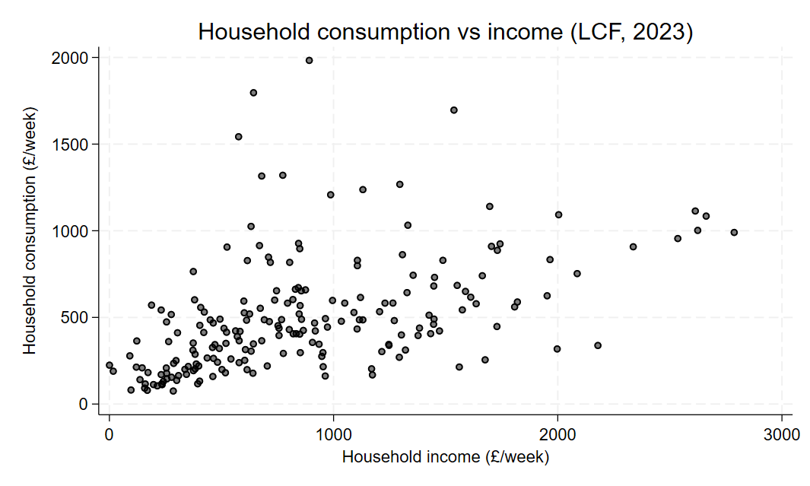

```{r}
#| include: false
#| cache: false

library(Statamarkdown)
knitr::opts_chunk$set(collectcode = TRUE)
```

:::{.content-visible when-format="revealjs"}
## This week

This week we cover:

1. Straight in the deep end

2. A step back

3. The model; i.e. assumptions ...
:::

# Linear Population Regression Function

## Linear Population Regression Function

General form:

$$
  y_i = \beta_0 + \beta_1x_{i1} + \beta_2x_{i2}+\dots + \beta_kx_{ik} + u_i
$$

## Component \#1: Data

$$
  \textcolor{red}{y_i} = \beta_0 + \beta_1\textcolor{red}{x_{i1}} + \beta_2\textcolor{red}{x_{i2}}+\dots + \beta_k\textcolor{red}{x_{ik}} + u_i
$$
The **observable** *random* variables in the model are,

- $y_i$: the outcome (dependent) variable,

- $x_{i1},x_{i2},\dots,x_{ik}$: the regressors (independent variables).[^1]

[^1]: There are other words given to the righthand-side variables; including "control variables" and "covariates". These terms have a particular meaning which will become clearer at a later stage.

:::{.callout-note title="Unit of Analysis"}
An often overlooked feature of the model is the unit of analysis. In the model, the subscript $i$ represents the unit at which the data is measured. For example, on model may represent data at the individual level, while another captures firm-level data.
:::

## Component \#2: Parameters

$$
  y_i = \textcolor{red}{\beta_0} + \textcolor{red}{\beta_1}x_{i1} + \textcolor{red}{\beta_2}x_{i2}+\dots + \textcolor{red}{\beta_k}x_{ik} + u_i
$$
The relationship between the outcome and regressors is explained by set of *non-random* population parameters:

- $\beta_1, \beta_2, ..., \beta_k$ are often referred to as "slope coefficients",

- $\beta_0$ is the "intercept". 

:::{.callout-important title="Linear in Parameters"}
The model is referred to as the *Linear* Population Regression Function not because it is linear in regressors, but because it is linear in parameters. Suppose $x_{i2}= x_{i1}^2$, the model would be non-linear in $x_{i1}$. However, it is still linear in parameters. 
:::

## Component \#3: Error

$$
  y_i = \beta_0 + \beta_1x_{i1} + \beta_2x_{i2}+ \dots + \beta_kx_{ik} + \textcolor{red}{u_i}
$$

The error term represents the part of $y_i$ that is NOT explained by the model:

In Econometrics 

 
## Vector notation

When reading papers, you will frequently see the following notation:

$$
  y_i = \mathbf{x}_i\beta + u_i
$$

**What's going on here?** The variables have been collected as vectors:

$$
  y_i = \underbrace{\begin{bmatrix} 1 & x_{i1} & x_{i2} & \dots &x_{ik}\end{bmatrix}}_{\mathbf{x}_i}\underbrace{\begin{bmatrix} \beta_0 \\ \beta_1 \\ \beta_2 \\ \vdots \\ \beta_{ik} \end{bmatrix}}_\beta  + u_i
$$

When written in vector notation $\mathbf{x}_i$ always preceeds $\beta$, as $\beta\mathbf{x}_i\neq \mathbf{x}_i\beta$.

::::{.content-visible unless-format="revealjs"}
:::{.callout-tip title="Vector notation differences" collapse=true }

Wooldridge defines $\mathbf{x}_i$ as a row vector, but $\beta$ as a column vector. Many texts define both as column vectors and will therefore express the linear population regression function as,

$$
  y_i = \mathbf{x}_i'\beta + u_i
$$

:::
::::

# How did we get here?

::: {.content-visible unless-format="revealjs"}
Let's take a step back and ask how we got here. Where does the Linear Population Regression Function come from? This is actually not an easy question to answer and there is more than one way to arrive at a model of this form. 
:::

## Approach \#1: DGP 

The model represents the true **data generating process** at the population level $\Rightarrow$

- if we know the population parameters 

- AND the distribution of the righthand-side variables (incl. error term) 

we can generate data in a manner akin to sampling from the population distribution.

e.g. 

$$
\begin{aligned}
&y_i = \beta_0 + \beta_1 x_{i} + u_i \\
\text{with}\;&\beta_0=0.5,\; \beta_1=0.6,\; x_{i}\sim U(0,1),\; u_i \sim N(0, 0.6^2)
\end{aligned}
$$

## {.scrollable}

:::{.panel-tabset}

### Stata 

```{stata}
#| echo: true
#| code-fold: true
#| output: false

* Set seed
set seed 9871

* Parameters
scalar b0 = 0.5
scalar b1 = 0.6
scalar sd_norm = 0.6

set obs 100

* Variables
generate x = runiform()
generate error = rnormal(0,scalar(sd_norm))
generate y = scalar(b0) + scalar(b1)*x + error

* Plot
twoway (scatter y x) (function y = scalar(b0)+scalar(b1)*x, lcolor(red)), legend(off)
```

```{stata}
#| echo: false
#| output: false
graph export "material/lecture-1/dgp.png", replace
```
{fig-align="center" width=67%}

### R

```{r}
#| echo: true
#| code-fold: true
#| warning: false
#| fig-align: center

# Load packages
library(ggplot2)

# Set seed
set.seed(9871)

# Parameters
n   <- 100
b0 <- 0.5
b1 <- 0.6
sd_norm <- 0.6

# Variables
x     <- runif(n)
error <- rnorm(n,sd=sd_norm)
y     <- b0 + b1 * x + error

df <- data.frame(x, y)

# Plot
ggplot(df, aes(x, y)) +
  geom_point() +
  geom_abline(intercept = b0, slope = b1, color = "red")
```

:::

Econometricians use such approaches to study the properties of estimators. It is often referred to as Monte Carlo simulation. Because you know the true value of the population parameters, you can look to see how well the estimator performs across multiple simulations. 


## Approach \#2: Prediction

Suppose you want predict a random variable $y_i$ using information from a set of variables $\mathbf{x}_i$. The 'best' predictor of $y_i$ is the conditional expectation (function; CEF)

$$
  E[y_i | \mathbf{x}_i] \equiv m(\mathbf{x}_i)
$$

Where the CEF is a function of $\mathbf{x}_i$. 


This is the starting point for Data Science. 

- "Fancier" methods like Lasso, Random Forests, and Neural Networks are simply newer methods to estimate $m(\mathbf{x}_i)$. They have core advantages over linear regression models that relate specifically to 'big' data.

::::{.content-visible unless-format="revealjs"}
:::{.callout-tip title="Best? Big?" collapse="true" }

What do we mean by *best* predictor? This is a very specific use of the word 'best'. The CEF is the best mean-squared error predictor of $y_i$. You can find more on this in my [notes on the CEF](). 

'Big' data also has a very specific meaning. It does not concern the absolute size (number of observations) of the dataset, but rather the number of regressors relative to observations. 'Big' data is used to describe settings where you have more regressors than observations. 
:::
::::

##

It turns out that you can write, 

$$
  y_i = m(\mathbf{x}_i) + u_i
$$

where $u_i$ has the nice property $E[u_i| \mathbf{x}_i] = 0$. [**We will see this shortly!**]

If you **assume** that $m(\mathbf{x}_i)$ is linear (in parameters), then 

$$
  y_i = \beta_0 + \beta_1x_{i1} + \beta_2x_{i2}+\dots + \beta_kx_{ik} + u_i
$$

and the best predictor of $y_i$ is

$$
  E[y_i | \mathbf{x}_i] = \beta_0 + \beta_1x_{i1} + \beta_2x_{i2}+\dots + \beta_kx_{ik} 
$$

## Approach \#3: Economics

The traditional approach to Econometrics is rooted in the formal economic modelling. A famous example is the Solow Growth model:

**Step 1:** Specify production function 

Popular choice is Cobb-Douglas

$$
  Y_t = A_tK_t^\alpha L_t^{1-\alpha}
$$

**Step 2:** Express in terms of per-worker variables:

$$
  y_t = A_tk_t^\alpha
$$

where $y_t=Y_t/L_t$ and $k_t=K_t/L_t$. 

##

**Step 3:** Log linearize

$$
  \ln y_t = \ln A_t + \alpha \ln k_t
$$
Now we have a linear model with a slope parameter $\alpha$ - the parameter of interest. 

**BUT** we have a problem:

1. $A_t$ - which represents TFP - is not observed in the data

2. There is no error term! The model is deterministic.

::::{.content-visible unless-format="revealjs"}
:::{.callout-tip title="Missing error terms" collapse=true}
Regression models model uncertain processes, but many economic models have no inherent uncertainty. More modern models do include uncertainty, but this uncertainty may be of a different form to that observed in real economic variables. Indeed
:::
::::

## 

**Step 4:** Make an assumption

Assume that TFP follows a particular time-series process (i.e. DGP):

$$
  \ln A_t = \ln A_0 +gt+u_t
$$

where $gt$ is a deterministic trend and $u_t$ a stochastic shock. 

**NOW** we have a model of the form

$$
  \ln y_t = \ln A_0 + gt + \alpha \ln k_t+u_t
$$

which we can rewrite as a linear regression model with 3 unknown parameters:

$$
  \ln y_t = \beta_0 + \beta_1t + \beta_2 \ln k_t + u_t
$$

::::{.content-visible unless-format="revealjs"}
:::{.callout-tip title="Mankiw, Romer \& Weil (1992)" collapse=true}

The above equation is a time-series regression model that requires rather strong assumptions. Mankiw, Romer and Weil (1992) derives a more complete approach, based on a model with inherent uncertainty. The paper uses a linear approximation of dynamics around the steady state and derives an equation which can be estimated using a cross-section of country-level data. This approach is discussed by Daron Acemoglu in his comprehensive [lecture notes](https://economics.mit.edu/sites/default/files/inline-files/Economic%20Growth%20Lectures%202%20and%203%202025_0.pdf). 

:::
::::

## Approach \#4: Estimation

A more modern approach, popularized by applied microeconomists, is not rooted in formal economic modelling. Instead, it focuses on a set of research designs (methodologies) that target the causal relationship between two variables. These are often taught as *Microeconometrics*.[^2]

[^2]: If you are keen to learn more about these approaches you should consider taking EC4425 *Econometrics of Impact Evaluation*.

::::{.content-visible unless-format="revealjs"}
:::{.callout-tip title="Microeconometrics" collapse=true}
Microeconometrics focuses on the identification and estimation of causal relationships. It builds on the Neyman-Rubin Causal Model which includes the Potential Outcomes Framework. Related to this field are literatures on randomized experiments, causal inference, treatment effects, and policy evaluation. And these methods are prolific across applied microeconomics fields; including, Labour, Health, Education, Development, Public Policy, etc. 

If you are interested in these topics, you should consider reading:

1. 
2. 
3. 
:::
::::

For example,  

$$
  \text{Marginal Tax Rate} \rightarrow \text{Labour Supply}
$$

A researcher might choose to estimate this relationship within a linear regression model framework, by specifying the *estimating equation*:

$$
  hrswrk_i = \beta_0 + \beta_1 \text{MTR}_i + u_i
$$

The estimate for $\beta_1$ tells us about how a change in $MTR$ affects $hrswrk$ in the data. [**More on this soon!**]

##

**BUT** if we were to estimate this relationship in the data, do we really think it will tell us something causal? Consider:

- those who face a higher marginal tax rate are higher are those with higher income;

- and those with higher income might be people with higher education;

- etc.

Can we account for these differences in the model?

$$
  hrswrk_i = \beta_0 + \beta_1 MTR_i + \beta_2 income_i + \beta_3 yrsedu_i + u_i
$$

This is where we get into the idea of adding additional regressors as "control" variables. 

# Classical Linear Regression Model

::::{.content-visible unless-format="revealjs"}
What constitutes a model? In some sense, a model is just a collection of assumptions. Here are the assumptions that govern the CLRM. Some of them will be more relevant once we discuss the estimation of the CLRM. 

:::{.callout-caution title="Alternatives"}
Please be aware that there alternative ways to specify the CLRM assumptions. One noteable variant, found in a number of texts (and websites), considers the case of non-random regressors. That is, the value of regressors do not change with sampling.
:::
::::

## MLR \#1

These assumptions have the abbreviation MLR for Multiple Linear Regression.

> **MLR-1: Linear in parameters** 
>
> The population model is given by,
>  
> $$
>   y_i = \beta_0 + \beta_1x_{i1} + \beta_2x_{i2}+\dots + \beta_kx_{ik} + u_i
> $$

It may seem obvious, but it is nonetheless an assumption that the model is **correctly specified** as linear in parameters.

## MLR \#2

> **MLR-2: Random sampling** 
>
> Random sample of $n$ from the population

This will 

## MLR \#3

> **MLR-3: No perfect collinearity** 
>
> No *exact* linear relationship among regressors (including the constant). 

This assumption is key for *identification*. It ensures that each parameter is uniquely identified. 

##

Consider a regression of hours-worked against temperature, measured in both Celsius and Fahrenheit, 

$$
  hrswrk_i = \beta_0 + \beta_1 tempC_i + \beta_2 tempF_i + u_i
$$

Note, the model has 3 parameters. 


There is a linear formula that links temperature in $F^\circ\Rightarrow C^\circ$:  $F^\circ = 9/5\cdot C^\circ+32$. 

- Plug this into the equation:

$$
  \begin{aligned}
    hrswrk_i=& \beta_0 + \beta_1 tempC_i + \beta_2 (9/5 \cdot tempF_i + 32) + u_i \\
            =& (\beta_0 + \beta_2 \cdot 32) + (\beta_1 + \beta_2 \cdot 9/5) tempC_i + u_i \\
            =& \gamma_0 + \gamma_1 tempC_i + u_i \\
  \end{aligned}
$$

The model has 2 parameters now. The third was not identified because the variable $tempF_i$ is perfectly collinear with $tempC_i$ and the constant in the model.

## MLR \#4

> **MLR-4: Zero conditional mean** 
>
> Also referred to as mean independence between the error term and regressors.
>  
> $$
>    E[u_i | \mathbf{x}_i] = 0
> $$
  
This is assumption is 

- weaker than full independence: $u_i\perp \mathbf{x}_i$); 

- but stronger than uncorrelatedness: $Cov(\mathbf{x}_i, u_i) = 0$

##

We can also show the following:

1. MLR-4 implies that the unconditional mean of the error term is 0. 

$$
  E[u_i | \mathbf{x}_i] = 0 \Rightarrow E[u_i] = 0
$$

2. MLR-4 implies the error term is uncorrelated with all regressors

$$
  E[u_i | \mathbf{x}_i] = 0 \Rightarrow E[u_ix_{ij}]=Cov(u_i, x_{ij}) = 0\quad j=1,2,\dots,k
$$
  
## MLR \#5

The next two assumptions yield nice properties for the OLS estimator.

> **MLR-5: Homoskedasticity** 
>
> The variance of the error term is constant. 
>  
> $$
>   Var(u_i|\mathbf{x}_i) = \sigma^2
> $$

- Needed to define the variance of the estimator

- Homoskedasticity is a key assumption needed for the famous BLUE property of OLS.

- It can be relaxed. Such errors are referred to as heteroskedastic.

This will be covered in future material. 


## MLR \#6

> **MLR-6: Normality** 
>  
> The conditional distribution of the error term is normal.
>  
> $$
>   u_i|\mathbf{x}_i\sim N(0,\sigma^2)
> $$

- Needed to know the finite distribution of the estimator

- Can be relaxed, but then only asymptotic distribution is known. 

Again, this will be covered in future material. 


## Univariate case

Let's consider the simplest case: univariate regression

$$
  y_i = \beta_0 + \beta_1 x_i + u_i
$$

Under MLR-1 and MLR-4:

$$
  \begin{aligned}
    E[y_i | x_i] =& E[\beta_0 + \beta_1 x_i + u_i | x_i] \\
    =& E[\beta_0 | x_i] + E[\beta_1 x_i | x_i] + E[u_i | x_i] \\
    =& \beta_0 + \beta_1 x_i + E[u_i | x_i] \\
    =& \beta_0 + \beta_1 x_i
  \end{aligned}
$$

## 

Let's plot $E[y_i | x_i]=0.5 + 0.6 x_i$

```{r}
#| echo: false
#| warning: false
#| fig-align: center

# Points on line
x_vals <- c(2, 4, 6)
y_vals <- b0 + b1*x_vals

# Conditional mean points
mean_points <- data.frame(
  x = x_vals,
  y = b0 + b1 * x_vals,
  label = c("E(y~'|'~x[1])==beta[0]+beta[1]*x[1]",
            "E(y~'|'~x[2])==beta[0]+beta[1]*x[2]",
            "E(y~'|'~x[3])==beta[0]+beta[1]*x[3]")
)

# Regression line
line_df <- data.frame(x = c(0.5, 8))
line_df$y <- b0 + b1 * line_df$x

# Plot
ggplot() +
  # Regression line
  geom_line(data = line_df, aes(x = x, y = y),
            color = "blue", linewidth = 1) +
  # Points on the regression line
  geom_point(data = mean_points, aes(x = x, y = y),
             color = "red", size = 3) +
  # Labels for each point
  geom_text(data = mean_points,
            aes(x = x, y = y, label = label),
            parse = TRUE,
            hjust = -0.1, vjust = 0.5, size = 3.5) +
  # x-axis tick labels
  scale_x_continuous(
    breaks = x_vals,
    labels = c("x[1]=2", "x[2]=4", "x[3]=6"),
    limits = c(0.5, 8)
    ) +
  # y-axis tick labels
  scale_y_continuous(
    breaks = y_vals,
    labels = c("y[1]=1.7", "y[2]=2.9", "y[3]=4.1"),
    limits = c(-0.5, 6)
    ) +
  labs(x = "x", y = "y") +
  theme_classic() +
  theme(
    axis.title = element_text(size = 13, face = "italic")
  )
```

##

Around the $E[y_i|x_i]$, the error term is normaly distributed: $u_i\sim N(0,0.6^2)$

```{r}
#| echo: false
#| warning: false
#| fig-align: center

# Normal distributions
normal_curve_vertical <- function(x_center) {
  y_mid <- b0 + b1 * x_center
  y_seq <- seq(y_mid - 2, y_mid + 2, length.out = 300)
  density_vals <- dnorm(y_seq, mean = y_mid, sd = sd_norm)
  scale_factor <- 0.8
  data.frame(
    x = x_center + density_vals * scale_factor,
    y = y_seq,
    group = as.character(x_center)
  )
}

curves_df <- do.call(rbind, lapply(x_vals, normal_curve_vertical))

# Plot
ggplot() +
  # Regression line
  geom_line(data = line_df, aes(x = x, y = y), color = "blue", linewidth = 1) +
  # Normal distribution curves (rotated)
  geom_path(data = curves_df, aes(x = x, y = y, group = group),
            color = "darkgreen", linewidth = 0.9) +
  # Points on the regression line
  geom_point(data = mean_points, aes(x = x, y = y),
             color = "red", size = 3) +
  # x-axis tick labels
  scale_x_continuous(
    breaks = x_vals,
    labels = c("x[1]=2", "x[2]=4", "x[3]=6"),
    limits = c(0.5, 8)
  ) +
  # y-axis tick labels
  scale_y_continuous(
    breaks = y_vals,
    labels = c("y[1]=1.7", "y[2]=2.9", "y[3]=4.1"),
    limits = c(-0.5, 6)
  ) +
  # Annotation
  annotate("text", x = 6.2, y = b0 + b1 * 5.5,
           label = "E(y~'|'~x[1]) == beta[0] + beta[1]*x",
           parse = TRUE, hjust = 0, size = 4) +
  labs(x = expression(x[i]), y = "y") +
  theme_classic() +
  theme(
    axis.title = element_text(size = 13, face = "italic")
  )
```

##

This is what it would look like if you sampled $n=50$ errors for $x$ from that distribution. 

```{r}
#| echo: false
#| warning: false
#| fig-align: center

# Parameters
n_per_x <- 150

# Sample data from the model
set.seed(42)
sampled_data <- data.frame(
  x = rep(x_vals, each = n_per_x),
  y = rep(b0 + b1 * x_vals, each = n_per_x) + rnorm(n_per_x * length(x_vals), mean = 0, sd = sd_norm)
)

# Plot
ggplot() +
  # Sampled points (translucent so overlaps darken)
  geom_point(data = sampled_data, aes(x = x, y = y),
             color = "darkgreen", alpha = 0.15, size = 2) +
  # Regression line
  geom_line(data = line_df, aes(x = x, y = y),
            color = "blue", linewidth = 1) +
  # Conditional mean points
  geom_point(data = mean_points, aes(x = x, y = y),
             color = "red", size = 3) +
  # Labels
  geom_text(data = mean_points,
            aes(x = x, y = y, label = label),
            parse = TRUE,
            hjust = -0.1, vjust = 0.5, size = 3.5) +
  # x-axis tick labels
  scale_x_continuous(
    breaks = x_vals,
    labels = c("x[1]=2", "x[2]=4", "x[3]=6"),
    limits = c(0.5, 8)
  ) +
  # y-axis tick labels
  scale_y_continuous(
    breaks = y_vals,
    labels = c("y[1]=1.7", "y[2]=2.9", "y[3]=4.1"),
    limits = c(-0.5, 6)
  ) +
  labs(x = expression(x[i]), y = "y") +
  theme_classic() +
  theme(
    axis.title = element_text(size = 13, face = "italic")
  )
```

For a given $x$, more of the observations will be concentrated around the *conditional* mean. 

## Interpretation

This then gives us a clear interpretation of $\beta_0$ and $\beta_1$

$$
  \begin{aligned}
    \beta_0 =& E[y_i | x_i=0] \\
    \beta_1 =& \frac{dE[y_i | x_i]}{dx_i}
  \end{aligned}
$$

:::{.callout-warning}
The interpretation of $\beta_1$ as a derivative assumes that $x_i$ is a continuous variable. We discuss the case of discrete variables at a later point. 
:::

Note, $\beta_0$ may not have a "realistic" interpretation. For example, you are unlikely to find some one in the data who has an age of 0. 

## Identification

Recall, under MLR-4

1. $E[u_i]=0$
2. $E[u_i x_i]=0$

We can use these two moments to demonstrate the identification of $\beta_0$ and $\beta_1$.

##

**Step 1**: Substitute $u_i = y_i - \beta_0 -\beta_1x_i$ into (1)

$$
  0 = E[u_i] = E[y_i - \beta_0 - \beta_1x_i]\Rightarrow \beta_0 = E[y_i]-\beta_1 E[x_i]
$$


**Step 2**: Substitute $u_i = y_i - \beta_0 -\beta_1x_i$ into (2)

$$
  0 = E[u_i x_i]=E[(y_i - \beta_0 -\beta_1x_i) x_i] = E[y_ix_i]-\beta_0 E[x_i]-\beta_1 E[x_i^2]
$$

**Step 3**: Substitute the solution for $\beta_0$


$$
  0 = E[y_ix_i]-\beta_0E[x_i]-\beta_1E[x_i^2] = E[y_ix_i] - (E[y_i]-\beta_1 E[x_i])E[x_i] - \beta_1 E[x_i^2]
$$

## 

Manipulate and solve

$$
  0 = \underbrace{E[y_ix_i]-E[y_i]E[x_i]}_{Cov(y_i,x_i)}-\beta_1(\underbrace{E[x_i^2]-E[x_i]^2}_{Var(x_i)})
$$

Arrive at the neat solution:

$$
  \beta_1 = \frac{Cov(y_i,x_i)}{Var(x_i)}
$$
and,

$$
  \beta_0 = E[y_i] - \beta_1 E[x_i]
$$

Both population parameters can be written as expressions of "observable" moments in the data. In this sence, they are identified. 

## Multivariate case

In the multivariate case we have models of the form,

$$
  y_i = \beta_0 + \beta_1 x_{i1} + \beta_2x_{i2}+\dots+\beta_k x_{ik} + u_i
$$

As with the univariate case, under MLR-1 and MLR-4:

$$
  E[y_i|\mathbf{x}_i] = \beta_0 + \beta_1 x_{i1} + \beta_2 x_{i2} + \dots + \beta_k x_{ik}
$$

## Interpretation

We can now think of each slope coefficient as 

$$
  \beta_j = \frac{\partial E[y_i | \mathbf{x}_i]}{\partial x_{ij}} \quad j=1,\dots,k
$$

This is a *partial derivative*. 

- Change in the conditional mean of $y$ for a 1 unit change in regressor $x_j$, **holding all other variables fixed**

- This is also why additional regressors in a model are referred to as "control variables", since their presence changes the interpretation of the slope coefficient. 

:::{.callout-note title="*Ceteris Paribus*"}
We often use the Latin phrase *ceteris paribus* to describe this interpretation as it means "all else equal".
:::


# Questions

1. How many parameters are there in the model $y_i = \beta_0 + \beta_1x_{i1} + \beta_2x_{i2}+\dots + \beta_kx_{ik} + u_i$? And how many regressors?

2. 
 