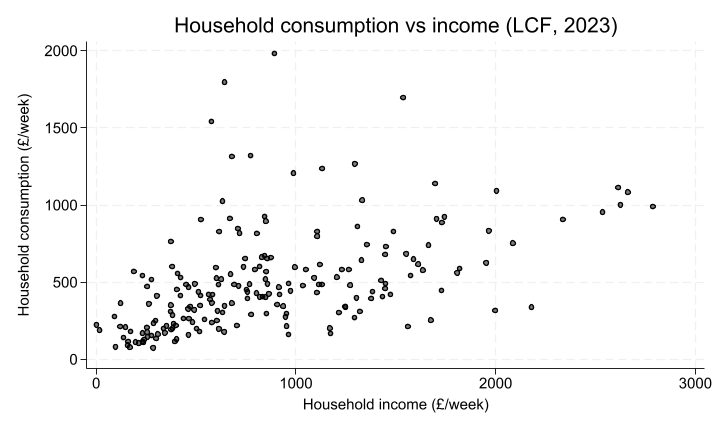
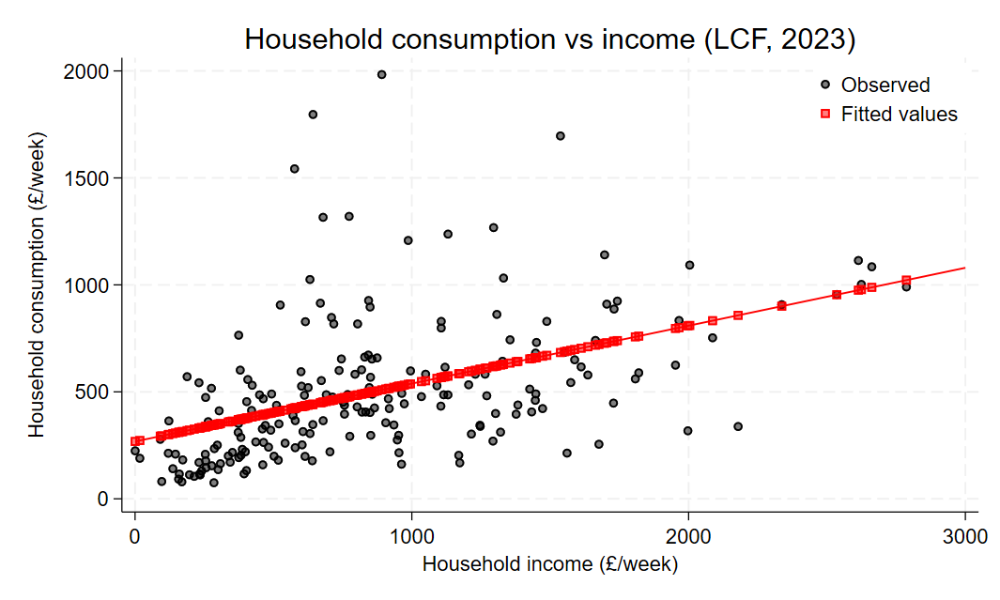
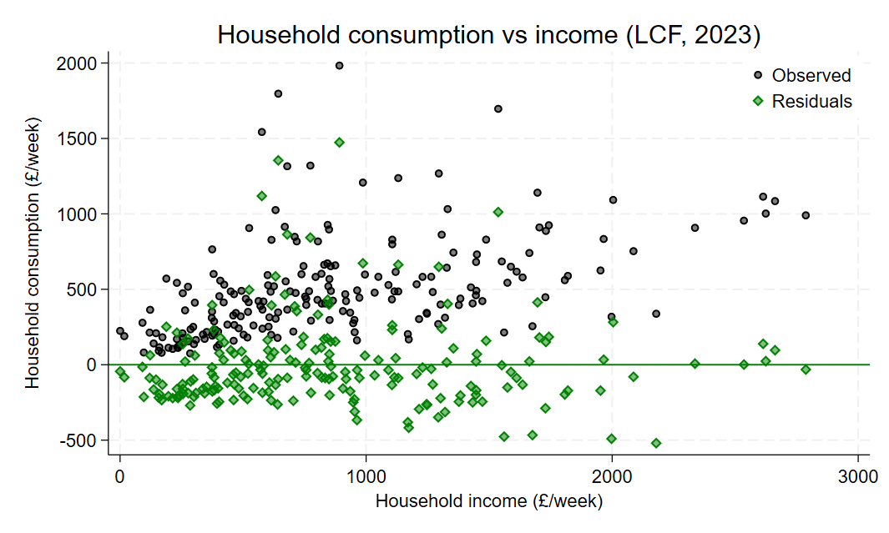

```{r}
#| include: false
#| cache: false

library(Statamarkdown)
knitr::opts_chunk$set(collectcode = TRUE)
```

:::{.content-visible when-format="revealjs"}
## Recap

This week we cover:

1. Straight in the deep end

2. A step back

3. The model; i.e. assumptions ...


## This week

This week we cover:

1. Data

2. Estimation: An intuitive approach

3. Ordinary Least Squares

:::

# Data

## 

We start with the multivariate linear regression model, 

$$
  y_i = \beta_0 + \beta_1x_{i1} + \beta_2x_{i2}+\dots + \beta_kx_{ik} + u_i
$$

which could represent:

- the true data generating process, 
- the conditional expectation function,
- an economic model, 
- an estimating equation

under different assumptions. 

##

Curcially, the model includes data: for each observation we observation

$$
  [y_i, x_{i1}, x_{i2}, \dots, x_{ik}] \quad i = 1, \dots, n
$$

Stacked together, we have a matrix of data:

$$
\begin{bmatrix}
y_1 & x_{11} & x_{12} & \dots & x_{1k} \\
y_2 & x_{21} & x_{22} & \dots & x_{2k} \\
\vdots & \vdots & \vdots & \ddots & \vdots \\
y_n & x_{n1} & x_{n2} & \dots & x_{nk} \\
\end{bmatrix}
$$

# Estimation: An intuitive approach

## 

Suppose you started with the data? For example, the Living Costs and Food Survey: a household level dataset with information on consumption and income. 

$$
  [cons_i, inc_i] \quad i = 1, \dots, n
$$

And suppose we had an economic model that suggested a linear relationship between consumption and income (i.e. constant propensity to consume). We might then posit a simple linear regression model: 

$$
  cons_i = \beta_0 + \beta_1 inc_i + u_i
$$

## {.scrollable}

:::{.panel-tabset}
### Stata 

```{stata}
#| echo: true
#| code-fold: true
#| output: false

* Open data
use "data/lcf_2023.dta", clear

* Plot
scatter hhcon hhinc, mc(black) mfc(%50) ytitle("Household consumption (£/week)") xtitle("Household income (£/week)") title("Household consumption vs income (LCF, 2023)")
```

```{stata}
#| echo: false
#| output: false
graph export "material/lecture-2/lcf-scatter.png", replace
```
{fig-align="center" width=67%}

### R

```{r}
#| echo: true
#| code-fold: true
#| warning: false
#| fig-align: center

# Packages
library(haven)                  # To load Stata .dta file
library(ggplot2)

# Load the Stata file
lcf_data <- read_dta("data/lcf_2023.dta")

# Plot
ggplot(lcf_data, aes(x = hhinc, y = hhcon)) +
  geom_point(alpha = 0.5) +
  labs(x = "Household income (£/week)",
       y = "Household consumption (£/week)",
       title = "Household consumption vs income (LCF, 2023)") +
  theme_minimal()
```
:::

## 

Consider the following two observations:

```{r}
#| echo: false
#| warning: false
#| fig-align: center

# Plot
ggplot(lcf_data, aes(x = hhinc, y = hhcon)) +
  geom_point(alpha = 0.5) +
  # Highlight obs == 134 (red)
  geom_point(data = subset(lcf_data, obs == 134),
             colour = "red", size = 3) +
  geom_text(data = subset(lcf_data, obs == 134),
            aes(label = paste0("(", round(hhinc, 1), ", ", round(hhcon, 1), ")")),
            colour = "red", vjust = -1, fontface = "bold") +
  # Highlight obs == 175 (blue)
  geom_point(data = subset(lcf_data, obs == 175),
             colour = "blue", size = 3) +
  geom_text(data = subset(lcf_data, obs == 175),
            aes(label = paste0("(", round(hhinc, 1), ", ", round(hhcon, 1), ")")),
            colour = "blue", vjust = -1, fontface = "bold") +
  labs(x = "Household income (£/week)",
       y = "Household consumption (£/week)",
       title = "Household consumption vs income (LCF, 2023)") +
  theme_minimal()
```

## Guess 1

Suppose we plot a line through the points: 

```{r}
#| echo: false
#| warning: false
#| fig-align: center

# Predicted values on the green line for the two highlighted x-values
line_pts <- subset(lcf_data, obs %in% c(134, 175))
line_pts$yhat <- 275 + 0.275 * line_pts$hhinc

# Position for the equation label: near the right end of the line
x_eq <- 0.85 * max(lcf_data$hhinc, na.rm = TRUE)
y_eq <- 275 + 0.275 * x_eq

# Plot
ggplot(lcf_data, aes(x = hhinc, y = hhcon)) +
  geom_point(alpha = 0.5) +
  # Green line: y = 275 + 0.275x
  geom_abline(intercept = 275, slope = 0.275,
              colour = "green4", linewidth = 1) +
  # Equation label for the line
  annotate("text", x = x_eq, y = y_eq,
           label = "y == 275 + 0.275 * x", parse = TRUE,
           colour = "green4", fontface = "bold",
           vjust = -1, hjust = 0.5) +
  # Green dots on the line at the same x-values as the red/blue points
  geom_point(data = line_pts,
             aes(x = hhinc, y = yhat),
             colour = "green4", size = 4) +
  # Highlight obs == 134 (red)
  geom_point(data = subset(lcf_data, obs == 134),
             colour = "red", size = 4) +
  geom_text(data = subset(lcf_data, obs == 134),
            aes(label = paste0("(", round(hhinc, 1), ", ", round(hhcon, 1), ")")),
            colour = "red", vjust = -1, fontface = "bold") +
  # Highlight obs == 175 (blue)
  geom_point(data = subset(lcf_data, obs == 175),
             colour = "blue", size = 4) +
  geom_text(data = subset(lcf_data, obs == 175),
            aes(label = paste0("(", round(hhinc, 1), ", ", round(hhcon, 1), ")")),
            colour = "blue", vjust = -1, fontface = "bold") +
  labs(x = "Household income (£/week)",
       y = "Household consumption (£/week)",
       title = "Household consumption vs income (LCF, 2023)") +
  theme_minimal()
```

##

The vertical distance between points in the data and the line tells us how the difference between the "prediction" of the line (for a given $inc_i$) and the actual data. 

```{r}
#| echo: false
#| warning: false
#| fig-align: center
# Predicted values and residual distances for the two highlighted obs
line_pts <- subset(lcf_data, obs %in% c(134, 175))
line_pts$yhat <- 275 + 0.275 * line_pts$hhinc
line_pts$dist <- line_pts$hhcon - line_pts$yhat        # signed gap
line_pts$ymid <- (line_pts$hhcon + line_pts$yhat) / 2  # midpoint for the label

# Small horizontal offset for the bracket, relative to the x-range
off <- 0.01 * diff(range(lcf_data$hhinc, na.rm = TRUE))

# Plot
ggplot(lcf_data, aes(x = hhinc, y = hhcon)) +
  geom_point(alpha = 0.5) +
  # Green line: y = 275 + 0.275x
  geom_abline(intercept = 275, slope = 0.275,
              colour = "green4", linewidth = 1) +
  # Green dots on the line
  geom_point(data = line_pts,
             aes(x = hhinc, y = yhat),
             colour = "green4", size = 4) +
  # Red / blue observed points
  geom_point(data = subset(lcf_data, obs == 134),
             colour = "red", size = 4) +
  geom_point(data = subset(lcf_data, obs == 175),
             colour = "blue", size = 4) +
  # Bracket: vertical segment just to the right of each pair of points
  geom_segment(data = line_pts,
               aes(x = hhinc + off, xend = hhinc + off,
                   y = hhcon, yend = yhat),
               linewidth = 0.7) +
  # Top and bottom caps of the bracket
  geom_segment(data = line_pts,
               aes(x = hhinc + 0.4 * off, xend = hhinc + off,
                   y = hhcon, yend = hhcon),
               linewidth = 0.7) +
  geom_segment(data = line_pts,
               aes(x = hhinc + 0.4 * off, xend = hhinc + off,
                   y = yhat, yend = yhat),
               linewidth = 0.7) +
  # Distance label at the midpoint of the bracket
  geom_text(data = line_pts,
            aes(x = hhinc + off, y = ymid,
                label = round(dist, 1)),
            hjust = -0.3, fontface = "bold") +
  labs(x = "Household income (£/week)",
       y = "Household consumption (£/week)",
       title = "Household consumption vs income (LCF, 2023)") +
  theme_minimal()

```

## Guess 2

What if we chose a different plot?

```{r}
#| echo: false
#| warning: false
#| fig-align: center

# Predicted values and residual distances for the two highlighted obs
line_pts <- subset(lcf_data, obs %in% c(134, 175))
line_pts$yhat <- 500 + 0.15 * line_pts$hhinc
line_pts$dist <- line_pts$hhcon - line_pts$yhat        # signed gap
line_pts$ymid <- (line_pts$hhcon + line_pts$yhat) / 2  # midpoint for the label

# Small horizontal offset for the bracket, relative to the x-range
off <- 0.01 * diff(range(lcf_data$hhinc, na.rm = TRUE))

# Position for the equation label: near the right end of the line
x_eq <- 0.85 * max(lcf_data$hhinc, na.rm = TRUE)
y_eq <- 500 + 0.15 * x_eq

# Plot
ggplot(lcf_data, aes(x = hhinc, y = hhcon)) +
  geom_point(alpha = 0.5) +
  # Purple line: y = 500 + 0.15x
  geom_abline(intercept = 500, slope = 0.15,
              colour = "purple", linewidth = 1) +
  # Equation label for the line
  annotate("text", x = x_eq, y = y_eq,
           label = "y == 500 + 0.15 * x", parse = TRUE,
           colour = "purple", fontface = "bold",
           vjust = -1, hjust = 0.5) +
  # Purple dots on the line
  geom_point(data = line_pts,
             aes(x = hhinc, y = yhat),
             colour = "purple", size = 4) +
  # Red / blue observed points
  geom_point(data = subset(lcf_data, obs == 134),
             colour = "red", size = 4) +
  geom_point(data = subset(lcf_data, obs == 175),
             colour = "blue", size = 4) +
  # Bracket: vertical segment just to the right of each pair of points
  geom_segment(data = line_pts,
               aes(x = hhinc + off, xend = hhinc + off,
                   y = hhcon, yend = yhat),
               linewidth = 0.7) +
  # Top and bottom caps of the bracket
  geom_segment(data = line_pts,
               aes(x = hhinc + 0.4 * off, xend = hhinc + off,
                   y = hhcon, yend = hhcon),
               linewidth = 0.7) +
  geom_segment(data = line_pts,
               aes(x = hhinc + 0.4 * off, xend = hhinc + off,
                   y = yhat, yend = yhat),
               linewidth = 0.7) +
  # Distance label at the midpoint of the bracket
  geom_text(data = line_pts,
            aes(x = hhinc + off, y = ymid,
                label = round(dist, 1)),
            hjust = -0.3, fontface = "bold") +
  labs(x = "Household income (£/week)",
       y = "Household consumption (£/week)",
       title = "Household consumption vs income (LCF, 2023)") +
  theme_minimal()
```

## 

**Which guess was better? Why?** 

## Structure

Let's formalize the above process:

- Goal: we want to pick the line that best fits the data.

- Problem: what do we mean by "fit"?

  - For a given value of $inc_i$ in the data, the "fitted" value of $cons_i$ is

  $$
    \widehat{cons}_i = b_0 + b_1 inc_i
  $$

  where $[b_0,b_1]$ are the chosen parameters. 

  - For example, 
  
    - $\widehat{cons}_i = 275 + 0.275 inc_i$
    
    - $\widehat{cons}_i = 500 + 0.15 inc_i$
    
## Fit

We need a measure of distance:

**Candidate 1**: difference

$$
  cons_i - \widehat{cons}_i
$$

- **PROBLEM**: could be negative (i.e. not a measure of distance)

**Candidate 2**: absolute value

$$
  |cons_i - \widehat{cons}_i|
$$

- **PRO**: intuitive
- **CON**: difficult to work with (i.e. not globally differentiable)

##

**Candidate 3**: squared deviation

$$
  (cons_i - \widehat{cons}_i)^2
$$

- always positive
- amplifies bigger deviations, which is more *efficient* (more on that soon!)

## Aggregation

What we care about is the difference between the prediction and data across all observations:

$$
  \sum_{i=1}^{n}(cons_i - \widehat{cons}_i)^2
$$

And since $\widehat{cons}_i = b_0 + b_1 inc_i$

$$
  \sum_{i=1}^{n}(cons_i - b_0 - b_1 inc_i)^2
$$

## Minization

The value of these squared deviations (from the prediction) depend on $[b_0,b_1]$. It seems intuitive then to pick the values that minimize this value:

$$
  \underset{b_0,b_1}{\min} \quad\sum_{i=1}^{n}(cons_i - b_0 - b_1 inc_i)^2
$$

# Ordinary Least Squares

## Notation

- Data: $[y_i,x_{i1},x_{i2},\dots,x_{ik}]\quad i=1,\dots,n$
- 

## Problem

Minimization problem:

$$
  \hat{\beta}=\underset{b}{\arg\min} \quad\sum_{i=1}^{n}(y_i - b_0 - b_1x_{i1}-\dots-b_kx_{ik})^2
$$

where $\hat{\beta} = [\hat{\beta}_0,\hat{\beta}_1,\dots,\hat{\beta}_k]$ and $b=[b_0,b_1,\dots,b_k]$.

- hence the name "Least Squares"


## First order conditions

Differentiate w.r.t. $b_j$'s and then set to 0. For $\hat{\beta}_0$ (the constant):

  $$
    \begin{aligned}
      & 0=2\sum_{i=1}^{n}(y_i - \hat{\beta}_0 - \hat{\beta}_1x_{i1}-\dots-\hat{\beta}_kx_{ik}) \\
      \Rightarrow \quad & 0=\frac{1}{n}\sum_{i=1}^{n}(y_i - \hat{\beta}_0 - \hat{\beta}_1x_{i1}-\dots-\hat{\beta}_kx_{ik}) \\
      \Rightarrow \quad & \hat{\beta}_0 = \bar{y} - \hat{\beta}_1\bar{x}_{1}-\dots-\hat{\beta}_k\bar{x}_{k}
    \end{aligned}
  $$
  
:::{.callout-note}
The inclusion of a constant in the model ensures that the residual is always mean zero:

$$
  0=\sum_{i=1}^{n}(y_i - \hat{\beta}_0 - \hat{\beta}_1x_{i1}-\dots-\hat{\beta}_kx_{ik})=\sum_{i=1}^{n}\hat{u}_i
$$

:::
  
##

For $\hat{\beta}_j\quad j=1,\dots,k$

  $$
    \begin{aligned}
      & 0=2\sum_{i=1}^{n}(y_i - \hat{\beta}_0 - \hat{\beta}_1x_{i1}-\dots-\hat{\beta}_kx_{ik})x_{ij} \\
      \Rightarrow \quad &0= \sum_{i=1}^{n}(y_i - \hat{\beta}_0 - \hat{\beta}_1x_{i1}-\dots-\hat{\beta}_kx_{ik})x_{ij}
    \end{aligned}
  $$

There are $k$ of these first-order conditions (plus the 1 for the constant)

$\Rightarrow$ $k+1$ equations and $k+1$ unknowns. 
  
## Univariate case

In the case of a single regressor, the solution is more easily solved. 

- For $\hat{\beta}_0$ (the constant):

$$
   \hat{\beta}_0 = \bar{y} - \hat{\beta}_1\bar{x}
$$
  
##

- For $\hat{\beta}_1$:

$$
  \begin{aligned}
    & 0=2\sum_{i=1}^{n}(y_i - \hat{\beta}_0 - \hat{\beta}_1x_{i})x_{i} \\
    \Rightarrow \quad & 0=\sum_{i=1}^{n}\big(y_i - (\textcolor{blue}{\bar{y} - \hat{\beta}_1\bar{x}}) - \hat{\beta}_1x_{i}\big)x_{i} \qquad \text{substitute in}\quad \textcolor{blue}{\hat{\beta}_0}\\
    \Rightarrow \quad & 0=\sum_{i=1}^{n}\big((y_i -\bar{y})  - \hat{\beta}_1(x_{i}-\bar{x})\big)x_{i}
  \end{aligned}
$$

##

The next step explooits the fact that:

$$
  \sum_{i=1}^{n}\hat{u}_i=0 \Rightarrow \bar{x}\sum_{i=1}^{n}\hat{u}_i=0 \Rightarrow \textcolor{red}{\sum_{i=1}^{n}\hat{u}_i\bar{x}}=0
$$

Therefore we can minus 0 from the right-hand side without changing anything.

$$
  \begin{aligned}
    & 0=\sum_{i=1}^{n}\big(\underbrace{(y_i -\bar{y})  - \hat{\beta}_1(x_{i}-\bar{x})}_{\hat{u}_i}\big)x_{i} -\textcolor{red}{\sum_{i=1}^{n}\hat{u}_i\bar{x}}\\
    \Rightarrow \quad & 0=\sum_{i=1}^{n}\big((y_i -\bar{y})  - \hat{\beta}_1(x_{i}-\bar{x})\big)(x_{i}-\bar{x})   \\
    \Rightarrow \quad & \hat{\beta}_1 = \frac{\sum_{i=1}^{n}(y_i -\bar{y})(x_{i}-\bar{x})}{\sum_{i=1}^{n}(x_{i}-\bar{x})^2} = \frac{\widehat{Cov}(y_i,x_i)}{\widehat{Var}(x_i)}
  \end{aligned}
$$

## Sample Analogue

Recall from Lecture 1, under the MLR assumptions (notably, $E[x_iu_i]=0$)

$$
  \begin{aligned}
    \beta_1 =& \frac{Cov(y_i,x_i)}{Var(x_i)} \\
    \beta_0 =& E[y_i]-\beta_1E[x_i]
  \end{aligned}
$$

The OLS estimators for a univariate model are the **sample analogue**

$$
  \begin{aligned}
    \hat{\beta}_1 =& \frac{\widehat{Cov}(y_i,x_i)}{\widehat{Var}(x_i)} \\
    \hat{\beta}_0 =& \bar{y} - \hat{\beta}_1\bar{x}
  \end{aligned}
$$

OLS replaces expectations with sample averages. 

## Decomposition

Given the OLS estimates, we can decompose the outcome into two parts: fitted values ($\hat{y}_i$) and residual ($\hat{u}_i$)

$$
  y_i = \underbrace{\hat{\beta_0} + \hat{\beta_1} x_i}_{\hat{y}_i} + \hat{u}_i
$$

where:

- $\sum_{i=1}^{n} \hat{u}_i=0$: residuals are mean zero

- $\sum_{i=1}^{n} x_i\hat{u}_i=0$: residuals and regressors are uncorrelated

- $\sum_{i=1}^{n} \hat{y}_i\hat{u}_i=0$: residuals and fitted values are uncorrelated

- $\sum_{i=1}^{n} \hat{y}_i = \sum_{i=1}^{n} y_i$: fitted values have the same mean as outcome

- $\sum_{i=1}^{n} y_i\hat{u}_i=\sum_{i=1}^{n} (\hat{y}_i+\hat{u}_i)\hat{u}_i=\sum_{i=1}^{n} \hat{u}_i^2$

# Example: LCF (2023)

## Estimation

:::{.panel-tabset}

### Stata 

```{stata}
#| echo: true
#| code-fold: false
#| output: true

* Estimate univariate linear regression
regress hhcon hhinc
```

### R

```{r}
#| echo: true
#| code-fold: false
#| warning: false

# Estimate univariate linear regression
model1 <- lm(hhcon ~ hhinc, data = lcf_data)

# View results
summary(model1)
```
:::

## Decomposition {.scrollable}

:::{.panel-tabset}

### Stata 

```{stata}
#| echo: true
#| code-fold: true
#| output: false

* Generate fitted values and residuals
predict fitted
predict residual, resid
```

```{stata}
#| echo: true
#| code-fold: false
#| output: true
* Compute averages
sum hhcon fitted residual
```

```{stata}
#| echo: true
#| code-fold: false
#| output: true
* Compute variance-covariance matrix
corr hhcon fitted residual, cov
```

### R

```{r}
#| echo: true
#| code-fold: true
#| warning: false
# Get fitted values and residuals
reg_vals <- data.frame(
  hhcon    = lcf_data$hhcon,
  fitted   = fitted(model1),
  resid    = residuals(model1)
)
```
```{r}
#| echo: true
#| code-fold: false
#| warning: false
# Compute averages
colMeans(reg_vals)
```
```{r}
#| echo: true
#| code-fold: false
#| warning: false
# Compute variance-covariance matrix
var(reg_vals)
```
:::

## Fitted values {.scrollable}

:::{.panel-tabset}

### Stata 

```{stata}
#| echo: true
#| code-fold: true
#| output: false

* Plot
twoway (scatter hhcon hhinc, mc(black) mfc(%50)) (scatter fitted hhinc, mc(red) mfc(%50) msize(small) ms(S)) (function y = _b[_cons] + _b[hhinc]*x, lc(red) lp(solid) range(0 3000)), ytitle("Household consumption (£/week)") xtitle("Household income (£/week)") title("Household consumption vs income (LCF, 2023)") legend(order(1 "Observed" 2 "Fitted values") r(2) pos(2) ring(0))
```


```{stata}
#| echo: false
#| output: false
graph export "material/lecture-2/lcf-decomp1.png", replace
```
{fig-align="center" width=67%}

### R

```{r}
#| echo: true
#| code-fold: true
#| warning: false
#| fig-align: center

# Data frame with the x-variable plus fitted values and residuals
plot_vals <- data.frame(
  hhinc  = model.frame(model1)$hhinc,  # exactly the rows lm() used
  hhcon  = model.frame(model1)$hhcon,
  fitted = fitted(model1),
  resid  = residuals(model1)
)

# Plot
ggplot(plot_vals, aes(x = hhinc, y = hhcon)) +
  geom_point(aes(colour = "Observed"), alpha = 0.5) +
  geom_point(aes(y = fitted, colour = "Fitted values"), shape = 15, size = 2, alpha = 0.5) +
  geom_abline(intercept = coef(model1)[1], slope = coef(model1)[2],
              colour = "red", linewidth = 0.7) +
  scale_colour_manual(values = c("Observed" = "grey30",
                                 "Fitted values" = "red")) +
  labs(x = "Household income (£/week)",
       y = "Household consumption (£/week)",
       title = "Household consumption vs income (LCF, 2023)",
       colour = NULL) +
  theme_minimal() +
  theme(legend.position = c(0.98, 0.98),
        legend.justification = c(1, 1))
```
:::

## Residual {.scrollable}

:::{.panel-tabset}

### Stata 

```{stata}
#| echo: true
#| code-fold: true
#| output: false

* Plot
twoway (scatter hhcon hhinc, mc(black) mfc(%50)) (scatter residual hhinc, mc(green) mfc(%50) msize(small) ms(D)), ytitle("Household consumption (£/week)") xtitle("Household income (£/week)") title("Household consumption vs income (LCF, 2023)") legend(order(1 "Observed" 2 "Residuals") r(2) pos(2) ring(0)) yline(0, lc(green) lp(solid))
```

```{stata}
#| echo: false
#| output: false
graph export "material/lecture-2/lcf-decomp2.png", replace
```
{fig-align="center" width=67%}

### R

```{r}
#| echo: true
#| code-fold: true
#| warning: false
#| fig-align: center

# Data frame with the x-variable plus fitted values and residuals
plot_vals <- data.frame(
  hhinc  = model.frame(model1)$hhinc,  # exactly the rows lm() used
  hhcon  = model.frame(model1)$hhcon,
  fitted = fitted(model1),
  resid  = residuals(model1)
)

# Plot
ggplot(plot_vals, aes(x = hhinc, y = hhcon)) +
  geom_point(aes(colour = "Observed"), alpha = 0.5) +
  geom_point(aes(y = resid, colour = "Residuals"), shape = 18, size = 2, alpha = 0.5) +
  geom_hline(yintercept = 0, colour = "green", linewidth = 0.7) +
  scale_colour_manual(values = c("Observed" = "grey30",
                                 "Residuals" = "green")) +
  labs(x = "Household income (£/week)",
       y = "Household consumption (£/week)",
       title = "Household consumption vs income (LCF, 2023)",
       colour = NULL) +
  theme_minimal() +
  theme(legend.position = c(0.98, 0.98),
        legend.justification = c(1, 1))
```
:::

# Goodness-of-Fit

## 

**How well did we fit the data?**

::: {.fragment .fade-in}
We have decomposed each observation into two parts:

$$
  y_i = \underbrace{\hat{y}_i}_\text{fitted valeus} + \underbrace{\hat{u}_i}_\text{residual}
$$
:::

## 

We can apply this decomposition to the *total sum of squares* (SST)

$$
  \text{SST} \equiv \sum_{i=1}^n (y_i-\bar{y})^2
$$

- The SST is a measure of the total variation in $y$. 

##

We can show that (Tutorial 1), 

$$
 \text{SST} = \text{SSE} + \text{SSR}
$$

where, 

- *explained sum of squares* (SSE):

$$
  \text{SSE} \equiv \sum_{i=1}^n (\hat{y}_i-\bar{y})^2
$$

- *residual sum of squares* (SSR):

$$
  \text{SSR} \equiv \sum_{i=1}^n \hat{u}_i^2
$$

## Measure of fit

One key measure of fit then is:

$$
  \mathbf{R}^2 = \frac{\text{SSE}}{\text{SST}} = 1-\frac{\text{SSR}}{\text{SST}}
$$

This measure captures the share of the variance in the outcome variable explained by the regressors. 

- If $\mathbf{R}^2=1$ then regressors perfectly predict the outcome. 

## Chasing $\mathbf{R}^2$

Many students make the mistake of thinking that higher $\mathbf{R}^2$ is always better. Here are reasons this need not be the case:

1. In social sciences, the DGP is often very complex and we don't observe many explanatory variables. 

   - given the same set of $\mathbf{x}$'s, different outcomes may have very different $\mathbf{R}^2$

2. If we care about the relationship between $y$ and a specific $x_j$, we do not necessarily care about explaining all of $y$. 

3. We can always add variables and (mechanically) increase $\mathbf{R}^2$; however, this comes at a potential cost:

   a. we *MAY* inadvertantly increase the variance of our estimates (e.g., *irrelevant* variables)
   
   b. we *MAY* end up adding "bad controls"
   
## Adjusted $\mathbf{R}^2$

An alternative measure fit is the *adjusted* $\mathbf{R}^2$:

$$
  \overline{\mathbf{R}}^2 = 1 - \frac{\text{SSR}/(n-k-1)}{\text{SST}/n}
$$

where, 

- $n$ is sample size
- $k$ is the number of regressors $\Rightarrow$ $k+1$ is the number of parameters estimated (including intercept).

::: {.fragment .fade-in}
As you increase $k$, you decrease $\overline{\mathbf{R}}^2$

- Creates a disincentive to add irrelevant regressors that do not also reduce $SSR$.

:::
