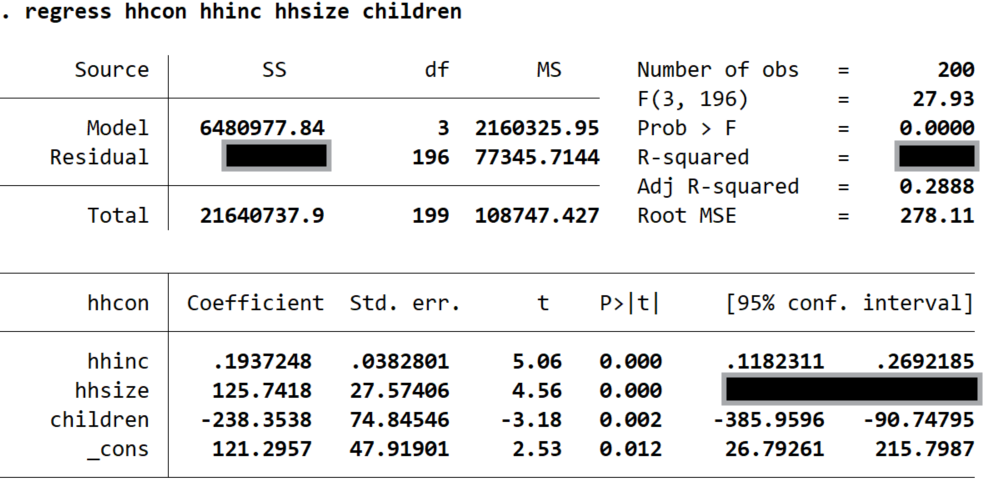

---
# GENERATED BY _prerender.py FROM lecture-3-multi.qmd - DO NOT EDIT
title: Properties of OLS and Statistical Inference
subtitle: "Lecture 3 (R code)"
format:
  pdf:
    toc: true
    output-file: lecture-3-notes-R.pdf
engine: knitr
multi-lang: r
lang-r: true
---
```{r}
#| include: false
#| cache: false

library(Statamarkdown)
knitr::opts_chunk$set(collectcode = TRUE)
```

```{r}
#| include: false

# Packages
library(haven)    

source(here::here("config.R"))
```

```{stata}
#| include: false

do "config.do"
```

:::{.content-visible unless-format="revealjs"}
In this lecture we investigate the properties of the OLS estimator and how it relates to the assumptions we make about the unobserved population regression model. As we do so it will help to keep in mind the distinction between the estimand, the estimator, and the estimate. 

```{mermaid}
%%| fig-width: 6
flowchart LR
  A[Estimator] --> B[Estimand]
  A --> C[Estimate]

```

The estimand ($\beta$) is an unknown population parameter (i.e., a non-random number); the estimator ($\hat{\beta}$) a random variable; and the estimate (e.g. $0.187$) a realized value of said random function (i.e. a non-random number).
:::

# Bias & Efficiency

::::{.content-visible unless-format="revealjs"}
:::{.callout-tip title="Mean Squared Error" collapse=true}
In the data science literature there is a trade-off between bias and efficiency; or mean vs variance. This trade off is captured by the Mean Square Error. The goal is to estimate to predict $y$ using information on $\mathbf{x}$ and the best MSE predictor of $y$ is the CEF:

$$
  E[y_i|\mathbf{x}_i] = m(\mathbf{x}_i)
$$

Let $\hat{m}(\mathbf{x}_i)$ be an estimator for $m(\mathbf{x}_i)$. Then, 

$$
  \begin{aligned}
  MSE(\hat{m}) =& E\bigg[\big(y_i-\hat{m}(\mathbf{x}_i)\big)^2\bigg]\\
  =& (\underbrace{Bias\big(\hat{m})}_\text{Bias}\big)^2 + \underbrace{Var(\hat{m})}_\text{Variance} + \underbrace{Var(\varepsilon_i)}_\text{Absolute error}
  \end{aligned}
$$

Given the set of $\mathbf{x}$s is fixed, the absolute error cannot be changed. There is however, a trade-off between bias and variance. You may choose a slight biased estimator that has a lower variance in order to minimize the MSE. 
:::
::::

## Biasedness

When is the OLS estimator unbias?

$$
 E[\hat{\beta}] = \beta
$$

## 

Under the assumptions MLR 1-4, 

$$
  E[\hat{\beta}_j] = \beta_j \qquad j=0,\dots,k
$$

## Proof

We do not have the math to do this for the multivariate case. However, we can show this for the simple/bivariate case:[^1]

[^1]: We can also use the Frisch-Waugh Theorem to define the multivariate estimator as a biavariate estimator. 

::: {.fragment .fade-in}
Under MLR 1-4 (equiv. to Wooldridge's SLR 1-4)

$$
  y_i = \beta_0 + \beta_1 x_i + u_i
$$

where $E[u_i|x_i]=0$. 
:::

##

The OLS estimator for $\beta_1$ is given by (see [Lecture 2](lecture-2-multi.qmd)):

$$
  \begin{aligned}
    \hat{\beta}_1 =& \frac{\sum_{i=1}^{n}(y_i -\bar{y})(x_{i}-\bar{x})}{\sum_{i=1}^{n}(x_{i}-\bar{x})^2} \\
    =& \frac{\sum_{i=1}^{n}y_i(x_{i}-\bar{x})}{\sum_{i=1}^{n}(x_{i}-\bar{x})^2} \\
    =& \frac{\sum_{i=1}^{n}y_i(x_{i}-\bar{x})}{\text{SST}_x}
  \end{aligned}
$$

where $\text{SST}_x=\sum_{i=1}^{n}(x_{i}-\bar{x})^2$

- remember, $\text{SST}_x$ is a function of $X$ (the regressors in the sample) alone. 

##

Substitute the model ($y_i = \textcolor{blue}{\beta_0 + \beta_1 x_i + u_i}$) in:

$$
  \hat{\beta}_1 = \frac{\sum_{i=1}^{n}(\textcolor{blue}{\beta_0 + \beta_1 x_i + u_i})(x_{i}-\bar{x})}{\text{SST}_x} 
$$

::: {.fragment .fade-in}
Expand the bracket:

$$
  \hat{\beta}_1 = \frac{\textcolor{blue}{\beta_0}}{\text{SST}_x}\sum_{i=1}^{n}(x_{i}-\bar{x}) + \frac{\textcolor{blue}{\beta_1}}{\text{SST}_x}\sum_{i=1}^{n}(x_{i}-\bar{x})\textcolor{blue}{x_i} + \frac{1}{\text{SST}_x}\sum_{i=1}^{n}(x_{i}-\bar{x})\textcolor{blue}{u_i}
$$

:::

##

Now we use the fact that:

$$
    \hat{\beta}_1 = \frac{\beta_0}{\text{SST}_x}\underbrace{\sum_{i=1}^{n}(x_{i}-\bar{x})}_{=0} + \frac{\beta_1}{\text{SST}_x}\underbrace{\sum_{i=1}^{n}(x_{i}-\bar{x})x_i}_{\text{SST}_x} + \frac{1}{\text{SST}_x}\sum_{i=1}^{n}(x_{i}-\bar{x})u_i
$$

::: {.fragment .fade-in}
Which gives you, 

$$
    \hat{\beta}_1 = \beta_1 + \underbrace{\textcolor{red}{\frac{1}{\text{SST}_x}\sum_{i=1}^{n}(x_{i}-\bar{x})}}_{\text{all depends on }X}u_i
$$

:::

##

Now we can take the expectation of $\hat{\beta}_1$ *conditional* on $X$: "the sample values of the independent variables" [@wooldridge2025, p. 43].[^2]

[^2]: The sample values of regressors is $X=[x_1,x_2,\dots,x_n]'$; a column vector (or matrix in the multivariate case). In my notation, I use capital $X$ to denote the column vector of $\{x_i\}_{i=1,\dots,n}$, and to distinguish it from $\mathbf{x}_i$ used to denote the row vector of regressors for observation $i$: $\{x_{ij}\}_{j=1,\dots,k}$. We will use the fact that, under random sampling $E[u_i|x_i]=0\Rightarrow E[u_i|X]=0$. 

$$
  \begin{aligned}
  E[\hat{\beta}_1|X] =& E\Bigg[\beta_1 + \textcolor{red}{\frac{1}{\text{SST}_x}\sum_{i=1}^{n}(x_{i}-\bar{x})}u_i\Bigg\vert X\Bigg] \\
  =& \beta_1 + E\Bigg[\textcolor{red}{\frac{1}{\text{SST}_x}\sum_{i=1}^{n}(x_{i}-\bar{x})}u_i\Bigg\vert X\Bigg] \\
  =& \beta_1 + \textcolor{red}{\frac{1}{\text{SST}_x}\sum_{i=1}^{n}(x_{i}-\bar{x})}\underbrace{E[u_i|X]}_{=0} \\
  =& \beta_1
  \end{aligned}
$$

##

Since, $E[\hat{\beta}_1|X] = \beta_1$, then by the Law of Iterated Expectations (see [CEF Material](material-cef.qmd))

$$
 E[\hat{\beta}_1] = E\big[E[\hat{\beta}_1|X]\big] = E[\beta_1] = \beta_1
$$

## Intuition

Unbiasedness means that **in expectation** the OLS estimator will give you the true parameter. 

- **IF** MLR 1-4 hold

::: {.fragment .fade-in}
If we estimated the model over-and-over-again (i.e. infinitely many times), drawing samples from the same population, the average of the estimator will be equal to the true population parameter. 

- We can demonstrate this by running a Monte Carlo simulation ($R = 1,000$) of the model: 

$$
  y_i = 2 + 0.5 x_i + u_i
$$
:::

## Monte Carlo simulation

```{r}
#| code-fold: true
#| fig-align: center
#| fig-width: 6
#| fig-height: 4
 
# Monte Carlo simulation of OLS estimator
# Model: y = 2 + 0.5*x + e,  e ~ N(0,1)

set.seed(123)      # for reproducibility
n <- 100           # sample size (set as desired)
R <- 1000    # number of Monte Carlo repetitions

b0 <- 2
b1 <- 0.5

# storage for estimates
b0_hat <- numeric(R)
b1_hat <- numeric(R)

# fixed regressor x (redrawn once, held fixed across repetitions)
x <- runif(n, min = 0, max = 1)

for (i in 1:R) {
  e <- rnorm(n, mean = 0, sd = 1)
  y <- b0 + b1 * x + e
  
  fit <- lm(y ~ x)
  
  b0_hat[i] <- coef(fit)[1]
  b1_hat[i] <- coef(fit)[2]
}

# Summary of results
#cat("Mean of intercept estimates:", mean(b0_hat), "\n")
cat("Mean of slope estimates:", mean(b1_hat), "\n")
#cat("SD of intercept estimates:", sd(b0_hat), "\n")
#cat("SD of slope estimates:", sd(b1_hat), "\n")

# Plot sampling distributions
#par(mfrow = c(1, 2))
#hist(b0_hat, main = "Intercept estimates", xlab = expression(hat(beta)[0]))
#abline(v = b0, col = "red", lwd = 2)

hist(b1_hat, main = "Slope estimates", xlab = expression(hat(beta)[1]))
abline(v = b1, col = "red", lwd = 2)

```

## Bias

When is $E[\hat{\beta}_1]\neq \beta_1$?

:::: {.fragment .fade-in}
::: incremental

- When $E[u_i|\mathbf{x}_i]\neq 0$

- We often describe this as **endogeneity** and describe regressors that are uncorrelated with the error term as **exogenous**.
:::
::::

:::: {.fragment .fade-in}
:::{.callout-important title="Endogenous"}
This language of endogenous and exogenous comes from an early field of econometrics focused on the estimation of systems of equations. A famous example is the estimation of demand and supply curves, which involves simultaneous equations. The word endogenous means "determined inside the system", while exogenous has the opposite meaning of "determined outside of the system". 

$$
  q_i = \alpha + \beta p_i + \mathbf{x}_i\gamma + \varepsilon_i
$$

Since both price and quantity are determined in equilibrium, the price of a good ($p_i$) depends on all the same factors that determine quantity ($q_i$); which includes $\varepsilon_i$. This makes $p_i$ endogenous, since it is determined *inside* the system.
:::
::::

::::{.content-visible unless-format="revealjs"}
:::{.callout-tip title="Simultaneous Equations" collapse=true}
If you were taking this module in the 1980s, more than likely, the course would have started with a discussion of demand and supply curves. Just as you begin any introduction to economics module solving for the equilibrium price and quantity in a market, econometrics would teach you to estimate a **system of equations**:

$$
\begin{aligned}
  q^{d}_i =& \alpha^{d} p_i + \mathbf{x}_i\gamma + \varepsilon^{d}_i \\
  q^{s}_i =& \alpha^{s} p_i + \mathbf{w}_i\psi + \varepsilon^{s}_i
\end{aligned}
$$

where $\alpha^{d}$ is the slope of the demand curve, and $\alpha^{s}$ the supply curve. We know that the **observed** price and quantity in the market are determined in equilibrium by solving:

$$
  q_i^{d} = q_i^s = q_i
$$

This means that $p_i$ is an outcome of both $\varepsilon_i^d$ and $\varepsilon_i^s$. This makes $p_i$ **endogenous**. 
:::
::::

## Endogeneity

There are reasons why $E[u|x]\neq 0$ (i.e., 'sources of endogeneity')

  - omitted variables (confounding factors not included in the model)
  - measurement error (certain types)
  - model mis-specification
  - selection into "treatment" 
  - sample selection
  - reverse causality ($Y\rightarrow X$) or simultaneity ($Y\leftrightharpoons X$)

:::: {.fragment .fade-in}
:::{.callout-important title="Endogenous"}
The language of 'endogeneity'/'exogeneity' is not universal. In the modern causal inference literature, the discussion centers around *selection into "treatment"*. As we will see at a later stage, this *can* be described as an omitted variable problem. The problem is typically solved through randomization, which results in unconfounded assignment. You could think of random assignment as a source of 'exogenous' variation in assignment, but this language is not always applied. 
:::
::::

::::{.content-visible unless-format="revealjs"}
:::{.callout-tip title="Heckman Selection" collapse=true}
A famous paper by Jim Heckman shows that selection into the sample can lead to biased estimates [@heckman1979sample]. The example that is often studied is the labour market: if we want to study the relationship between hours of work and the wage rate (i.e. elasticty of labour supply), we need to account for the fact that we don't observe data for people who choose not work. And since that choice not to work may depend on the wage offers an individual receives, the selection of the sample may lead to biased estimates of the elasticity of labour supply.

@heckman1979sample proposes a rather simple solution to this problem using a two-step estimation procedure. In Stata the command is called `heckman`, while in R you can use the `selection()` function from the `sampleSelection` package. The method is discussed in @wooldridge2025 [ch. 17.6].

This sample selection problem should not be confused with the problem of *selection into "treatment"*. 
:::
::::

## Efficiency

**Did you notice?** There was a wide 'spread' of estimates in our simulation. 

::: {.fragment .fade-in}
**Why?**

$$
  \hat{\beta}_1 \; \text{is a random variable}
$$

- every sample realizes a different value of the estimator

- it has a mean, variance, and distribution

- we have established that (under MLR 1-4) its mean is: $E[\hat{\beta}_1] = \beta_1$.
:::

## Variance

The variance of the estimator will depend on both the variance of the $x$ and $u$. 

- Under MLR 4, we can focus on just $u$ (i.e. treat $X$ as fixed). 

::: {.fragment .fade-in}
As before, we can show this more easily for the simple case:

$$
  \begin{aligned}
  Var(\hat{\beta}_1|X) =& E\Big[\big(\hat{\beta}_1-\underbrace{E[\hat{\beta}_1|X]}_{\beta_1}\big)^2\Big|X\Big] \\
  =& E\big[(\hat{\beta}_1-\beta_1)^2\big|X\big]
  \end{aligned}
$$

:::

## 

Earlier, we showed that

$$
  \hat{\beta}_1 = \textcolor{red}{\beta_1} + \frac{1}{\text{SST}_x}\sum_{i=1}^{n}(x_{i}-\bar{x})u_i
$$

::: {.fragment .fade-in}
Substituting this is, we get:

$$
  \begin{aligned}
  Var(\hat{\beta}_1|X) =& E\Bigg[\bigg(\textcolor{red}{\beta_1}+\frac{1}{\text{SST}_x}\sum_{i=1}^{n}(x_{i}-\bar{x})u_i\textcolor{blue}{-\beta_1}\bigg)^2\Bigg|X\Bigg] \\
  =& E\Bigg[\bigg(\frac{1}{\text{SST}_x}\sum_{i=1}^{n}(x_{i}-\bar{x})u_i\bigg)^2\Bigg|X\Bigg]
  \end{aligned}
$$
:::

## 

After *some* math...(exploiting MLR-2)

$$
  Var(\hat{\beta}_1|X) = \frac{E[u_i^2|X]}{SST_x}= \frac{Var(u_i|x_i)}{SST_x} = \frac{\sigma^2}{SST_x}
$$

:::: {.fragment .fade-in}
Using MLR-5 (Homoskedasticity).

- The larger the variance of error term, the bigger the variance of the estimator

  - $\Rightarrow$ if you add variables that explain more of $y$ you can reduce the variance. 
  
- If you increase the variance in $x$, you reduce the variance of the estimator. 

::: {.callout-note title="Optimal experiment"}
In Randomized Control Trials the regressor is a single dummy variable: $x_i=1$ ($=0$) if treated (if control). In this case, $SST_x=n\bar{x}(1-\bar{x})$: a function that is quadratic in $\bar{x}=n^{-1}\sum_i x_i$ - the share of treated individuals. This function is concave, with a maximum at $\bar{x} = 0.5$. This tells us that the most efficient assignment is 50-50. For a given sample size, equal treatment minimizes the variance of the estimator.
:::
::::

## Simulation

If we run the same Monte Carlo simulation for two cases - $\sigma = 1$ and $\sigma = 2$ - we should should see a big difference in the variance of the estimator.   

```{r}
#| code-fold: true
#| fig-align: center
#| fig-width: 8
#| fig-height: 4
 
# Monte Carlo simulation of OLS estimator
# Model: y = 2 + 0.5*x + e,  e ~ N(0,1)

# storage for estimates
b0_hat2 <- numeric(R)
b1_hat2 <- numeric(R)

# fixed regressor x (redrawn once, held fixed across repetitions)
x <- runif(n, min = 0, max = 1)

for (i in 1:R) {
  e <- rnorm(n, mean = 0, sd = 2)
  y <- b0 + b1 * x + e
  
  fit <- lm(y ~ x)
  
  b0_hat2[i] <- coef(fit)[1]
  b1_hat2[i] <- coef(fit)[2]
}

# Plot sampling distributions
par(mfrow = c(1, 2))
hist(b1_hat, main = "Slope estimates (sigma=1)", xlab = expression(hat(beta)[1]), xlim = c(-2, 3))
abline(v = b1, col = "red", lwd = 2)

hist(b1_hat2, main = "Slope estimates (sigma=2)", xlab = expression(hat(beta)[1]), xlim = c(-2, 3))
abline(v = b1, col = "red", lwd = 2)

```

## Multivariate case

There is an equivalent formula for the multivariate estimator:

$$
  Var(\hat{\beta}_j|X) = \frac{Var(u_i|X)}{\text{SSR}_j} = \frac{\sigma^2}{\text{SSR}_j}
$$

where $\text{SSR}_j$ is the residual sum of squares from regressing $x_j$ on all other regressors. 

- relates to idea of partialling out from [Lecture 2](lecture-2-multi.qmd)

## 

Since, 

$$
  \mathbf{R}^2_j = 1-\frac{\text{SSR}_j}{\text{SST}_j}\Rightarrow \text{SSR}_j = \text{SST}_j(1-\mathbf{R}^2_j)
$$

::: {.fragment .fade-in}
This is the definition then that Wooldridge uses [-@wooldridge2025, p. 89]

$$
  Var(\hat{\beta}_j|X) = \frac{\sigma^2}{\text{SST}_j(1-\mathbf{R}^2_j)}
$$

- Wooldridge just writes $Var(\hat{\beta}_j)$ and adds "conditional on the sample values of the independent variables" (p. 89) to his description.

:::

## Intuition

:::{.incremental}
- if other regressors explain a lot of the variation in $x_j$, the $\downarrow\text{SSR}_j\Rightarrow \uparrow Var$

  - alternatively, then $\uparrow\mathbf{R}^2_j\Rightarrow \downarrow (1-\mathbf{R}^2_j)\Rightarrow\uparrow Var$

- adding regressors has competing effects in terms of efficiency. 

  - **potentially** explain more of $y_i\Rightarrow \downarrow \sigma^2$
  
  - changes the variance of other estimators through correlation between regressors. 
:::

## Gauss-Markov Theorem

The Gauss-Markov Theorem states that under MLR 1-5[^3]

[^3]: We will not prove this theorem. Plenty are available online, but the proof is not examinable.

- OLS is the **Best Linear Unbiased Estimator** (BLUE)

::: {.fragment .fade-in}
- 'Best': most efficient (i.e. lowest variance)

- Crucially:
  
  - Among linear estimators (there are more efficient non-linear options)
  
  - Among unbiased estimators (you can trade off a bit of bias for more efficiency)
  
  - Assumes homoskedasticity (MLR 5)
  
    - If for heteroskedastic error variance, Generalized Least Squares is more efficient.

:::

# Distribution

## Recap

The OLS estimator is a **random variable**. Under MLR 1-5:

- $E[\hat{\beta}_j] = \beta_j\quad j=0,\dots,k$

- $Var(\hat{\beta}_j|X) = \sigma^2/SSR_j\quad j=1,\dots,k$

:::{.callout-note title="Intercept"}
We have ignored the $Var(\hat{\beta}_0|X)$. There is a formula for the simple case in Wooldridge in Ch. 2.5 for the SLR case. 

$$
  Var(\hat{\beta}_0|X) =\frac{\sigma^2 n^{-1}\sum_{i=1}^nx_i^2}{SST_x}
$$

While no formula is given for the MLR case. This is because it does not have a neat form (unless expressed using linear algebra). You do NOT need to learn this formula.  
:::

## Normality

Under MLR 6:

$$
  \hat{\beta}_j|X \sim\quad N\big(\beta_j,\,Var(\hat{\beta}_j|X)\big) 
$$

Why?

- $u_i|\mathbf{x}_i \sim N(0,\sigma^2)$

- conditional on $X$ (the sample values of regressors), $\hat{\beta}$ is a linear transformation of $u$.

## Normalization

We can therefore standardize the distribution: 

$$
  \frac{\hat{\beta}_j-\beta_j}{sd(\hat{\beta}_j)} | x \sim N(0,1)
$$

where $sd(\hat{\beta}_j) = \sqrt{Var(\hat{\beta}_j|X)}$

##

This term - let's call it $z=(\hat{\beta}_j-\beta_j)/sd(\hat{\beta}_j)$ is another random variable. Since we know the properties $N(0,1)$, we know:

::: incremental
- $Pr(z<\text{z}_{0.025}) = 0.025$ where $\text{z}_{0.025} = -1.96$ is the $2.5^{th}$ percentile of $N(0,1)$

- $Pr(z>\text{z}_{0.975}) = 0.025$ where $\text{z}_{0.975} = 1.96$ is the $97.5^{th}$ percentile of $N(0,1)$

- $Pr(\text{z}_{0.025}<z<\text{z}_{0.975}) = 0.95$ (or 95%)
:::

## Confidence Intervals

We can use this knowledge to form confidence intervals for the unknown $\beta_j$

$$
  \begin{aligned}
  0.95 =& Pr(\text{z}_{0.025} < z < \text{z}_{0.975}) \\
  =& Pr\Bigg(\text{z}_{0.025} < \frac{\hat{\beta}_j-\beta_j}{sd(\hat{\beta}_j)} < \text{z}_{0.975}\Bigg) \\
  =& Pr\big(\text{z}_{0.025}\times sd(\hat{\beta}_j) < \hat{\beta}_j-\beta_j < \text{z}_{0.975}\times sd(\hat{\beta}_j)\big) \\
  =& Pr\big(-\hat{\beta}_j+\text{z}_{0.025}\times sd(\hat{\beta}_j) < -\beta_j < -\hat{\beta}_j+\text{z}_{0.975}\times sd(\hat{\beta}_j)\big) \\
  =& Pr\big(\hat{\beta}_j - \text{z}_{0.975}\times sd(\hat{\beta}_j) < \beta_j < \hat{\beta}_j - \text{z}_{0.025}\times sd(\hat{\beta}_j)\big) \\
  \end{aligned}
$$

Notice, the percentiles end up on opposite sides. 

## 

For symmetric distributions, like Normal, $\text{z}_{0.975}=- \text{z}_{0.025}$. This gives us the simplified Confidence Interval:

$$
  \text{CI}_{0.95} = \big[\hat{\beta}_j - \text{z}_{0.975}\times sd(\hat{\beta}_j),\hat{\beta}_j + \text{z}_{0.975}\times sd(\hat{\beta}_j)\big]
$$

::: {.callout-note}
The CI is depends on the estimator $\hat{\beta}_j$. Since the estimator is random variable, the CI is also random. For this reason, we can ask: what is the probability that $\beta_j$ lies within the CI. 

$$
  Pr(\beta_j\in \text{CI}_{0.95}) = 0.95
$$

This holds for $\beta_j$ alone, because the conditional distribution of $\hat{\beta}_j$ is centered around $\beta_j$. 
:::

## Be careful

Suppose the **estimate** of $\hat{\beta}_j$ is $0.35$, with $sd=0.12$. The constructed the 95% confidence interval is:

$$
  [0.35 - \text{z}_{0.975}\times 0.12,0.35 + \text{z}_{0.975}\times 0.12] = [0.115,0.585]
$$

:::{.fragment .fade-in}
What is the $Pr\big(\beta_j \in [0.115,0.585]\big)$? 
:::

##

You might be tempted to say 95%, but (from a frequentest perspective) you would be wrong. 

::::{.fragment .fade-in}
The answer is either $0$ or $1$.

**Why?** 

::: incremental

- The interval you have constructed is not random; it is just two numbers, a lower and upper bound. 

- The question is equivalent to asking what is $Pr\big(5 \in [1,4]\big)$? In this case the answer is evidently 0, but if the interval were $[2,6]$ the answer would be 1. 

- What then is the point of the CI? Well, you can conduct inference using the CI. 

:::
::::

# Inference

## Null hypothesis

How does this work?

1. Establish a null hypothesis

$$
  H_0: \beta_j = 0
$$

::: {.callout-note}
This is the most common null hypothesis as it essentially states that there is no relationship between $y$ and $x_j$. In empirical research, we are often trying to establish whether there is a (causal) relationship bewteen two variables. In order to test this theory we state a null hypothesis that we will reject if the evidence supports our claim.
:::

::::{.content-visible unless-format="revealjs"}
:::{.callout-tip title="Reject, not prove" collapse="true"}
Why do we rule out hypothesis and instead of ruling them in? The answer two fold:

1. The estimator is a random variable, with infinite support. Consistent with $\beta_j=0$, the estimator can take on any real value $\mathbb{R}:(-\infty,\infty)$. This means that every value the estimator could take on, is consistent with every unknown value of the true $\beta_j$.

2. We solve this problem by restricting probability of rejecting the null hypothesis when it is true (Type 1 error). That is, we design a test to *rule out* $H_0$, not rule it in. 

If you want to establish that there is a relationship between, for example, smoking and lung cancer, you need to rule out the hypothesis that there is no relationship. 
:::
::::

## Alternative hypothesis

2. The null determines the alternative:

$$
  H_1: \beta_j \neq 0
$$
If we reject $H_0$ we conclude $H_1$. It is NOT accurate to say that we 'prove' $H_1$.

## Test statistic

3. Design a test statistic with a known distribution. 

We know that under MLR 1-6,

$$
  \frac{\hat{\beta}_j-\beta_j}{sd(\hat{\beta}_j)} | X \sim N(0,1)
$$

Under $H_0: \beta_j=0$

$$
  z\text{-stat} = \frac{\hat{\beta}_j-0}{sd(\hat{\beta}_j)} | X \underset{H_0}{\sim} N(0,1)
$$

::: {.callout-important}
In this case, the test statics only has a normal distribution under $H_0$. If $H_0$ is not true, then the test statistic has different distribution. 
:::

## Significance level

4. Pick a significance level ($\alpha$).[^4] This is the permitted probability of a type 1 error:

[^4]: Also referred to as the 'size' of the test. 

$$
  \alpha = Pr(\text{Reject}\; H_0|H_0\;\text{is true}, X)
$$

In Economics, we typically use $\alpha = \{0.01,0.05,0.10\}$.

## Rejection rule

4. Determine a rejection rule consistent with a chosen $\alpha$. 

Under $H_0$, 

$$
  z\text{-stat}|X \underset{H_0}{\sim} N(0,1)
$$

##

$$
  \Rightarrow Pr(-1.96 < z\text{-stat} < 1.96 | H_0) = 0.95
$$  
```{r}
#| code-fold: true
#| fig-align: center
#| fig-width: 6
#| fig-height: 4

x <- seq(-3, 3, length.out = 1000)
y <- dnorm(x)

par(mar = c(4, 4, 2, 1))

plot(x, y, type = "l", lwd = 2, col = "black",
     xlim = c(-3, 3),
     xlab = "z", ylab = "Density",
     main = "Standard Normal Distribution",
     xaxs = "i", yaxs = "i", ylim = c(0, max(y) * 1.1))

# Shade the area between -1.96 and 1.96
x_shade <- seq(-1.96, 1.96, length.out = 500)
y_shade <- dnorm(x_shade)

polygon(c(x_shade[1], x_shade, tail(x_shade, 1)),
        c(0, y_shade, 0),
        col = rgb(0.20, 0.40, 0.70, 0.5), border = NA)

# Re-draw the curve on top so the outline stays crisp over the shading
lines(x, y, lwd = 2, col = "black")

# Reference lines at the cutoffs
abline(v = c(-1.96, 1.96), lty = 2, col = "gray40")

# Label the shaded area
text(0, dnorm(0) * 0.4, "Area = 0.95", cex = 1.1, font = 2)

# Label the cutoff values on the x-axis
axis(1, at = c(-1.96, 1.96), labels = c("-1.96", "1.96"),
     line = 1.1, tick = FALSE, cex.axis = 0.85, col.axis = "gray30")

```

##

Reject $H_0$ if: $z\text{-stat}>1.96$ or $z\text{-stat}<-1.96$

$$
  \Rightarrow \text{Reject if}\quad  |z\text{-stat}|>1.96
$$

```{r}
#| code-fold: true
#| fig-align: center
#| fig-width: 6
#| fig-height: 4

plot(x, y, type = "l", lwd = 2, col = "black",
     xlim = c(-3, 3),
     xlab = "z", ylab = "Density",
     main = "Standard Normal Distribution",
     xaxs = "i", yaxs = "i", ylim = c(0, max(y) * 1.25))

# --- Left tail: x <= -1.96 ---
x_left <- seq(-3, -1.96, length.out = 200)
y_left <- dnorm(x_left)
polygon(c(x_left[1], x_left, tail(x_left, 1)),
        c(0, y_left, 0),
        col = rgb(0.80, 0.15, 0.15, 0.7), border = NA)

# --- Right tail: x >= 1.96 ---
x_right <- seq(1.96, 3, length.out = 200)
y_right <- dnorm(x_right)
polygon(c(x_right[1], x_right, tail(x_right, 1)),
        c(0, y_right, 0),
        col = rgb(0.80, 0.15, 0.15, 0.7), border = NA)

# Re-draw the curve on top so the outline stays crisp over the shading
lines(x, y, lwd = 2, col = "black")

# Reference lines at the cutoffs
abline(v = c(-1.96, 1.96), lty = 2, col = "gray40")

# Labels for each tail, placed above the curve with an arrow pointing
# down into the shaded region (the tails are too thin to hold text)
arrows(x0 = -2.45, y0 = 0.09, x1 = -2.20, y1 = 0.012,
       length = 0.08, col = "black", lwd = 1.2)
text(-2.95, 0.10, "Area = 0.025", cex = 0.95, font = 2, pos = 4)

arrows(x0 = 2.45, y0 = 0.09, x1 = 2.20, y1 = 0.012,
       length = 0.08, col = "black", lwd = 1.2)
text(2.95, 0.10, "Area = 0.025", cex = 0.95, font = 2, pos = 2)

# Label the cutoff values on the x-axis
axis(1, at = c(-1.96, 1.96), labels = c("-1.96", "1.96"),
     line = 1.1, tick = FALSE, cex.axis = 0.85, col.axis = "gray30")

```

## $p$-value

The p-value is the **smallest significance level at which you would reject** $H_0$. 

::: incremental
- Suppose you reject $H_0$ using the 10% (two-sided) critical value:  $|z-\text{stat}|>\text{z}_{0.95}$
- You may then also reject $H_0$ at a 5% level: i.e. $|z-\text{stat}|>\text{z}_{0.975}$
- ...and at a 3% level: i.e. $|z-\text{stat}|>\text{z}_{0.985}$
- ...until?

:::

:::{.callout-warning}
The $p$-value is NOT a probability. Despite how it is written, it is a random variable since it is a function of the estimator. In fact, we know its distribution: $p-value\sim U(0,1)$. This is the basis of research on "$p$-hacking".
:::

##

For a two-sided test our critical value is $\text{z}_{1-\alpha/2}$

::: incremental
- $\text{z}_{1-\alpha/2}$ is a percentile of the the normal distribution. 

  $$
  \text{z}_{1-\alpha/2} = \Phi^{-1}(1-\alpha/2)
  $$

- To solve for the $\alpha$, we do the opposite:
  
  $$
     \Phi(\text{z}_{1-\alpha/2}) = 1-\alpha/2
  $$

- If at the point of indifference $|z-\text{stat}|=\text{z}_{1-\alpha^*/2}$, then

  $$
    1-\alpha^*/2 = \Phi(|z-\text{stat}|)
  $$

- This $\alpha^*$ is what we call the $p$-value. 

  $$
    p-\text{value} = 2\times \big(1-\Phi(|z-\text{stat}|)\big)
  $$
  
:::

## Confidence intervals

We mentioned that the $\text{CI}_{0.095}$ can be used for hypothesis testing. 

$$
  \text{CI}_{0.95} = \big[\hat{\beta}_j - \text{z}_{0.975}\times sd(\hat{\beta}_j),\hat{\beta}_j + \text{z}_{0.975}\times sd(\hat{\beta}_j)\big]
$$

:::{.fragment .fade-in}
For two-side test, our rejection rule is:

$$
  \begin{aligned}
  \text{Reject}\;&H_0\;\text{if}\quad |z-\text{stat}|> \text{z}_{0.95} \\
  \Rightarrow & z-\text{stat}> \text{z}_{0.95} \quad\text{or} \quad z-\text{stat}<-\text{z}_{0.95}
  \end{aligned}
$$
:::

##

Let $H_0: \beta_j = \kappa_0$ (some constant chosen for the null), then

$$
  z-\text{stat} = \frac{\hat{\beta}_j-\kappa_0}{sd(\hat{\beta}_j)}
$$

:::{.fragment .fade-in}
Then, our rejection rule can be written as: **Reject $H_0$ if**

$$
  \begin{aligned}
  \frac{\hat{\beta}_j-\kappa_0}{sd(\hat{\beta}_j)}> \text{z}_{0.95} \quad&\text{or} \quad \frac{\hat{\beta}_j-\kappa_0}{sd(\hat{\beta}_j)}<-\text{z}_{0.95} \\
  \Rightarrow -\kappa_0> \text{z}_{0.95}\times sd(\hat{\beta}_j) - \hat{\beta}_j \quad&\text{or} \quad -\kappa_0<-\text{z}_{0.95}\times sd(\hat{\beta}_j)-\hat{\beta}_j \\
  \Rightarrow \kappa_0< \hat{\beta}_j-\text{z}_{0.95}\times sd(\hat{\beta}_j)  \quad&\text{or} \quad \kappa_0>\hat{\beta}_j +\text{z}_{0.95}\times sd(\hat{\beta}_j)\\
  & \\
  \Rightarrow \kappa_0 &\not\in \text{CI}_{0.95}
  \end{aligned}
$$
:::

## Example

Back to our example where our **estimate** of $\hat{\beta}_j$ is $0.35$, with $sd=0.12$. The constructed the 95% confidence interval is:

$$
  [0.35 - \text{z}_{0.975}\times 0.12,0.35 + \text{z}_{0.975}\times 0.12] = [0.115,0.585]
$$

:::{.fragment .fade-in}

- at a $\alpha = 0.05$, we FAIL to reject any $H_0: \beta_j  = \kappa_0$ where 

  $$\kappa_0\in [0.115,0.585]$$
  
  - We would reject $H_0: \beta_j  = 0$
  - But fail to reject $H_0: \beta_j  = 0.2$
  
::: 

## Type 2 errors

We've limited the probability of type 1 errors to $\alpha$, but what about **type 2 errors**?

$$
  Pr(\text{Fail to reject}\;H_0|H_0\;\text{is false}) = ?
$$

where, for example, $H_0: \beta_j = \kappa_0$. 

:::{.fragment .fade-in}
What do we mean by $H_0$ is false?

- not $H_0\Rightarrow \beta_j\neq \kappa_0$; a lot of possibilities.

:::

## Power function

Suppose $\beta_j = \kappa \neq \kappa_0$. 

$$
  Pr(\text{Reject}\;H_0|\beta_j = \kappa)
$$

:::{.fragment .fade-in}

We call this the **power function**. And,

$$
  \begin{aligned}
  1-Pr(\text{Reject}\;H_0|\beta_j = \kappa) =& Pr(\text{Fail to}\;H_0|\beta_j = \kappa) \\
  =& Pr(\text{Type 2 error})
  \end{aligned}
$$

- Higher power $\rightarrow$ lower probability of type 2 error. 

:::

## 

We know what this function looks like:

$$
  \begin{aligned}
    &Pr(\text{Reject}\;H_0|\beta_j = \kappa) \\
    =& Pr(|z\text{-stat}|>1.96|\beta_j = \kappa) \\
    =& Pr\Bigg(\Bigg| \frac{\hat{\beta}_j-\kappa_0}{sd(\hat{\beta}_j)}\Bigg|>1.96\Bigg|\beta_j = \kappa\Bigg) \\
    =& Pr\Bigg(\frac{\hat{\beta}_j-\kappa_0}{sd(\hat{\beta}_j)}<-1.96\Bigg|\beta_j = \kappa\Bigg) + Pr\Bigg(\frac{\hat{\beta}_j-\kappa_0}{sd(\hat{\beta}_j)}>1.96\Bigg|\beta_j = \kappa\Bigg)
  \end{aligned}
$$

This probability is not $0.05$ because $\beta_j \neq 0$. 

##

We have to add and subtract $\kappa/sd(\hat{\beta}_j)$. 

$$
  \begin{aligned}
    &Pr(\text{Reject}\;H_0|\beta_j = \kappa) \\ 
    =&Pr\Bigg(\frac{\hat{\beta}_j\textcolor{blue}{-\kappa}}{sd(\hat{\beta}_j)}+\frac{\textcolor{red}{\kappa}-\kappa_0}{sd(\hat{\beta}_j)}<-1.96\Bigg|\beta_j = \kappa\Bigg) + Pr\Bigg(\frac{\hat{\beta}_j\textcolor{blue}{-\kappa}}{sd(\hat{\beta}_j)}+\frac{\textcolor{red}{\kappa}-\kappa_0}{sd(\hat{\beta}_j)}>1.96\Bigg|\beta_j = \kappa\Bigg) \\
    =& Pr\Bigg(\underbrace{\frac{\hat{\beta}_j\textcolor{blue}{-\kappa}}{sd(\hat{\beta}_j)}}_{\sim N(0,1)}<-1.96-\frac{\textcolor{red}{\kappa}-\kappa_0}{sd(\hat{\beta}_j)}\Bigg|\beta_j = \kappa\Bigg) + Pr\Bigg(\underbrace{\frac{\hat{\beta}_j\textcolor{blue}{-\kappa}}{sd(\hat{\beta}_j)}}_{\sim N(0,1)}>1.96-\frac{\textcolor{red}{\kappa}-\kappa_0}{sd(\hat{\beta}_j)}\Bigg|\beta_j = \kappa\Bigg) \\
    =& \Phi\big(-1.96-(\textcolor{red}{\kappa}-\kappa_0)/sd(\hat{\beta}_j)\big) + 1- \Phi\big(1.96-(\textcolor{red}{\kappa}-\kappa_0)/sd(\hat{\beta}_j)\big) \\
    \geq & 0.05
  \end{aligned}
$$

Under the null hypothesis we assumed the distribution of $\hat{\beta}_j$ was centered on $\kappa_0$, when it is actually $\kappa$. This yields a probability of rejection greater than $0.05=\alpha$. 

##

Suppose $\kappa_0=0$ and $\kappa/sd(\hat{\beta}_j)=1$. Conditional on $\beta_j=\kappa$, the standardized test statistic is actually centered around 1. 

```{r}
#| code-fold: true
#| fig-align: center
#| fig-width: 7
#| fig-height: 4

x <- seq(-4, 5, length.out = 1000)
y0 <- dnorm(x, mean = 0, sd = 1)   # null distribution
y1 <- dnorm(x, mean = 1, sd = 1)   # alternative distribution

par(mar = c(4, 4, 2, 1))

plot(x, y0, type = "l", lwd = 2, col = "black",
     xlim = c(-4, 5),
     xlab = "z", ylab = "Density",
     main = "Standard Normal vs. N(1, 1)",
     xaxs = "i", yaxs = "i", ylim = c(0, max(y0, y1) * 1.15))

# --- Shade N(1,1) area left of -1.96 ---
x_left <- seq(-4, -1.96, length.out = 200)
y_left <- dnorm(x_left, mean = 1, sd = 1)
polygon(c(x_left[1], x_left, tail(x_left, 1)),
        c(0, y_left, 0),
        col = rgb(0.20, 0.60, 0.20, 0.6), border = NA)

# --- Shade N(1,1) area right of 1.96 ---
x_right <- seq(1.96, 5, length.out = 200)
y_right <- dnorm(x_right, mean = 1, sd = 1)
polygon(c(x_right[1], x_right, tail(x_right, 1)),
        c(0, y_right, 0),
        col = rgb(0.20, 0.60, 0.20, 0.6), border = NA)

# Draw both curves on top of the shading
lines(x, y0, lwd = 2, col = "black")
lines(x, y1, lwd = 2, col = "steelblue4")

# Vertical reference lines at the rejection-rule cutoffs
abline(v = c(-1.96, 1.96), lty = 2, col = "gray40")

# Label the cutoff values on the x-axis
axis(1, at = c(-1.96, 1.96), labels = c("-1.96", "1.96"),
     line = 1.1, tick = FALSE, cex.axis = 0.85, col.axis = "gray30")

legend("topright", inset = 0.02,
       legend = c("N(0, 1)", "N(1, 1)"),
       col = c("black", "steelblue4"), lwd = 2, bty = "n")

```

The probability of rejecting increases as $\kappa$ moves further from $0$ (or, more generally, the value under $H_0: \beta_j = \kappa_0$).

## Power function

```{r}
#| code-fold: true
#| fig-align: center
#| fig-width: 6
#| fig-height: 4

power_fn <- function(kappa, se) {
  1 - pnorm(1.96 - kappa / se) + pnorm(-1.96 - kappa / se)
}

kappa <- seq(-6, 6, length.out = 1000)
power <- power_fn(kappa, se = 1.5)

par(mar = c(4, 4, 2, 1))

plot(kappa, power, type = "l", lwd = 2, col = "steelblue4",
     xlim = c(-6, 6), ylim = c(0, 1),
     xlab = expression(kappa), ylab = "Power",
     main = "Power Function (sd = 1.5)",
     xaxs = "i", yaxs = "i")

# Reference line at kappa = 0 (the null) and the significance level
abline(v = 0, lty = 2, col = "gray40")
abline(h = 0.05, lty = 3, col = "gray40")

text(0, 0.05, expression(alpha == 0.05), pos = 3, cex = 0.85, col = "gray30")
```

## More power

One way to increase power is to reduce the variance of the estimator. 

```{r}
#| code-fold: true
#| fig-align: center
#| fig-width: 6
#| fig-height: 4

power_15 <- power_fn(kappa, se = 1.5)
power_10 <- power_fn(kappa, se = 1.0)

plot(kappa, power_15, type = "l", lwd = 2, col = "steelblue4",
     xlim = c(-6, 6), ylim = c(0, 1),
     xlab = expression(kappa), ylab = "Power",
     main = "Power Function", xaxs = "i", yaxs = "i")

lines(kappa, power_10, lwd = 2, col = "firebrick3")

legend("bottomright", inset = 0.02,
       legend = c("sd = 1.5", "sd = 1.0"),
       col = c("steelblue4", "firebrick3"), lwd = 4, bty = "n")
```

# Variance estimator

## 'Sleight of hand'

All our computations have assumed knowledge of, 

$$
  Var(\hat{\beta}_j|X) = \frac{Var(u_i|X)}{\text{SSR}_j} = \frac{\sigma^2}{\text{SSR}_j}
$$

BUT, 

$$
  Var(u_i|\mathbf{x}_i) = \sigma^2
$$

Is an *unknown* population parameter. 

## Estimator

We replace $\sigma^2$ with its estimator:

$$
  \hat{\sigma}^2 = \frac{1}{n-k-1}\sum_{i=1}^n\hat{u}_i^2
$$

**Why** $n-k-1$?

- $\frac{1}{n}\sum_{i=1}\hat{u}_i^2$ is a **biased** estimator for $\sigma^2$

- $n-k-1$ are referred to as the residual *degrees of freedom*

## $t$-distribution

When we substitue $\sigma^2$ for $\hat{\sigma}^2$, the re-centered estimator has a (Student's) $t$-distribution

$$
  \frac{\hat{\beta}_j-\beta_j}{se(\hat{\beta}_j)} | x \sim t_{n-k-1}
$$

with $n-k-1$ degrees of freedom. Where, 

$$
  se(\hat{\beta}_j) = \sqrt{\frac{\hat{\sigma}^2}{SSR_j}}
$$

::::{.content-visible unless-format="revealjs"}
::: {.callout-tip title="Student's t-distribution" collapse="true"}

If $z\sim N(0,1)$ and $w\sim \chi^2_{m}$ then, 

$$
  \frac{z}{w}\sim t_m
$$

Note, a chi-squared distribution is defined as the sum of squared standard normals

$$
  \sum_{l=1}^{m}z_l^2 \sim \chi ^2_{m}
$$
:::
::::

## $t$ test-statistic

For $H_0: \beta_j = 0$

$$
  t\text{-stat} = \frac{\hat{\beta}_j}{se(\hat{\beta}_j)} | X \underset{H_0}{\sim} t_{n-k-1}
$$

This is often referred to as the **t-statistic** in is reported as a default test parameter in regression output. 

:::{.fragment .fade-in}

- You can perform all the same inference steps (critical values, $p$-values, CI) replacing normal distribution with $t$-distribution

- Using the $t$-distribution leads to slightly more "conservative" decisions. 
  
  - the tests have less statistical power relative to their normal counterpart (if you knew $\sigma^2$)
  
:::

## Critical values

For normally distributed test-statistic, the critical value(s) for a two-sided $\alpha=0.05$ (significance level) test are $\{-1.96,1.96\}$. 

The t-distribution is similarly symmetric ($n-k-1=50$):

```{r}
qt(0.025, df = 50)
qt(0.975, df = 50)
```

And as $df$ increase ($n-k-1=100,200,400$), the value decreases,

```{r}
qt(0.975, df = 100)
qt(0.975, df = 200)
qt(0.975, df = 400)
```

and converges to $\text{z}_{0.975} \approx 1.96$

```{r}
qnorm(0.975)
```

## Example

```{r}
#| echo: true
#| code-fold: true
#| warning: false
    

# Load the Stata file
lcf_data <- read_dta(file.path(data_dir, "lcf_2023.dta"))

# Estimate univariate linear regression
model1 <- lm(hhcon ~ hhinc, data = lcf_data)

# View results
summary(model1)
```

# Regression Output (Stata)

## Stata output

After Lectures 1-3 you should understand all aspects of this output, with the exception of $\texttt{F( , )}$ and $\texttt{Prob > F}$.

```{stata}
#| echo: false
#| output: true

* Open data
use "$data_dir\lcf_2023.dta", clear

* Estimate univariate linear regression
regress hhcon hhinc hhsize children
```

$\texttt{Root MSE}$ is just $\sqrt{SSR/(n-k-1)}$.

## Quiz

Can you solve for these values?

{fig-align="center" width=67%}

## Useful code {.scrollable}

```{r}
#| echo: true
#| warning: false

# Standard normal distribution

## Evaluate point on CDF: i.e., probability below 0.675
pnorm(0.675)

## Percentile of CDF
qnorm(0.975)
```

```{r}
#| echo: true
#| warning: false
## t-distribution

## Evaluate point on CDF (df = 100): i.e., probability below 0.675
pt(0.675, 100)

## Percentile of CDF (df = 100)
qt(0.975, 100)
```

# References

## Bibliography
